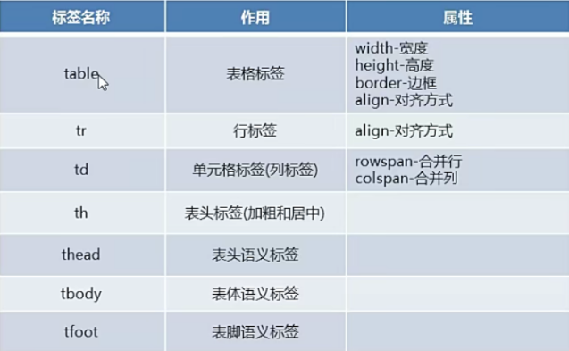
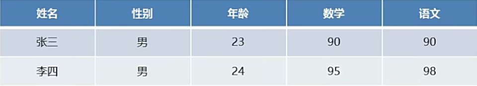
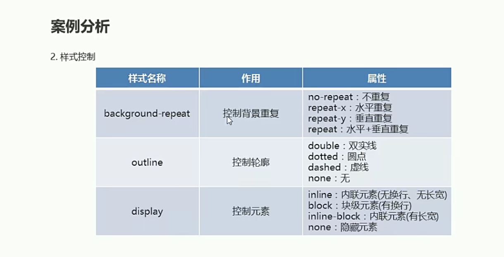
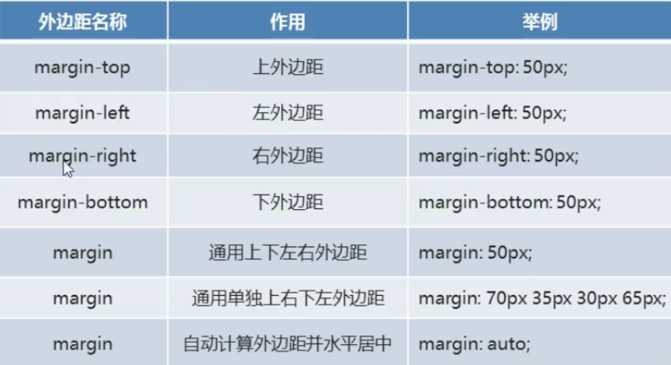
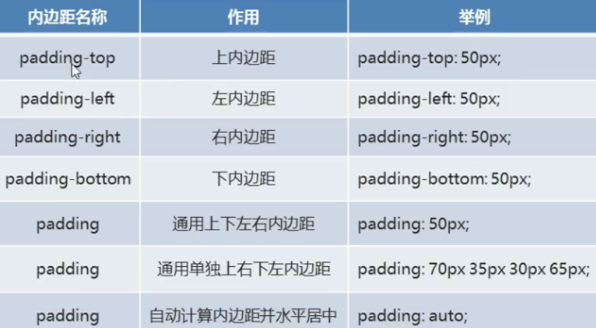

# 案例-登陆页面

## 表格标签
  

三个tr标签  五个td标签
  


## 样式控制
  

```html

<!DOCTYPE html>
<html lang="en">
<head>
    <meta charset="UTF-8">
    <title>样式控制</title>

    <style>
        /*背景图片重复 no-repeat：不重复   repeat-x:水平重复   repeat-y:垂直重复 repeat:水平+垂直重复*/
        /*背景图片通过设置body标签来进行控制*/
        body{

            background:url("../img/bg1.jpg");
            background-repeat:no-repeat;

        }

        /*轮廓控制 double 双实线  dotted:圆点  dashed:虚线  none:无*/
        input{
            outline:double;
        }

        /*元素显示 inline:内联元素（无换行、无长度） block:块级元素（有换行） inline-block:内联元素 none:隐藏元素*/
        div{
            display:block;
        }

    </style>
    
</head>
<body>

    用户名: <input type = "text"/>
    <br/>`


    <div>春季</div>
    <div>夏季</div>
    <div>秋季</div>
    <div>冬季</div>

</body>
</html>

```


## 盒子模型
* 盒子模型是通过设置边框和元素内容的边距，从而实现布局的方式，分为内边距和外边距两种方式
* 如果实现布局，可以采用设置内边距或外边距来实现

  

```html
<!DOCTYPE html>
<html lang="en">
<head>
    <meta charset="UTF-8">
    <title>盒子模型</title>

    <style>
        .wai{
            border:1px solid red;
            width:200px;
            height:200px;
        }

        .nei{
            border:1px solid blue;
            width:100px;
            height:100px;

            /*上右 下左*/
           margin:50px 50px 50px 50px
        }

    </style>
    
</head>
<body>

    <div class = "wai">
        <div class = "nei">
        </div>
    </div>

</body>
</html>
```


设置内边距 导致外框发生变化
  


## 正式实现

实现步骤-顶部和中间表单
1. 创建一个html文件
2. 创建三个div标签划分区域（顶部公司图标、中间表单、底部页脚）
3. 在顶部div标签中通过img标签引入图片
4. 在中间表单div标签中通过表单标签和表格标签填充表单项
5. 设置样式（背景图片、背景色、宽度、外边距、弧度、文字水平对齐）
   

   