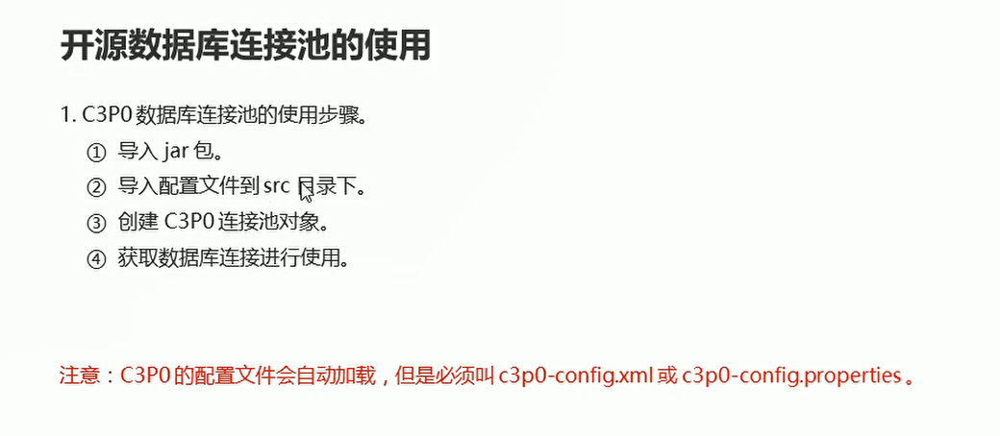
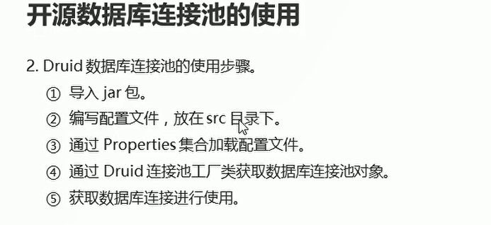

# C3p0连接池和

## C3P0连接池的使用

  

  


```java
package com.itheima03;

import com.mchange.v2.c3p0.ComboPooledDataSource;

import javax.sql.DataSource;
import java.sql.Connection;
import java.sql.PreparedStatement;
import java.sql.ResultSet;
import java.sql.SQLException;

public class C3p0Test {
    public static void main(String[] args) throws SQLException {
        // 创建c3p0的数据库连接池对象
        DataSource dataSource = new ComboPooledDataSource();

        // 通过连接池对象 获取数据库连接
        Connection con = dataSource.getConnection();

        // 执行操作
        String sql = "SELECT * FROM student";

        PreparedStatement preparedStatement = con.prepareStatement(sql);

        // 执行sql语句   接受结果集
        ResultSet resultSet = preparedStatement.executeQuery();
        // 处理结果集 
        while(resultSet.next()){
            System.out.println(resultSet.getInt("sid") + "\t" + resultSet.getString("name") + "\t" + resultSet.getInt("age") + resultSet.getDate("birthday"));
        }

        // 释放资源
        resultSet.close();
        preparedStatement.close();
        con.close();

    }
}


```

## Druid连接池的使用

  

注意：**Druid不会自动加载配置文件，需要手动进行加载，但是文件的名称可以自定义**

```java
package com.itheima03;

import com.alibaba.druid.pool.DruidDataSourceFactory;

import javax.sql.DataSource;
import java.io.IOException;
import java.io.InputStream;
import java.lang.reflect.Proxy;
import java.sql.Connection;
import java.sql.PreparedStatement;
import java.sql.ResultSet;
import java.util.Properties;

public class DRUIDTEST1 {
    public static void main(String[] args) throws Exception {
        // 通过properties集合 加载配置文件
        // 通过Druid连接池工厂类获取数据库连接池对象
        // 通过连接池对象获取数据库连接进行使用

        // 获取配置文件的流对象
        InputStream is = DRUIDTEST1.class.getClassLoader().getResourceAsStream("druid.properties");

        // 通过properties集合 加载配置文件
        Properties prop = new Properties();
        prop.load(is);// 参数是配置文件的输入流对象

        // 通过Druid连接池工厂类获取数据库连接池对象
        DataSource dataSource = DruidDataSourceFactory.createDataSource(prop);

        // 通过连接池对象获取数据库连接进行使用
        Connection con = dataSource.getConnection();

        // 执行操作
        String sql = "SELECT * FROM student";

        PreparedStatement preparedStatement = con.prepareStatement(sql);

        // 执行sql语句   接受结果集
        ResultSet resultSet = preparedStatement.executeQuery();
        // 处理结果集
        while(resultSet.next()){
            System.out.println(resultSet.getInt("sid") + "\t" + resultSet.getString("name") + "\t" + resultSet.getInt("age") + resultSet.getDate("birthday"));
        }

        // 释放资源
        resultSet.close();
        preparedStatement.close();
        con.close();


    }
}


```

## 连接池的工具类

```java
package com.itheima01.utils;

import com.alibaba.druid.pool.DruidDataSourceFactory;

import javax.sql.DataSource;
import java.io.InputStream;
import java.sql.Connection;
import java.sql.ResultSet;
import java.sql.SQLException;
import java.sql.Statement;
import java.util.Properties;

public class DataSourceUtils {
    // 私有构造方法
    private  DataSourceUtils(){}

    // 声明数据源变量
    private static DataSource dataSource;

    // 提供静态代码块  完成配置文件的加载和获取数据库连接池对象
    static {
        try{
            // 加载配置文件
            InputStream is = DataSourceUtils.class.getClassLoader().getResourceAsStream("druid.properties");
            Properties prop = new Properties();
            prop.load(is);// 读取配置文件的参数
            
            // 获取数据库连接池对象
            dataSource = DruidDataSourceFactory.createDataSource(prop);// 传入配置文件的参数 创建连接池对象
        }catch(Exception e){
            e.printStackTrace();
        }
    }

    // 提供一个获取数据库连接的方法
    public static Connection getConnection() throws SQLException {
        Connection con = null;
        con = dataSource.getConnection();
        return con;
    }

    // 提供一个获取数据库连接池对象的方法
    public static DataSource getDataSource(){
        return dataSource;
    }

    // 释放资源
    public void close(Connection con, Statement stat, ResultSet rs) throws SQLException {
        if(con != null){
            con.close();
        }

        if(stat != null){
            stat.close();
        }

        if(rs != null){
            rs.close();
        }
    }
}


```


