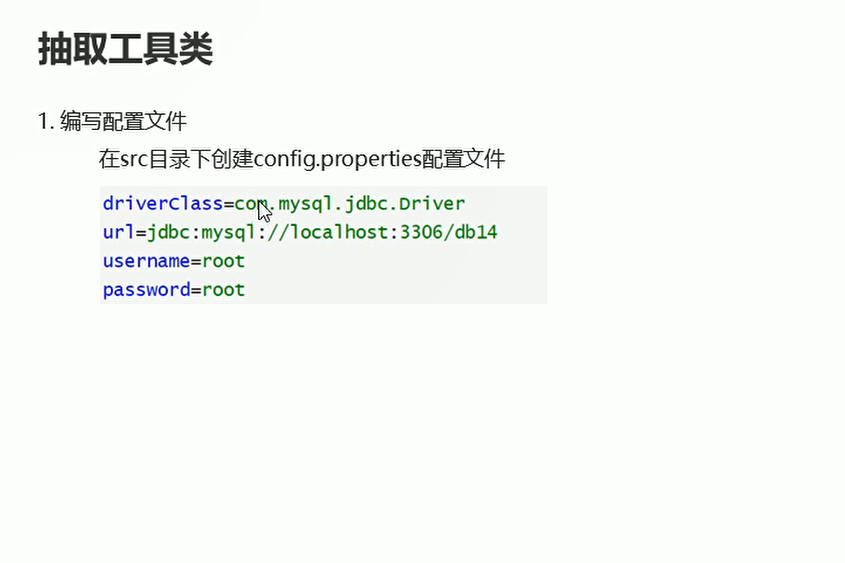

# JDBC工具类

## 创建配置文件

  

```java
driverClass=com.mysql.cj.jdbc.Driver
url=jdbc:mysql://localhost:3306/db11
username=root
password=123456

```


## 编写JDBC的工具类

* 私有空参构造方法
* 声明所需要的配置变量
* 声明连接对象
* 读取配置文件 将需要配置的变量进行赋值  
* 注册驱动
* 提供获取数据库连接的方法
* 释放资源 分为查询和增删改两种重载的方法

```java
package com.itheima01.utils;

import java.io.IOException;
import java.io.InputStream;
import java.sql.*;
import java.util.Properties;

// JDBC的工具类
public class JDBCUtils {
    // 私有构造方法
    private JDBCUtils(){}

    // 声明所需要的配置变量
    private static String driverClass;
    private static String url;
    private static String username;
    private static String password;

    // 声明连接对象
    private static Connection con;

    // 提供静态代码块  读取配置文件的信息为变量进行赋值  注册驱动
    // 静态代码块 在类加载的时候就会执行
    static {
        try {
            InputStream is = JDBCUtils.class.getClassLoader().getResourceAsStream("config.properties");// 读取配置文件的资源
            Properties prop = new Properties();
            prop.load(is);
            driverClass = prop.getProperty("driverClass");
            url = prop.getProperty("url");
            username = prop.getProperty("username");
            password = prop.getProperty("password");

            // 注册驱动
            Class.forName(driverClass);

        } catch (IOException ex) {
            throw new RuntimeException(ex);
        } catch (ClassNotFoundException e) {
            throw new RuntimeException(e);
        }

    }

    // 提供获取数据库连接的方法
    public static  Connection getConnection() throws SQLException {
        con = DriverManager.getConnection(url,username,password);
        return con;
    }

    // 提供释放资源的方法  如果是查询方法 会有结果集对象 但是增删改 没有结果对象
    public static void close(Connection con, Statement stat, ResultSet res) throws SQLException {
        if(con!= null){
            con.close();
        }
        if(stat!= null){
            stat.close();
        }
        if(res != null){
            res.close();
        }
    }

    // 提供重载的方法  增删改 没有结果集对象
    public static void close(Connection con, Statement stat) throws SQLException {
        if(con!= null){
            con.close();
        }
        if(stat!= null){
            stat.close();
        }
    }
}


```


## 优化学生信息管理CRUD的案例

* StudentController
```java
package com.itheima01.controller;

import com.itheima01.domain.Student;
import com.itheima01.service.StudentService;
import com.itheima01.service.StudentServiceImpl;
import org.junit.Test;

import java.sql.SQLException;
import java.util.ArrayList;
import java.util.Date;

public class StudentController {
    private StudentService service = new StudentServiceImpl();

    // 查询所有学生信息
    // 注解 进行测试方法
    @Test
    public void findAll() throws SQLException, ClassNotFoundException {

        // 调用service中的findAllstudent 方法  这个方法返回一个arrayList对象
        ArrayList<Student> list = service.findAll();

        for (Student student : list) {
            System.out.println(student);
        }

    }

    // 条件查询
    public void findById() throws SQLException {
        Student stu = service.findById(3);
        System.out.println(stu);
    }

    // 新增数据
    @Test
    public void insert() throws SQLException {
        Student stu = new Student(10,"周七",27,new Date());
        int insert = service.insert(stu);

        if(insert != 0){
            System.out.println("添加成功");
        }else{
            System.out.println("添加失败");
        }
    }

    // 更新数据
    @Test
    public void update() throws SQLException {
        Student stu = service.findById(5);// 根据id获取对象
        stu.setName("周星星");
        int update = service.update(stu);// 调用service方法  更新数据
        if(update != 0){
            System.out.println("修改成功");
        }else{
            System.out.println("修改失败");
        }
    }

    // 删除数据
    @Test
    public void delete() throws SQLException {
        int delete = service.delete(5);
        if(delete != 0){
            System.out.println("删除成功");
        }else {
            System.out.println("删除失败");
        }
    }
}


```

* StudentDao
```java
package com.itheima01.dao;

import com.itheima01.domain.Student;

import java.sql.SQLException;
import java.util.ArrayList;

// 接口中都是抽象方法
public interface StudentDao {
    // 查询所有的学生信息
    public abstract ArrayList<Student> findAll() throws ClassNotFoundException, SQLException;

    // 条件查询  根据id获取学生信息
    public abstract Student findById(Integer id) throws SQLException;

    // 新增学生信息
    public abstract int insert(Student stu) throws SQLException;

    // 修改学生信息
    public abstract int update(Student stu) throws SQLException;

    // 删除学生信息
    public abstract int delete(Integer id) throws SQLException;
}


```

* StudentDaoImpl
```java
package com.itheima01.dao;

import com.itheima01.domain.Student;
import com.itheima01.utils.JDBCUtils;

import javax.swing.plaf.InsetsUIResource;
import java.sql.*;
import java.text.SimpleDateFormat;
import java.util.ArrayList;

public class StudentDaoImpl implements StudentDao{

    // 实现studentDao接口  重写里面所有的方法
    // 查询所有的学生信息
    @Override
    public ArrayList<Student> findAll() throws ClassNotFoundException, SQLException {
        ArrayList<Student> list = new ArrayList<>();

        Connection con = null;
        Statement statement = null;
        ResultSet resultSet = null;

        try{
            // 注册驱动
            con = JDBCUtils.getConnection();// 获取数据库的连接对象  调用静态方法

            // 获取执行者对象
            statement = con.createStatement();

            // 执行sql语句 接受返回的结果集
            String sql = "SELECT * FROM student";

            // 处理结果集
            resultSet = statement.executeQuery(sql);
            while(resultSet.next()){
                int sid = resultSet.getInt("sid");// 获取学号  返回int类型的数据
                String name = resultSet.getString("name");// 获取姓名 返回String类型的 数据
                int age = resultSet.getInt("age");// 获取年龄
                Date birthday = resultSet.getDate("birthday");// 获取生日
                // 封装成student对象
                Student stu = new Student(sid,name,age,birthday);
                // 将student对象保存到集合中
                list.add(stu);
            }

        }catch (Exception e){
            e.printStackTrace();
        }finally {
            JDBCUtils.close(con,statement,resultSet);
        }

        return list;
    }

    // 根据id进行查询学生信息
    @Override
    public Student findById(Integer id) throws SQLException {

        Student s = new Student();
        Connection con = null;
        Statement statement = null;
        ResultSet resultSet = null;

        try{
           con = JDBCUtils.getConnection();

            // 获取执行者对象
            statement = con.createStatement();

            // 执行sql语句 接受返回的结果集
            String sql = "SELECT * FROM student WHERE sid ='"+id+"'";// 凭借id 转换成String

            // 处理结果集
            resultSet = statement.executeQuery(sql);
            while(resultSet.next()){
                int sid = resultSet.getInt("sid");// 获取学号  返回int类型的数据
                String name = resultSet.getString("name");// 获取姓名 返回String类型的 数据
                int age = resultSet.getInt("age");// 获取年龄
                Date birthday = resultSet.getDate("birthday");// 获取生日
                // 封装成student对象
                s.setAge(age);
                s.setName(name);
                s.setBirthday(birthday);
                s.setSid(sid);
            }

            // 释放资源

        }catch (Exception e){
            e.printStackTrace();
        }finally {
            JDBCUtils.close(con,statement,resultSet);
        }
        return s;
    }

    // 增加数据
    @Override
    public int insert(Student stu) throws SQLException {
        Connection con = null;
        Statement statement = null;
//        ResultSet resultSet = null;
        int result = 0;

        try{
            // 注册驱动
            con = JDBCUtils.getConnection();
            // 获取执行者对象
            statement = con.createStatement();
            // 返回指定格式的字符串
            java.util.Date d = stu.getBirthday();
            SimpleDateFormat sdf = new SimpleDateFormat("yyyy-MM-dd");
            String f = sdf.format(d);// 解析date对象  返回指定的格式字符串
            // 执行sql语句 接受返回的结果集
            String sql = "INSERT INTO student VALUES('"+stu.getSid()+"','"+stu.getName()+"','"+stu.getAge()+"','"+f+"')";// 凭借id 转换成String

            // 处理结果集 执行增删改的sql语句
            result = statement.executeUpdate(sql);// 返回影响行数
        }catch (Exception e){
            e.printStackTrace();
        }finally {
            JDBCUtils.close(con,statement);
        }
        return result;
    }

    // 更新数据
    @Override
    public int update(Student stu) throws SQLException {

        Connection con = null;
        Statement statement = null;
//        ResultSet resultSet = null;
        int result = 0;

        try{
            // 注册驱动
            con = JDBCUtils.getConnection();
            // 获取执行者对象
            statement = con.createStatement();
            // 返回指定格式的字符串
            java.util.Date d = stu.getBirthday();
            SimpleDateFormat sdf = new SimpleDateFormat("yyyy-MM-dd");
            String f = sdf.format(d);// 解析date对象  返回指定的格式字符串

            // 执行sql语句 接受返回的结果集
            String sql = "UPDATE student SET sid = '"+stu.getSid()+"',name='"+stu.getName()+"',age='"+stu.getAge()+"',birthday='"+f+"' WHERE sid = '"+stu.getSid()+"'";// 凭借id 转换成String

            // 处理结果集 执行增删改的sql语句
            result = statement.executeUpdate(sql);// 返回影响行数
        }catch (Exception e){
            e.printStackTrace();
        }finally {
            JDBCUtils.close(con,statement);
        }
        return result;
    }

    // 删除数据
    @Override
    public int delete(Integer id) throws SQLException {
        Connection con = null;
        Statement statement = null;
        int result = 0;
        try{
            // 注册驱动
            con = JDBCUtils.getConnection();
            // 获取执行者对象
            statement = con.createStatement();

            // 执行sql语句 接受返回的结果集
            String sql = "DELETE FROM student WHERE sid = '"+id+"'";// 凭借id 转换成String

            // 处理结果集 执行增删改的sql语句
            result = statement.executeUpdate(sql);// 返回影响行数
        }catch (Exception e){
            e.printStackTrace();
        }finally {
            JDBCUtils.close(con,statement);
        }
        return result;
    }
}


```
* Student

```java
package com.itheima01.domain;

import java.util.Date;

public class Student {

    // 使用包装类进行赋值  避免表中null值没办法进行赋值
    private  Integer sid;
    private String name;
    private Integer age;
    private Date birthday;

    public Student() {
    }

    public Student(Integer sid, String name, Integer age, Date birthday) {
        this.sid = sid;
        this.name = name;
        this.age = age;
        this.birthday = birthday;
    }

    public Integer getSid() {
        return sid;
    }

    public void setSid(Integer sid) {
        this.sid = sid;
    }

    public String getName() {
        return name;
    }

    public void setName(String name) {
        this.name = name;
    }

    public Integer getAge() {
        return age;
    }

    public void setAge(Integer age) {
        this.age = age;
    }

    public Date getBirthday() {
        return birthday;
    }

    public void setBirthday(Date birthday) {
        this.birthday = birthday;
    }

    @Override
    public String toString() {
        return "Student{" +
                "sid=" + sid +
                ", name='" + name + '\'' +
                ", age=" + age +
                ", birthday=" + birthday +
                '}';
    }
}


```

* StudentService

```java
package com.itheima01.service;

import com.itheima01.domain.Student;

import java.sql.SQLException;
import java.util.ArrayList;

public interface StudentService {
    // 查询所有学生信息  返回学生对象集合
    public abstract ArrayList<Student> findAll() throws SQLException, ClassNotFoundException;

    // 条件查询   根据Id获取学生信息
    public abstract Student findById(Integer id) throws SQLException;

    // 新增学生信息
    public abstract int insert(Student stu) throws SQLException;

    // 修改学生信息
    public abstract int update(Student stu) throws SQLException;

    // 删除学生信息
    public abstract int delete(Integer id) throws SQLException;
}


```

* StudentServiceImpl
```java
package com.itheima01.service;

import com.itheima01.dao.StudentDao;
import com.itheima01.dao.StudentDaoImpl;
import com.itheima01.domain.Student;

import java.sql.SQLException;
import java.util.ArrayList;

public class StudentServiceImpl implements StudentService{

    private StudentDao dao = new StudentDaoImpl();
    @Override
    public ArrayList<Student> findAll() throws SQLException, ClassNotFoundException {
        return dao.findAll();
    }

    @Override
    public Student findById(Integer id) throws SQLException {
        return dao.findById(id);
    }

    @Override
    public int insert(Student stu) throws SQLException {
        return dao.insert(stu);// 返回影响的行数
    }

    @Override
    public int update(Student stu) throws SQLException {
        return dao.update(stu);
    }

    @Override
    public int delete(Integer id) throws SQLException {
        return dao.delete(id);
    }
}

```

* JDBCUtils

```java
package com.itheima01.utils;

import java.io.IOException;
import java.io.InputStream;
import java.sql.*;
import java.util.Properties;

// JDBC的工具类
public class JDBCUtils {
    // 私有构造方法
    private JDBCUtils(){}

    // 声明所需要的配置变量
    private static String driverClass;
    private static String url;
    private static String username;
    private static String password;

    // 声明连接对象
    private static Connection con;

    // 提供静态代码块  读取配置文件的信息为变量进行赋值  注册驱动
    // 静态代码块 在类加载的时候就会执行
    static {
        try {
            InputStream is = JDBCUtils.class.getClassLoader().getResourceAsStream("config.properties");// 读取配置文件的资源
            Properties prop = new Properties();
            prop.load(is);
            driverClass = prop.getProperty("driverClass");
            url = prop.getProperty("url");
            username = prop.getProperty("username");
            password = prop.getProperty("password");

            // 注册驱动
            Class.forName(driverClass);

        } catch (IOException ex) {
            throw new RuntimeException(ex);
        } catch (ClassNotFoundException e) {
            throw new RuntimeException(e);
        }

    }

    // 提供获取数据库连接的方法
    public static  Connection getConnection() throws SQLException {
        con = DriverManager.getConnection(url,username,password);
        return con;
    }

    // 提供释放资源的方法  如果是查询方法 会有结果集对象 但是增删改 没有结果对象
    public static void close(Connection con, Statement stat, ResultSet res) throws SQLException {
        if(con!= null){
            con.close();
        }
        if(stat!= null){
            stat.close();
        }
        if(res != null){
            res.close();
        }
    }

    // 提供重载的方法  增删改 没有结果集对象
    public static void close(Connection con, Statement stat) throws SQLException {
        if(con!= null){
            con.close();
        }
        if(stat!= null){
            stat.close();
        }
    }
}


```


