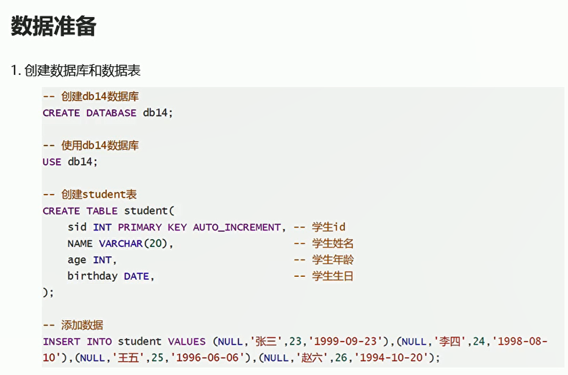

# JDBC快速入门-学生信息的增删改查

## 概述

  

## 快速入门

  

```java
package com.itheima01;

import java.sql.*;

public class JDBC01 {
    public static void main(String[] args) throws ClassNotFoundException, SQLException {
        //  导入jar包  项目文件下面 创建libs文件夹  该jar包 属于mysql的驱动
        // 注意数据库版本和mysql驱动jar包的版本对应关系
        // 注册驱动
        Class.forName("com.mysql.cj.jdbc.Driver");

        // 获取连接  连接数据库  使用localhost 代表本机地址
        Connection con = DriverManager.getConnection("jdbc:mysql://localhost:3306/dbs", "root", "123456");

        // 获取执行者对象
        Statement stat = con.createStatement();

        // 执行sql语句  并且接受结果
        String sql = "SELECT * FROM student";
        ResultSet resultSet = stat.executeQuery(sql);// 执行sql语句 保存结果  返回表中的所有数据

        // 处理结果
        while(resultSet.next()){
            // 打印id name  指定列名下面的数据
            System.out.println(resultSet.getInt("id") + "\t" + resultSet.getString("name"));
        }

        // 释放资源
        // 释放所有的对象资源
        con.close();
        stat.close();
    }
}
```
## JDBC功能类详解

* DriverManager

  

注意：
* 我们不需要通过DriverManager调用静态方法registerDriver(),因为只要Driver类被使用，则会执行其静态代码块完成注册驱动
* mysql5之后可以省略注册驱动的步骤。在jar包中，存在一个java.sql.Driver配置文件，文件中指定了com.mysql.jdbc.Driver

  

* Connection数据库连接对象
  

* statement执行sql语句的对象

  * 执行DML语句：int executeUpdate(String sql)
    返回值int:返回影响的行数
    参数sql:可以执行insert、update\delete语句

  * 执行DQL语句：ResultSet executeQuery(String sql)
    返回值ResultSet；封装查询的结果
    参数sql:可以执行select语句
  * 释放资源：close()

* ResultSet结果集对象
  * 判断结果集中是否还有数据：boolean next();有数据返回true,并将索引向下移动一行，没有数据返回false
  * 获取结果集中的数据：XXX getXXX("列名"); XXX代表数据类型（要获取某一列的数据，这一列的数据类型），比如:String getString("name"),int getInt("age")


## JDBC案例数据准备

  

* 数据准备
  

```sql
-- 创建db11数据库
CREATE DATABASE db11;

-- 使用db11数据库
USE db11;

-- 创建student表
CREATE TABLE student(
	sid INT PRIMARY KEY AUTO_INCREMENT, -- 学生id  id写成null 表示默认自增形式
	NAME VARCHAR(20),    -- 学生姓名
  age INT,-- 学生年龄
  -- 最后一行不要加上逗号
  birthday DATE -- 学生生日
);


-- 添加数据
INSERT INTO student VALUES (NULL,'张三',23,'1222-11-11'),(NULL,'李四',21,'1212-11-11'),(NULL,'王五',24,'1223-11-11'),(NULL,'赵六',29,'1292-11-11');

```

  

**注意：自定义类的功能是为了封装表中每一列数据，成员变量和列类型数据保持一致，所有基本数据类型需要使用对应包装类，以免表中null值没办法进行赋值**

```java
package com.itheima01.domain;

import java.util.Date;

public class Student {

    // 使用包装类进行赋值  避免表中null值没办法进行赋值
    private  Integer sid;
    private String name;
    private Integer age;
    private Date birthday;

    public Student() {
    }

    public Student(Integer sid, String name, Integer age, Date birthday) {
        this.sid = sid;
        this.name = name;
        this.age = age;
        this.birthday = birthday;
    }

    public Integer getSid() {
        return sid;
    }

    public void setSid(Integer sid) {
        this.sid = sid;
    }

    public String getName() {
        return name;
    }

    public void setName(String name) {
        this.name = name;
    }

    public Integer getAge() {
        return age;
    }

    public void setAge(Integer age) {
        this.age = age;
    }

    public Date getBirthday() {
        return birthday;
    }

    public void setBirthday(Date birthday) {
        this.birthday = birthday;
    }

    @Override
    public String toString() {
        return "Student{" +
                "sid=" + sid +
                ", name='" + name + '\'' +
                ", age=" + age +
                ", birthday=" + birthday +
                '}';
    }
}
```

## 查询所有学生信息

* domain

```java
package com.itheima01.domain;

import java.util.Date;

public class Student {

    // 使用包装类进行赋值  避免表中null值没办法进行赋值
    private  Integer sid;
    private String name;
    private Integer age;
    private Date birthday;

    public Student() {
    }

    public Student(Integer sid, String name, Integer age, Date birthday) {
        this.sid = sid;
        this.name = name;
        this.age = age;
        this.birthday = birthday;
    }

    public Integer getSid() {
        return sid;
    }

    public void setSid(Integer sid) {
        this.sid = sid;
    }

    public String getName() {
        return name;
    }

    public void setName(String name) {
        this.name = name;
    }

    public Integer getAge() {
        return age;
    }

    public void setAge(Integer age) {
        this.age = age;
    }

    public Date getBirthday() {
        return birthday;
    }

    public void setBirthday(Date birthday) {
        this.birthday = birthday;
    }

    @Override
    public String toString() {
        return "Student{" +
                "sid=" + sid +
                ", name='" + name + '\'' +
                ", age=" + age +
                ", birthday=" + birthday +
                '}';
    }
}


```

* StudentDao
```java
package com.itheima01.dao;

import com.itheima01.domain.Student;

import java.sql.SQLException;
import java.util.ArrayList;

// 接口中都是抽象方法
public interface StudentDao {
    // 查询所有的学生信息
    public abstract ArrayList<Student> findAll() throws ClassNotFoundException, SQLException;

    // 条件查询  根据id获取学生信息
    public abstract Student findById(Integer id);

    // 新增学生信息
    public abstract int insert(Student stu);

    // 修改学生信息
    public abstract int update(Student stu);

    // 删除学生信息
    public abstract int delete(Integer id);
}


```

* StudentDaoImpl
```java
package com.itheima01.dao;

import com.itheima01.domain.Student;

import javax.swing.plaf.InsetsUIResource;
import java.sql.*;
import java.text.SimpleDateFormat;
import java.util.ArrayList;

public class StudentDaoImpl implements StudentDao{

    // 实现studentDao接口  重写里面所有的方法
    // 查询所有的学生信息
    @Override
    public ArrayList<Student> findAll() throws ClassNotFoundException, SQLException {
        ArrayList<Student> list = new ArrayList<>();

        Connection con = null;
        Statement statement = null;
        ResultSet resultSet = null;

        try{
            // 注册驱动
            Class.forName("com.mysql.cj.jdbc.Driver");// 注册驱动

            // 获取数据库连接
            con = DriverManager.getConnection("jdbc:mysql://localhost:3306/db11", "root", "123456");

            // 获取执行者对象
            statement = con.createStatement();

            // 执行sql语句 接受返回的结果集
            String sql = "SELECT * FROM student";

            // 处理结果集
            resultSet = statement.executeQuery(sql);
            while(resultSet.next()){
                int sid = resultSet.getInt("sid");// 获取学号  返回int类型的数据
                String name = resultSet.getString("name");// 获取姓名 返回String类型的 数据
                int age = resultSet.getInt("age");// 获取年龄
                Date birthday = resultSet.getDate("birthday");// 获取生日
                // 封装成student对象
                Student stu = new Student(sid,name,age,birthday);
                // 将student对象保存到集合中
                list.add(stu);
            }


            // 释放资源

        }catch (Exception e){
            e.printStackTrace();
        }finally {
            if(con != null){
                try{
                    con.close();
                }catch (SQLException e){
                    e.printStackTrace();
                }
            }

            if(statement != null){
                try{
                    statement.close();
                }catch (SQLException e){
                    e.printStackTrace();
                }
            }
            if(resultSet != null){
                try{
                    resultSet.close();
                }catch (SQLException e){
                    e.printStackTrace();
                }
            }
//            statement.close();
//            resultSet.close();
        }

        return list;
    }

    // 根据id进行查询学生信息
    @Override
    public Student findById(Integer id) {

        Student s = new Student();
        Connection con = null;
        Statement statement = null;
        ResultSet resultSet = null;

        try{
            // 注册驱动
            Class.forName("com.mysql.cj.jdbc.Driver");// 注册驱动

            // 获取数据库连接
            con = DriverManager.getConnection("jdbc:mysql://localhost:3306/db11", "root", "123456");

            // 获取执行者对象
            statement = con.createStatement();

            // 执行sql语句 接受返回的结果集
            String sql = "SELECT * FROM student WHERE sid ='"+id+"'";// 凭借id 转换成String

            // 处理结果集
            resultSet = statement.executeQuery(sql);
            while(resultSet.next()){
                int sid = resultSet.getInt("sid");// 获取学号  返回int类型的数据
                String name = resultSet.getString("name");// 获取姓名 返回String类型的 数据
                int age = resultSet.getInt("age");// 获取年龄
                Date birthday = resultSet.getDate("birthday");// 获取生日
                // 封装成student对象
                s.setAge(age);
                s.setName(name);
                s.setBirthday(birthday);
                s.setSid(sid);
            }

            // 释放资源

        }catch (Exception e){
            e.printStackTrace();
        }finally {
            if(con != null){
                try{
                    con.close();
                }catch (SQLException e){
                    e.printStackTrace();
                }
            }

            if(statement != null){
                try{
                    statement.close();
                }catch (SQLException e){
                    e.printStackTrace();
                }
            }
            if(resultSet != null){
                try{
                    resultSet.close();
                }catch (SQLException e){
                    e.printStackTrace();
                }
            }
        }
        return s;
    }

    // 增加数据
    @Override
    public int insert(Student stu) {
        Connection con = null;
        Statement statement = null;
//        ResultSet resultSet = null;
        int result = 0;

        try{
            // 注册驱动
            Class.forName("com.mysql.cj.jdbc.Driver");// 注册驱动
            // 获取数据库连接
            con = DriverManager.getConnection("jdbc:mysql://localhost:3306/db11", "root", "123456");
            // 获取执行者对象
            statement = con.createStatement();

            // 返回指定格式的字符串
            java.util.Date d = stu.getBirthday();
            SimpleDateFormat sdf = new SimpleDateFormat("yyyy-MM-dd");
            String f = sdf.format(d);// 解析date对象  返回指定的格式字符串

            // 执行sql语句 接受返回的结果集
            String sql = "INSERT INTO student VALUES('"+stu.getSid()+"','"+stu.getName()+"','"+stu.getAge()+"','"+f+"')";// 凭借id 转换成String

            // 处理结果集 执行增删改的sql语句
            result = statement.executeUpdate(sql);// 返回影响行数


        }catch (Exception e){
            e.printStackTrace();
        }finally {
            if(con != null){
                try{
                    con.close();
                }catch (SQLException e){
                    e.printStackTrace();
                }
            }

            if(statement != null){
                try{
                    statement.close();
                }catch (SQLException e){
                    e.printStackTrace();
                }
            }
        }
        return result;
    }

    // 更新数据
    @Override
    public int update(Student stu) {

        Connection con = null;
        Statement statement = null;
//        ResultSet resultSet = null;
        int result = 0;

        try{
            // 注册驱动
            Class.forName("com.mysql.cj.jdbc.Driver");// 注册驱动
            // 获取数据库连接
            con = DriverManager.getConnection("jdbc:mysql://localhost:3306/db11", "root", "123456");
            // 获取执行者对象
            statement = con.createStatement();

            // 返回指定格式的字符串
            java.util.Date d = stu.getBirthday();
            SimpleDateFormat sdf = new SimpleDateFormat("yyyy-MM-dd");
            String f = sdf.format(d);// 解析date对象  返回指定的格式字符串

            // 执行sql语句 接受返回的结果集
            String sql = "UPDATE student SET sid = '"+stu.getSid()+"',name='"+stu.getName()+"',age='"+stu.getAge()+"',birthday='"+f+"' WHERE sid = '"+stu.getSid()+"'";// 凭借id 转换成String

            // 处理结果集 执行增删改的sql语句
            result = statement.executeUpdate(sql);// 返回影响行数
        }catch (Exception e){
            e.printStackTrace();
        }finally {
            if(con != null){
                try{
                    con.close();
                }catch (SQLException e){
                    e.printStackTrace();
                }
            }

            if(statement != null){
                try{
                    statement.close();
                }catch (SQLException e){
                    e.printStackTrace();
                }
            }
        }
        return result;

    }

    // 删除数据
    @Override
    public int delete(Integer id) {
        Connection con = null;
        Statement statement = null;
        int result = 0;
        try{
            // 注册驱动
            Class.forName("com.mysql.cj.jdbc.Driver");// 注册驱动
            // 获取数据库连接
            con = DriverManager.getConnection("jdbc:mysql://localhost:3306/db11", "root", "123456");
            // 获取执行者对象
            statement = con.createStatement();

            // 执行sql语句 接受返回的结果集
            String sql = "DELETE FROM student WHERE sid = '"+id+"'";// 凭借id 转换成String

            // 处理结果集 执行增删改的sql语句
            result = statement.executeUpdate(sql);// 返回影响行数
        }catch (Exception e){
            e.printStackTrace();
        }finally {
            if(con != null){
                try{
                    con.close();
                }catch (SQLException e){
                    e.printStackTrace();
                }
            }

            if(statement != null){
                try{
                    statement.close();
                }catch (SQLException e){
                    e.printStackTrace();
                }
            }
        }
        return result;
    }
}


```

* StudentService
```java
package com.itheima01.service;

import com.itheima01.domain.Student;

import java.sql.SQLException;
import java.util.ArrayList;

public interface StudentService {
    // 查询所有学生信息  返回学生对象集合
    public abstract ArrayList<Student> findAll() throws SQLException, ClassNotFoundException;

    // 条件查询   根据Id获取学生信息
    public abstract Student findById(Integer id);

    // 新增学生信息
    public abstract int insert(Student stu);

    // 修改学生信息
    public abstract int update(Student stu);

    // 删除学生信息
    public abstract int delete(Integer id);
}

```


* StudentServiceImpl
```java
package com.itheima01.service;

import com.itheima01.dao.StudentDao;
import com.itheima01.dao.StudentDaoImpl;
import com.itheima01.domain.Student;

import java.sql.SQLException;
import java.util.ArrayList;

public class StudentServiceImpl implements StudentService{

    private StudentDao dao = new StudentDaoImpl();
    @Override
    public ArrayList<Student> findAll() throws SQLException, ClassNotFoundException {
        return dao.findAll();
    }

    @Override
    public Student findById(Integer id) {
        return dao.findById(id);
    }

    @Override
    public int insert(Student stu) {
        return dao.insert(stu);// 返回影响的行数
    }

    @Override
    public int update(Student stu) {
        return dao.update(stu);
    }

    @Override
    public int delete(Integer id) {
        return dao.delete(id);
    }
}


```


* StudentController
```java
package com.itheima01.controller;

import com.itheima01.domain.Student;
import com.itheima01.service.StudentService;
import com.itheima01.service.StudentServiceImpl;
import org.junit.Test;

import java.sql.SQLException;
import java.util.ArrayList;
import java.util.Date;

public class StudentController {
    private StudentService service = new StudentServiceImpl();

    // 查询所有学生信息
    // 注解 进行测试方法
    @Test
    public void findAll() throws SQLException, ClassNotFoundException {

        // 调用service中的findAllstudent 方法  这个方法返回一个arrayList对象
        ArrayList<Student> list = service.findAll();

        for (Student student : list) {
            System.out.println(student);
        }

    }

    // 条件查询
    public void findById(){
        Student stu = service.findById(3);
        System.out.println(stu);
    }

    // 新增数据
    @Test
    public void insert(){
        Student stu = new Student(10,"周七",27,new Date());
        int insert = service.insert(stu);

        if(insert != 0){
            System.out.println("添加成功");
        }else{
            System.out.println("添加失败");
        }
    }

    // 更新数据
    @Test
    public void update(){
        Student stu = service.findById(5);// 根据id获取对象
        stu.setName("周星星");
        int update = service.update(stu);// 调用service方法  更新数据
        if(update != 0){
            System.out.println("修改成功");
        }else{
            System.out.println("修改失败");
        }
    }

    // 删除数据
    @Test
    public void delete(){
        int delete = service.delete(5);
        if(delete != 0){
            System.out.println("删除成功");
        }else {
            System.out.println("删除失败");
        }
    }
}


```

