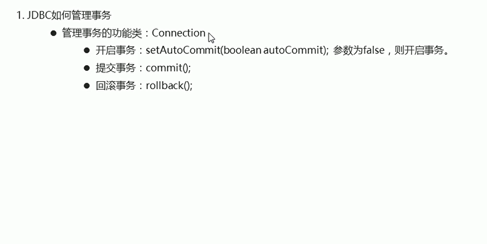

# jdbc管理事务

## 概述

  


## 演示案例-批量添加数据并且在业务层管理事务

```java
    public void batchAdd(List<User> users) throws SQLException {
        // 获取数据库连接对象
        Connection con = JDBCUtils.getConnection();

        try{
            // 开启事务机制
            con.setAutoCommit(false);

            for(User user:users){
                // 创建ID 并把UUID中的-替换
                String uid = UUID.randomUUID().toString().replace("-","").toUpperCase();
                //给User的uid进行赋值
                user.setUid(uid);

                // 出现异常
                int n = 1 / 0;// 出现事务  需要进行回滚事务的操作  放到catch中

                // 保存
                // 生成员工编号
                userDao.save(con,user);
            }


            // 提交事务
            con.commit();


        }catch (Exception e){

            con.rollback();// 回滚事务
            e.printStackTrace();
        }

    }

```


