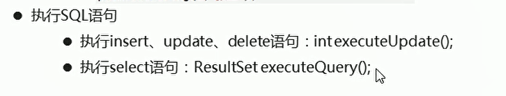

# SQL注入攻击

## 概述

* 就是利用sql语句的漏洞对系统进行攻击

## 原理

* 按照正常道理来说，我们在密码处输入的所有内容，都应该认为是密码的组成
* 但是现在statement对象在执行sql语句的时候，将密码的一部分内容当作查询条件来执行了

## 解决

* 使用PreparedStatement预编译执行者对象
  * 在执行sql语句之前，将sql语句进行提前编译。明确sql语句的格式之后，就不会改变了。剩余的内容都会认为是参数
  * SQL语句中的参数使用？作为占位符
* 为？占位符赋值的方法：setXXX(参数1，参数2)
  * XXX代表：数据类型
  * 参数一：？ 的位置编号
  * 参数二：？的实际参数

  

  

```java
  String loginName = null;
            String password = null;
            con = JDBCUtils.getConnection();
            
            // 执行sql语句 接受返回的结果集
            String sql = "SELECT * FROM user WHERE loginname = ? AND password=?";// 凭借id 转换成String
            
            // 获取操作对象 执行sql语句  获取结果集
            PreparedStatement preparedStatement = con.prepareStatement(sql);

            // 填充指定位置的参数
            preparedStatement.setString(1,loginName);
            preparedStatement.setString(2,password);

            ResultSet resultSet1 = preparedStatement.executeQuery();// 获取结果集

```
