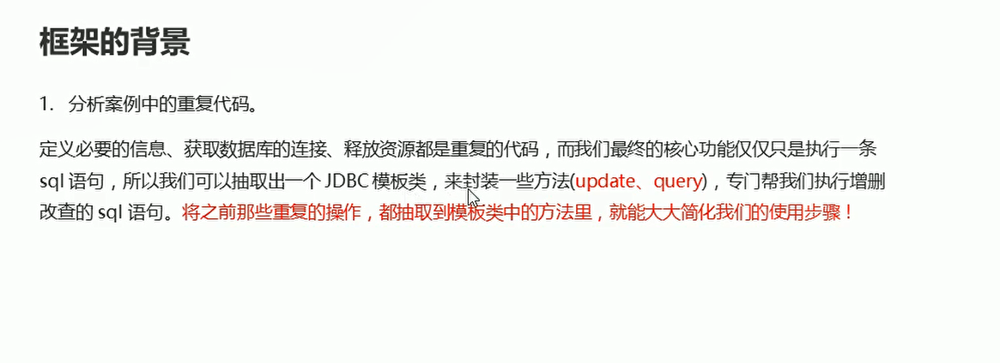
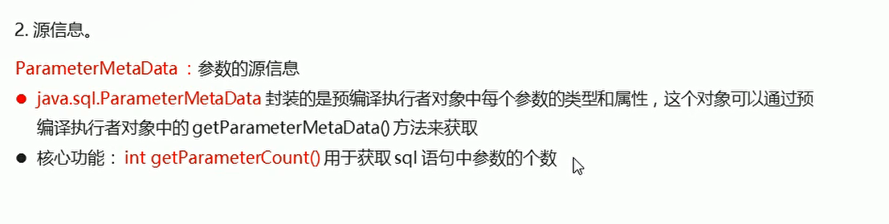
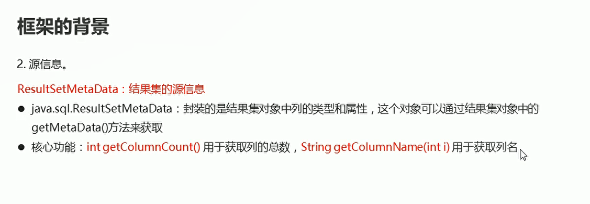

# 自定义JDBC框架

## 框架背景

  


## 数据库的源信息

* DataBaseMetaData:数据库的源信息
* java.sql.DataBaseMetaData封装了整个数据库的综合信息
* String getDatabaseProductName(): 获取数据库产品的名称
* int getDatabaseProductVersion():获取数据库产品的版本号

  


  


## Update方法的实现-执行增删改功能

```java
    public int update(String sql,Object...objs) throws SQLException {
        // 定义一个int类型的变量  用于接受增删改之后影响的行数
        int result = 0;
        
        // 通过连接池获取一个数据库连接
        Connection con = dataSource.getConnection();

        // 通过数据库连接对象获取执行者对象 并且对sql语句进行预编译
        PreparedStatement preparedStatement = con.prepareStatement(sql);

        // 通过执行者对象获取参数的源信息对象
        ParameterMetaData parameterMetaData = preparedStatement.getParameterMetaData();

        // 通过参数辕信息对象获取参数的个数
        int parameterCount = parameterMetaData.getParameterCount();

        // 判断参数数量是否一致
        if(parameterCount != objs.length){
            throw new RuntimeException("参数个数不匹配");
        }

        // 为sql语句占位符进行赋值
        for(int i = 0; i < objs.length; i++){
            preparedStatement.setObject(i + 1,objs[i]);
        }
        
        // 执行sql语句并且接受结果
        result = pst.executeUpdate();

        // 释放资源
        DataSourceUtils.close(con,preparedStatement);

        return result;
    }
```


