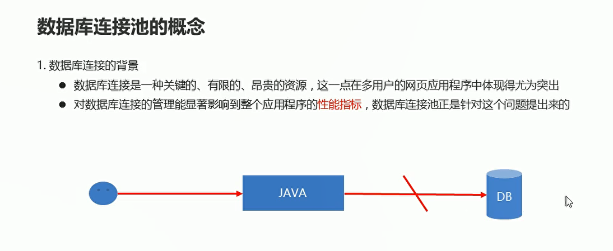
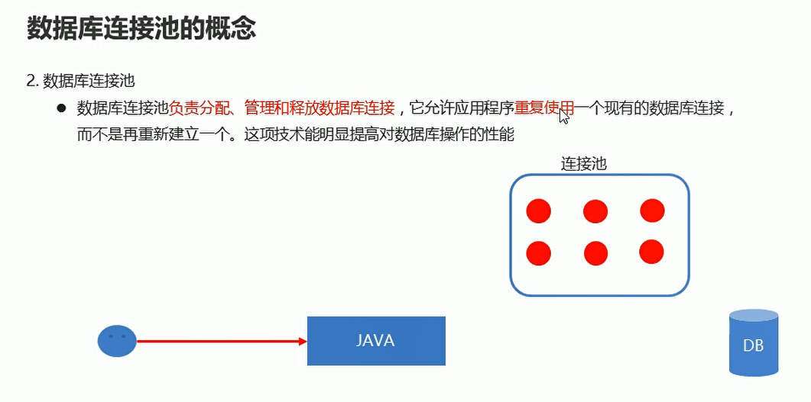
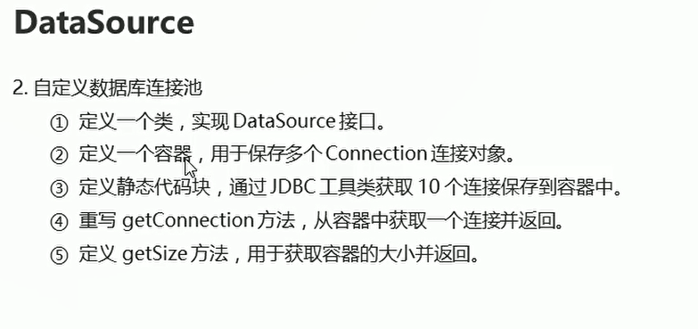
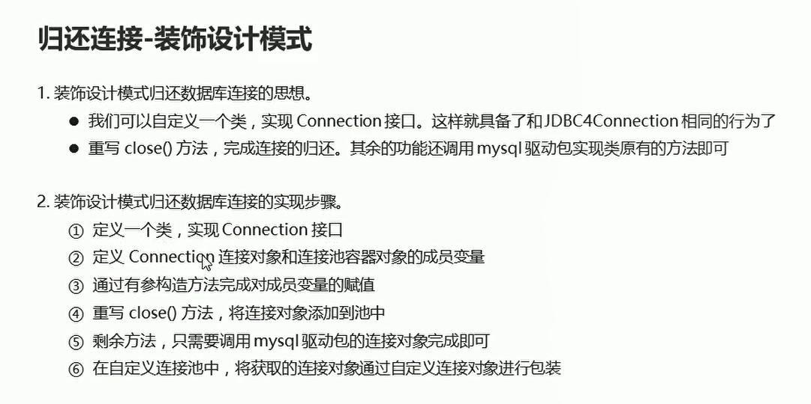
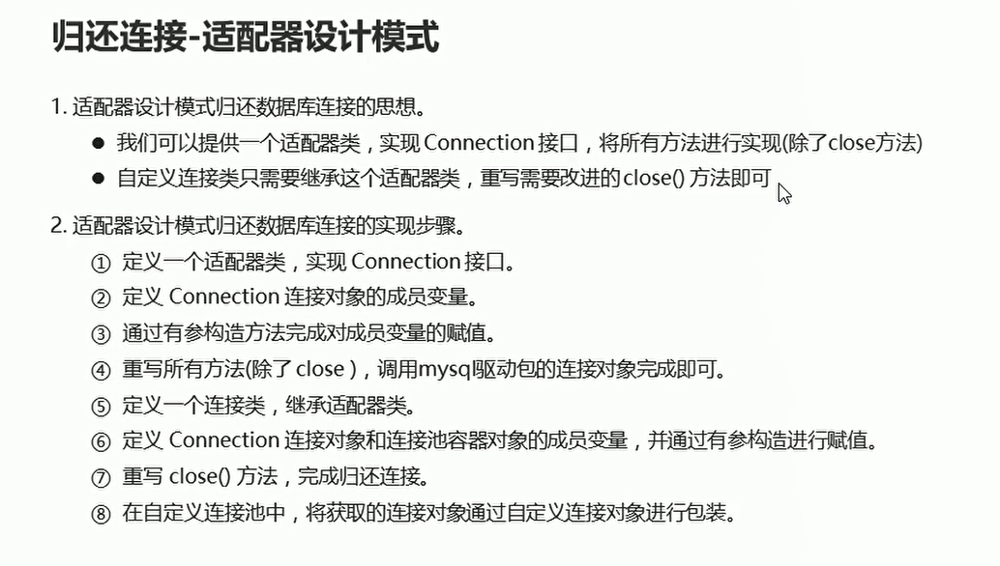
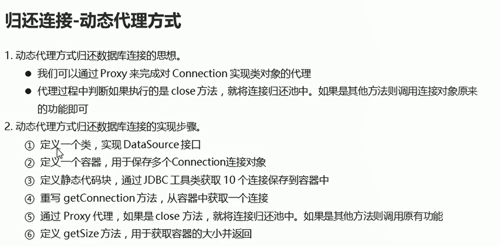

# 连接池

## 概述

  


  

## 自定义数据库连接池

* DataSource接口概述
  * javax.sql.DataSource接口：数据源（数据库连接池） Java官方提供的数据库连接池规范
  * 如果像完成数据库连接池技术，就必须实现dataSource接口
  * 核心功能：获取数据库连接对象：connection getConnection()

  

连接池接口的实现

```java
package com.itheima01;
import com.itheima01.utils.JDBCUtils;
import javax.sql.DataSource;
import java.io.PrintWriter;
import java.sql.Connection;
import java.sql.SQLException;
import java.sql.SQLFeatureNotSupportedException;
import java.util.ArrayList;
import java.util.Collections;
import java.util.List;
import java.util.logging.Logger;

public class MyDataSource implements DataSource {

    // 从连接池中获取一个连接对象

    // 准备容器 用于保存多个连接对象  将对象设置为线程安全的对象
    private  static List<Connection> pool = Collections.synchronizedList(new ArrayList<>());// 将arrayList变成线程安全的对象

    // 定义静态代码块  通过工具类获取10个连接对象 类加载的时候 就执行该静态代码块
    static {
        for(int i = 1; i <= 10; i++){
            try {
                Connection con = JDBCUtils.getConnection();
                pool.add(con);// 将连接对象添加到连接池中
            } catch (SQLException e) {
                throw new RuntimeException(e);
            }
        }
    }

//    重写getConnection 用于获取一个连接对象
    @Override
    public Connection getConnection() throws SQLException {
        // 只要池子中还有对象  返回0索引的对象
        if(pool.size() > 0){
            Connection con = pool.remove(0);// 移除一个元素  返回该连接对象
            return con;
        }else{
            throw new RuntimeException("连接数量已经用尽");
        }
    }

    // 定义getSize方法  获取连接池容器的大小
    public int getSize(){
        return pool.size();
    }

    @Override
    public Connection getConnection(String username, String password) throws SQLException {
        return null;
    }

    @Override
    public PrintWriter getLogWriter() throws SQLException {
        return null;
    }

    @Override
    public void setLogWriter(PrintWriter out) throws SQLException {

    }

    @Override
    public void setLoginTimeout(int seconds) throws SQLException {

    }

    @Override
    public int getLoginTimeout() throws SQLException {
        return 0;
    }

    @Override
    public Logger getParentLogger() throws SQLFeatureNotSupportedException {
        return null;
    }

    @Override
    public <T> T unwrap(Class<T> iface) throws SQLException {
        return null;
    }

    @Override
    public boolean isWrapperFor(Class<?> iface) throws SQLException {
        return false;
    }
}


```

连接池接口的测试

```java
package com.itheima01;

import java.sql.Connection;
import java.sql.PreparedStatement;
import java.sql.ResultSet;
import java.sql.SQLException;

public class MyDataSourceTest {
    public static void main(String[] args) throws SQLException {
        // 创建连接池对象
        MyDataSource m = new MyDataSource();

        // 使用之前的数量
        System.out.println("使用之前的数量：" + m.getSize());

        // 通过连接池对象 获取对象
        Connection con = m.getConnection();

        // 查询学生表的全部信息
        String sql = "SELECT * FROM student";

        // 创建执行者对象 防止SQL攻击
        PreparedStatement preparedStatement = con.prepareStatement(sql);

        // 执行sql语句 接收结果集
        ResultSet resultSet = preparedStatement.executeQuery();

        // 处理结果集
        while(resultSet.next()){
            // 打印学生信息
            System.out.println(resultSet.getInt("sid") + "\t" + resultSet.getString("name") + "\t" + resultSet.getInt("age") + "\t" + resultSet.getDate("birthday"));
        }

        // 释放资源
        con.close();
        preparedStatement.close();
        resultSet.close();

        // 使用之后的连接池对象数量
        System.out.println("使用之后的连接池的数量：" + m.getSize());
    }
}
```

## 归还连接-装饰设计模式

  

* 自定义连接对象

```java
package com.itheima01;
import java.sql.*;
import java.util.List;
import java.util.Map;
import java.util.Properties;
import java.util.concurrent.Executor;

// 定义一个类 实现Connection接口
// 定义连接对象和连接池容器对象的成员变量
// 通过有参构造方法为成员变量进行赋值
// 重写close方法 完成归还连接
// 剩余方法 还是调用原有的连接对象中的功能即可
public class MyConnection1 implements Connection {

    // 定义连接对象和连接池容器对象的成员变量
    private Connection con;// 连接对象
    private List<Connection> pool;// 连接池对象

    // 通过有参构造方法为成员变量进行赋值
    public MyConnection1(Connection con,List<Connection> pool){
        this.con = con;
        this.pool = pool;
    }

    // 重写close方法  完成归还连接
    @Override
    public void close(){
        pool.add(con);// 将连接对象添加到连接池中
    }

    // 剩余方法 还是调用原来的的连接对象中的功能即可

    @Override
    public Statement createStatement() throws SQLException {
        return con.createStatement();
    }

    @Override
    public PreparedStatement prepareStatement(String sql) throws SQLException {
        return con.prepareStatement(sql);
    }

    @Override
    public CallableStatement prepareCall(String sql) throws SQLException {
        return con.prepareCall(sql);
    }

    @Override
    public String nativeSQL(String sql) throws SQLException {
        return con.nativeSQL(sql);
    }

    @Override
    public void setAutoCommit(boolean autoCommit) throws SQLException {
        con.setAutoCommit(autoCommit);
    }

    @Override
    public boolean getAutoCommit() throws SQLException {
        return con.getAutoCommit();
    }

    @Override
    public void commit() throws SQLException {
        con.commit();
    }

    @Override
    public void rollback() throws SQLException {
        con.rollback();
    }

    @Override
    public boolean isClosed() throws SQLException {
        return con.isClosed();
    }

    @Override
    public DatabaseMetaData getMetaData() throws SQLException {
        return con.getMetaData();
    }

    @Override
    public void setReadOnly(boolean readOnly) throws SQLException {
        con.setReadOnly(readOnly);
    }

    @Override
    public boolean isReadOnly() throws SQLException {
        return con.isReadOnly();
    }

    @Override
    public void setCatalog(String catalog) throws SQLException {
        con.setCatalog(catalog);
    }

    @Override
    public String getCatalog() throws SQLException {
        return con.getCatalog();
    }

    @Override
    public void setTransactionIsolation(int level) throws SQLException {
        con.setTransactionIsolation(level);
    }

    @Override
    public int getTransactionIsolation() throws SQLException {
        return con.getTransactionIsolation();
    }

    @Override
    public SQLWarning getWarnings() throws SQLException {
        return con.getWarnings();
    }

    @Override
    public void clearWarnings() throws SQLException {
        con.clearWarnings();
    }

    @Override
    public Statement createStatement(int resultSetType, int resultSetConcurrency) throws SQLException {
        return con.createStatement(resultSetType,resultSetConcurrency);
    }

    @Override
    public PreparedStatement prepareStatement(String sql, int resultSetType, int resultSetConcurrency) throws SQLException {
        return con.prepareStatement(sql,resultSetType,resultSetConcurrency);
    }

    @Override
    public CallableStatement prepareCall(String sql, int resultSetType, int resultSetConcurrency) throws SQLException {
        return con.prepareCall(sql,resultSetType,resultSetConcurrency);
    }

    @Override
    public Map<String, Class<?>> getTypeMap() throws SQLException {
        return con.getTypeMap();
    }

    @Override
    public void setTypeMap(Map<String, Class<?>> map) throws SQLException {
        con.setTypeMap(map);
    }

    @Override
    public void setHoldability(int holdability) throws SQLException {
        con.setHoldability(holdability);
    }

    @Override
    public int getHoldability() throws SQLException {
        return con.getHoldability();
    }

    @Override
    public Savepoint setSavepoint() throws SQLException {
        return con.setSavepoint();
    }

    @Override
    public Savepoint setSavepoint(String name) throws SQLException {
        return con.setSavepoint(name);
    }

    @Override
    public void rollback(Savepoint savepoint) throws SQLException {
        con.rollback(savepoint);
    }

    @Override
    public void releaseSavepoint(Savepoint savepoint) throws SQLException {
        con.releaseSavepoint(savepoint);
    }

    @Override
    public Statement createStatement(int resultSetType, int resultSetConcurrency, int resultSetHoldability) throws SQLException {
        return con.createStatement(resultSetType,resultSetConcurrency,resultSetHoldability);
    }

    @Override
    public PreparedStatement prepareStatement(String sql, int resultSetType, int resultSetConcurrency, int resultSetHoldability) throws SQLException {
        return con.prepareStatement(sql,resultSetType,resultSetConcurrency,resultSetHoldability);
    }

    @Override
    public CallableStatement prepareCall(String sql, int resultSetType, int resultSetConcurrency, int resultSetHoldability) throws SQLException {
        return con.prepareCall(sql,resultSetType,resultSetConcurrency,resultSetHoldability);
    }

    @Override
    public PreparedStatement prepareStatement(String sql, int autoGeneratedKeys) throws SQLException {
        return con.prepareStatement(sql,autoGeneratedKeys);
    }

    @Override
    public PreparedStatement prepareStatement(String sql, int[] columnIndexes) throws SQLException {
        return con.prepareStatement(sql,columnIndexes);
    }

    @Override
    public PreparedStatement prepareStatement(String sql, String[] columnNames) throws SQLException {
        return con.prepareStatement(sql,columnNames);
    }

    @Override
    public Clob createClob() throws SQLException {
        return con.createClob();
    }

    @Override
    public Blob createBlob() throws SQLException {
        return con.createBlob();
    }

    @Override
    public NClob createNClob() throws SQLException {
        return con.createNClob();
    }

    @Override
    public SQLXML createSQLXML() throws SQLException {
        return con.createSQLXML();
    }

    @Override
    public boolean isValid(int timeout) throws SQLException {
        return con.isValid(timeout);
    }

    @Override
    public void setClientInfo(String name, String value) throws SQLClientInfoException {
        con.setClientInfo(name,value);
    }

    @Override
    public void setClientInfo(Properties properties) throws SQLClientInfoException {
        con.setClientInfo(properties);
    }

    @Override
    public String getClientInfo(String name) throws SQLException {
        return con.getClientInfo(name);
    }

    @Override
    public Properties getClientInfo() throws SQLException {
        return con.getClientInfo();
    }

    @Override
    public Array createArrayOf(String typeName, Object[] elements) throws SQLException {
        return con.createArrayOf(typeName,elements);
    }

    @Override
    public Struct createStruct(String typeName, Object[] attributes) throws SQLException {
        return con.createStruct(typeName,attributes);
    }

    @Override
    public void setSchema(String schema) throws SQLException {
        con.setSchema(schema);
    }

    @Override
    public String getSchema() throws SQLException {
        return con.getSchema();
    }

    @Override
    public void abort(Executor executor) throws SQLException {
        con.abort(executor);
    }

    @Override
    public void setNetworkTimeout(Executor executor, int milliseconds) throws SQLException {
        con.setNetworkTimeout(executor,milliseconds);
    }

    @Override
    public int getNetworkTimeout() throws SQLException {
        return con.getNetworkTimeout();
    }

    @Override
    public <T> T unwrap(Class<T> iface) throws SQLException {
        return con.unwrap(iface);
    }

    @Override
    public boolean isWrapperFor(Class<?> iface) throws SQLException {
        return con.isWrapperFor(iface);
    }
}


```

* 自定义DataSource
```java
package com.itheima01;
import com.itheima01.utils.JDBCUtils;
import javax.sql.DataSource;
import java.io.PrintWriter;
import java.sql.Connection;
import java.sql.SQLException;
import java.sql.SQLFeatureNotSupportedException;
import java.util.ArrayList;
import java.util.Collections;
import java.util.List;
import java.util.logging.Logger;

public class MyDataSource implements DataSource {

    // 从连接池中获取一个连接对象

    // 准备容器 用于保存多个连接对象  将对象设置为线程安全的对象
    private  static List<Connection> pool = Collections.synchronizedList(new ArrayList<>());// 将arrayList变成线程安全的对象

    // 定义静态代码块  通过工具类获取10个连接对象 类加载的时候 就执行该静态代码块
    static {
        for(int i = 1; i <= 10; i++){
            try {
                Connection con = JDBCUtils.getConnection();
                pool.add(con);// 将连接对象添加到连接池中
            } catch (SQLException e) {
                throw new RuntimeException(e);
            }
        }
    }

//    重写getConnection 用于获取一个连接对象
    @Override
    public Connection getConnection() throws SQLException {
        // 只要池子中还有对象  返回0索引的对象
        if(pool.size() > 0){
            Connection con = pool.remove(0);// 移除一个元素  返回该连接对象

            // 创建自定义连接对象  对原有的连接对象进行包装  主要是为了使用归还资源的方法
            MyConnection1 myCon = new MyConnection1(con,pool);

            return myCon;
        }else{
            throw new RuntimeException("连接数量已经用尽");
        }
    }

    // 定义getSize方法  获取连接池容器的大小
    public int getSize(){
        return pool.size();
    }

    @Override
    public Connection getConnection(String username, String password) throws SQLException {
        return null;
    }

    @Override
    public PrintWriter getLogWriter() throws SQLException {
        return null;
    }

    @Override
    public void setLogWriter(PrintWriter out) throws SQLException {

    }

    @Override
    public void setLoginTimeout(int seconds) throws SQLException {

    }

    @Override
    public int getLoginTimeout() throws SQLException {
        return 0;
    }

    @Override
    public Logger getParentLogger() throws SQLFeatureNotSupportedException {
        return null;
    }

    @Override
    public <T> T unwrap(Class<T> iface) throws SQLException {
        return null;
    }

    @Override
    public boolean isWrapperFor(Class<?> iface) throws SQLException {
        return false;
    }
}

```

## 归还连接-适配器设计模式

  


* MyAdapter
```java
package com.itheima01;

import java.sql.*;
import java.util.Map;
import java.util.Properties;
import java.util.concurrent.Executor;

// 定义一个适配器类 实现connection接口  没有重写close方法
// 抽象类 既可以有普通方法 抽象方法 也可以有构造方法 私有成员变量
public abstract class MyAdapter implements Connection {
    // 定义连接对象的成员变量
    private Connection con;

    // 通过有参构造为变量进行赋值
    public MyAdapter(Connection con){
        this.con = con;
    }

    @Override
    public Statement createStatement() throws SQLException {
        return con.createStatement();
    }

    @Override
    public PreparedStatement prepareStatement(String sql) throws SQLException {
        return con.prepareStatement(sql);
    }

    @Override
    public CallableStatement prepareCall(String sql) throws SQLException {
        return con.prepareCall(sql);
    }

    @Override
    public String nativeSQL(String sql) throws SQLException {
        return con.nativeSQL(sql);
    }

    @Override
    public void setAutoCommit(boolean autoCommit) throws SQLException {
        con.setAutoCommit(autoCommit);
    }

    @Override
    public boolean getAutoCommit() throws SQLException {
        return con.getAutoCommit();
    }

    @Override
    public void commit() throws SQLException {
        con.commit();
    }

    @Override
    public void rollback() throws SQLException {
        con.rollback();
    }

    @Override
    public boolean isClosed() throws SQLException {
        return con.isClosed();
    }

    @Override
    public DatabaseMetaData getMetaData() throws SQLException {
        return con.getMetaData();
    }

    @Override
    public void setReadOnly(boolean readOnly) throws SQLException {
        con.setReadOnly(readOnly);
    }

    @Override
    public boolean isReadOnly() throws SQLException {
        return con.isReadOnly();
    }

    @Override
    public void setCatalog(String catalog) throws SQLException {
        con.setCatalog(catalog);
    }

    @Override
    public String getCatalog() throws SQLException {
        return con.getCatalog();
    }

    @Override
    public void setTransactionIsolation(int level) throws SQLException {
        con.setTransactionIsolation(level);
    }

    @Override
    public int getTransactionIsolation() throws SQLException {
        return con.getTransactionIsolation();
    }

    @Override
    public SQLWarning getWarnings() throws SQLException {
        return con.getWarnings();
    }

    @Override
    public void clearWarnings() throws SQLException {
        con.clearWarnings();
    }

    @Override
    public Statement createStatement(int resultSetType, int resultSetConcurrency) throws SQLException {
        return con.createStatement(resultSetType,resultSetConcurrency);
    }

    @Override
    public PreparedStatement prepareStatement(String sql, int resultSetType, int resultSetConcurrency) throws SQLException {
        return con.prepareStatement(sql,resultSetType,resultSetConcurrency);
    }

    @Override
    public CallableStatement prepareCall(String sql, int resultSetType, int resultSetConcurrency) throws SQLException {
        return con.prepareCall(sql,resultSetType,resultSetConcurrency);
    }

    @Override
    public Map<String, Class<?>> getTypeMap() throws SQLException {
        return con.getTypeMap();
    }

    @Override
    public void setTypeMap(Map<String, Class<?>> map) throws SQLException {
        con.setTypeMap(map);
    }

    @Override
    public void setHoldability(int holdability) throws SQLException {
        con.setHoldability(holdability);
    }

    @Override
    public int getHoldability() throws SQLException {
        return con.getHoldability();
    }

    @Override
    public Savepoint setSavepoint() throws SQLException {
        return con.setSavepoint();
    }

    @Override
    public Savepoint setSavepoint(String name) throws SQLException {
        return con.setSavepoint(name);
    }

    @Override
    public void rollback(Savepoint savepoint) throws SQLException {
        con.rollback(savepoint);
    }

    @Override
    public void releaseSavepoint(Savepoint savepoint) throws SQLException {
        con.releaseSavepoint(savepoint);
    }

    @Override
    public Statement createStatement(int resultSetType, int resultSetConcurrency, int resultSetHoldability) throws SQLException {
        return con.createStatement(resultSetType,resultSetConcurrency,resultSetHoldability);
    }

    @Override
    public PreparedStatement prepareStatement(String sql, int resultSetType, int resultSetConcurrency, int resultSetHoldability) throws SQLException {
        return con.prepareStatement(sql,resultSetType,resultSetConcurrency,resultSetHoldability);
    }

    @Override
    public CallableStatement prepareCall(String sql, int resultSetType, int resultSetConcurrency, int resultSetHoldability) throws SQLException {
        return con.prepareCall(sql,resultSetType,resultSetConcurrency,resultSetHoldability);
    }

    @Override
    public PreparedStatement prepareStatement(String sql, int autoGeneratedKeys) throws SQLException {
        return con.prepareStatement(sql,autoGeneratedKeys);
    }

    @Override
    public PreparedStatement prepareStatement(String sql, int[] columnIndexes) throws SQLException {
        return con.prepareStatement(sql,columnIndexes);
    }

    @Override
    public PreparedStatement prepareStatement(String sql, String[] columnNames) throws SQLException {
        return con.prepareStatement(sql,columnNames);
    }

    @Override
    public Clob createClob() throws SQLException {
        return con.createClob();
    }

    @Override
    public Blob createBlob() throws SQLException {
        return con.createBlob();
    }

    @Override
    public NClob createNClob() throws SQLException {
        return con.createNClob();
    }

    @Override
    public SQLXML createSQLXML() throws SQLException {
        return con.createSQLXML();
    }

    @Override
    public boolean isValid(int timeout) throws SQLException {
        return con.isValid(timeout);
    }

    @Override
    public void setClientInfo(String name, String value) throws SQLClientInfoException {
        con.setClientInfo(name,value);
    }

    @Override
    public void setClientInfo(Properties properties) throws SQLClientInfoException {
        con.setClientInfo(properties);
    }

    @Override
    public String getClientInfo(String name) throws SQLException {
        return con.getClientInfo(name);
    }

    @Override
    public Properties getClientInfo() throws SQLException {
        return con.getClientInfo();
    }

    @Override
    public Array createArrayOf(String typeName, Object[] elements) throws SQLException {
        return con.createArrayOf(typeName,elements);
    }

    @Override
    public Struct createStruct(String typeName, Object[] attributes) throws SQLException {
        return con.createStruct(typeName,attributes);
    }

    @Override
    public void setSchema(String schema) throws SQLException {
        con.setSchema(schema);
    }

    @Override
    public String getSchema() throws SQLException {
        return con.getSchema();
    }

    @Override
    public void abort(Executor executor) throws SQLException {
        con.abort(executor);
    }

    @Override
    public void setNetworkTimeout(Executor executor, int milliseconds) throws SQLException {
        con.setNetworkTimeout(executor,milliseconds);
    }

    @Override
    public int getNetworkTimeout() throws SQLException {
        return con.getNetworkTimeout();
    }

    @Override
    public <T> T unwrap(Class<T> iface) throws SQLException {
        return con.unwrap(iface);
    }

    @Override
    public boolean isWrapperFor(Class<?> iface) throws SQLException {
        return con.isWrapperFor(iface);
    }
}


```

* MyConnection2
```java
package com.itheima01;

import java.sql.Connection;
import java.sql.SQLException;
import java.util.List;

//定义一个类  继承适配器类
public class MyConnection2 extends MyAdapter{

    // 定义连接对象和连接池容器对象的成员变量
    private Connection con;// 连接对象
    private List<Connection> pool;// 连接池对象

    // 通过有参构造为变量进行赋值
    public MyConnection2(Connection con,List<Connection> pool){
        super(con);
        this.con = con;
        this.pool = pool;
    }

    @Override
    public void close() throws SQLException {
        pool.add(con);// 添加连接对象
    }
}

```

* MyDataSource

```java
package com.itheima01;
import com.itheima01.utils.JDBCUtils;
import javax.sql.DataSource;
import java.io.PrintWriter;
import java.sql.Connection;
import java.sql.SQLException;
import java.sql.SQLFeatureNotSupportedException;
import java.util.ArrayList;
import java.util.Collections;
import java.util.List;
import java.util.logging.Logger;

public class MyDataSource implements DataSource {

    // 从连接池中获取一个连接对象

    // 准备容器 用于保存多个连接对象  将对象设置为线程安全的对象
    private  static List<Connection> pool = Collections.synchronizedList(new ArrayList<>());// 将arrayList变成线程安全的对象

    // 定义静态代码块  通过工具类获取10个连接对象 类加载的时候 就执行该静态代码块
    static {
        for(int i = 1; i <= 10; i++){
            try {
                Connection con = JDBCUtils.getConnection();
                pool.add(con);// 将连接对象添加到连接池中
            } catch (SQLException e) {
                throw new RuntimeException(e);
            }
        }
    }

//    重写getConnection 用于获取一个连接对象
    @Override
    public Connection getConnection() throws SQLException {
        // 只要池子中还有对象  返回0索引的对象
        if(pool.size() > 0){
            Connection con = pool.remove(0);// 移除一个元素  返回该连接对象
            // 创建自定义连接对象  对原有的连接对象进行包装  主要是为了使用归还资源的方法
            MyConnection2 myCon = new MyConnection2(con,pool);
            return myCon;
        }else{
            throw new RuntimeException("连接数量已经用尽");
        }
    }

    // 定义getSize方法  获取连接池容器的大小
    public int getSize(){
        return pool.size();
    }

    @Override
    public Connection getConnection(String username, String password) throws SQLException {
        return null;
    }

    @Override
    public PrintWriter getLogWriter() throws SQLException {
        return null;
    }

    @Override
    public void setLogWriter(PrintWriter out) throws SQLException {

    }

    @Override
    public void setLoginTimeout(int seconds) throws SQLException {

    }

    @Override
    public int getLoginTimeout() throws SQLException {
        return 0;
    }

    @Override
    public Logger getParentLogger() throws SQLFeatureNotSupportedException {
        return null;
    }

    @Override
    public <T> T unwrap(Class<T> iface) throws SQLException {
        return null;
    }

    @Override
    public boolean isWrapperFor(Class<?> iface) throws SQLException {
        return false;
    }
}


```

## 动态代理

* 动态代理：在不改变目标对象方法的情况下对方法进行增强
* 组成：被代理对象：真实的对象 代理对象：内存中的一个对象
* 要求：代理对象必须和被代理对象实现相同的接口
* 实现:Proxy.newProxyInstance()

```java

package com.itheima02;

import java.lang.reflect.InvocationHandler;
import java.lang.reflect.Method;
import java.lang.reflect.Proxy;

public class Test {
    public static void main(String[] args) {
        Student stu = new Student();
//        stu.eat("米饭");
//        stu.study();

//        类加载器：和被代理对象使用相同的类加载器
//        接口类型的数组：和被代理对象使用相同的接口
//        代理的规则：完成代理增强的功能
        StudentInterface proxyStu = (StudentInterface) Proxy.newProxyInstance(stu.getClass().getClassLoader(), new Class[]{StudentInterface.class}, new InvocationHandler() {
            @Override
            public Object invoke(Object proxy, Method method, Object[] args) throws Throwable {
                if(method.getName().equals("study")){
                    System.out.println("学习");
                    return null;
                }else {
                    return method.invoke(stu,args);
                }
            }
        });

        proxyStu.eat("米饭");
        proxyStu.study();

    }
}

```

## 动态代理-归还数据库连接

  

```java
    public Connection getConnection() throws SQLException {
        // 只要池子中还有对象  返回0索引的对象
        if(pool.size() > 0){
            Connection con = pool.remove(0);// 移除一个元素  返回该连接对象

            Connection proxy = (Connection) Proxy.newProxyInstance(con.getClass().getClassLoader(), new Class[]{Connection.class}, new InvocationHandler() {
                // 执行Connection实现类连接对象所有的方法都会经过invoke
                // 如果是close方法 归还链接
                // 如果不是 直接执行连接对象原有的功能即可

                @Override
                public Object invoke(Object proxy, Method method, Object[] args) throws Throwable {
                    if(method.getName().equals("close")){
                        // 归还连接
                        pool.add(con);
                        return null;
                    }else{
                        return method.invoke(con,args);
                    }
                }
            });

            return proxy;

        }else{
            throw new RuntimeException("连接数量已经用尽");
        }
    }

```


