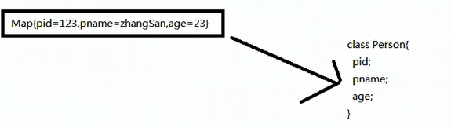

## CommonUtils类就两个方法：

* String Uuid():生成长度为32的随机字符，通常用来做实体类的ID,底层使用了UUID类完成
* ToBean(Map,Class<T>):把Map转换成指定类型的Bean对象，通常用来获取表单数据(request.getParameterMap())封装到JavaBean中，通常用来获取表单中的数据(Request.getParameterMap())封装到javaBean中，底层使用了common-beanutils。注意，本方法要求map中的键的名称要与Bean属性名称相同菜能完成映射，否则不能完成映射。
  
  


```java
package com.hfut;

import java.util.HashMap;
import java.util.Map;

import org.junit.Test;

import cn.itcast.commons.CommonUtils;

/**
 * 测试 CommonUtils类
 * Commonutils类依赖于jar: commons-beanutils.jar commons-logging.jar
 * @author LuZhouShiLi
 *
 */

public class xxf1 {
	
	/**
	 * 测试UUid()
	 * 返回一个随机的32位长的字符串
	 * 
	 * 用途：
	 * 1.用来做id 数据库表中的主键是不能重复的，他就是不重复的
	 * 2.激活码也是不能重复的 也可以用它
	 */
	
	@Test
	public void testUuid()
	{
		String s = CommonUtils.uuid();
		System.out.println(s);
		
	}
	/**
	 *作用：把一个map中的数据封装到javabean中
	 *要求：
	 *1. map中的key名称与javabean中的属性相同
	 */
	
	@Test
	public void testToBean(){
		
		Map<String,Object> map = new HashMap<String,Object>();
		map.put("pid","123");
		map.put("pname","张三");
		map.put("age", "23");
		map.put("xxx","XXX"); //不会进行匹配
		
		
		//通过map中的数据创建person类型的javabean对象
		Person p = CommonUtils.toBean(map, Person.class);
		System.out.println(p);
		
	}
}

```