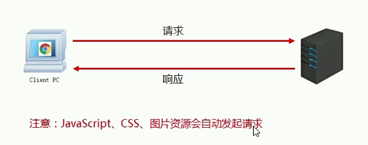
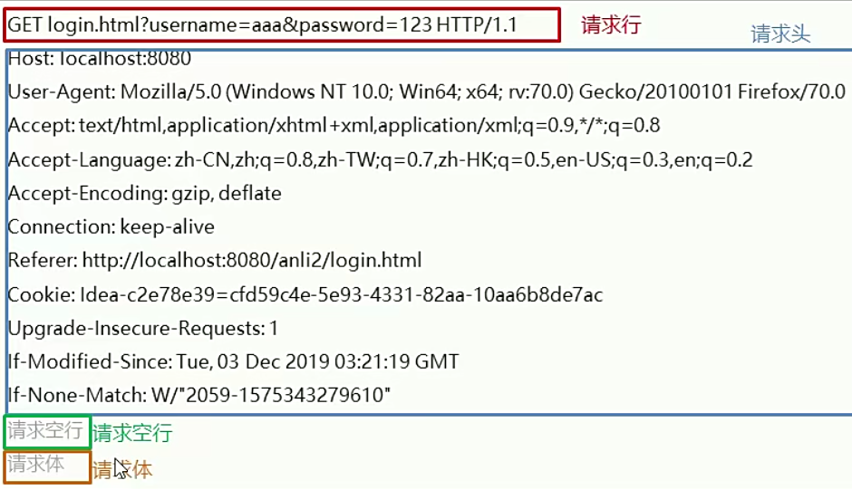
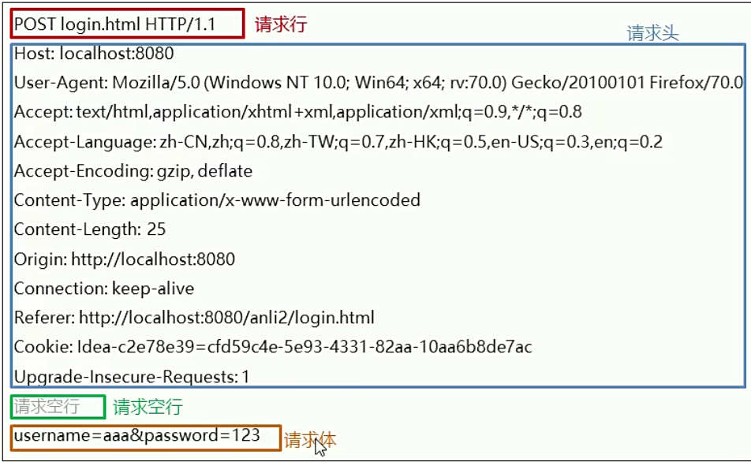
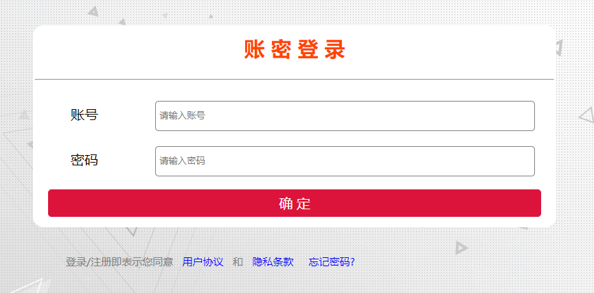
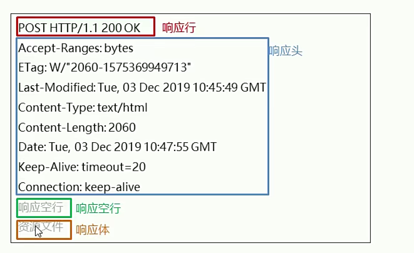
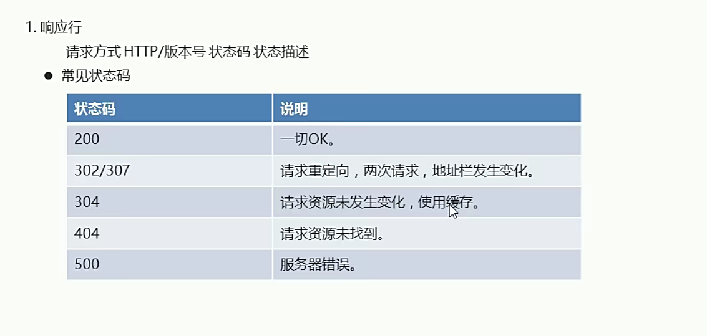
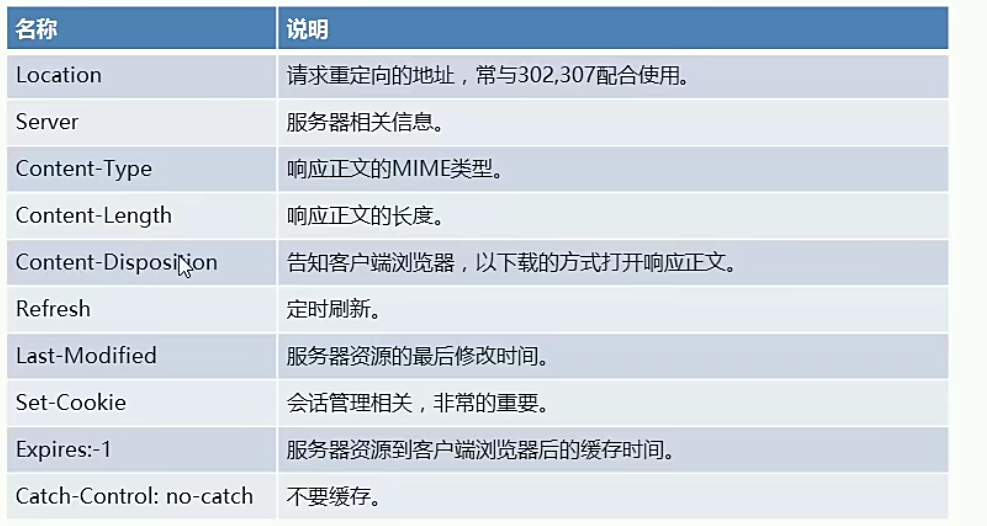

# HTTP协议的初步认识

##  HTTP协议的介绍
* http协议：超文本传输协议
* http协议是基于TCP/IP协议的
* 超文本：比普通文本更加强大
* 传输协议：客户端和服务器端的通信规则（握手规则）

  

## HTTP协议的请求
1.请求的组成部分
* 请求行
* 请求头
* 请求空行
* 请求体

2.请求的方式
* GET 用户提交的内容会显示在URL
* POST 用户提交的内容不会显示在URL
* 只用post方式才有请求体
  
  

* 请求行包含了用户名以及密码 http协议的版本号
* Host代表请求的主机 端口号8080
* User-Agent代表请求的浏览器
* Accept-text/html代表支持的文本格式
* Accept-Language代表支持的语言
* Accept-Encoding代表支持的压缩格式
* Connection：代表连接的状态

可以看到请求行是没有用户名以及密码，用户名和密码存在于请求体中
  

将已经写好的css login img文件导入web目录下
  

然后最好重启一次idea（资源导入进去） 不然启动tomcat会加载不出来login.html

  

## HTTP协议的响应

1.相应的组成部分
* 响应行
* 响应头
* 响应空行
* 响应体

  

2. 响应行有个200 OK 代表状态码 常见状态码如下：
  

3. 响应头的格式
  

4. 响应空行：普通的换行，用于区分响应头和响应体
5. 响应体：将资源文件发送给客户端浏览器进行解析

