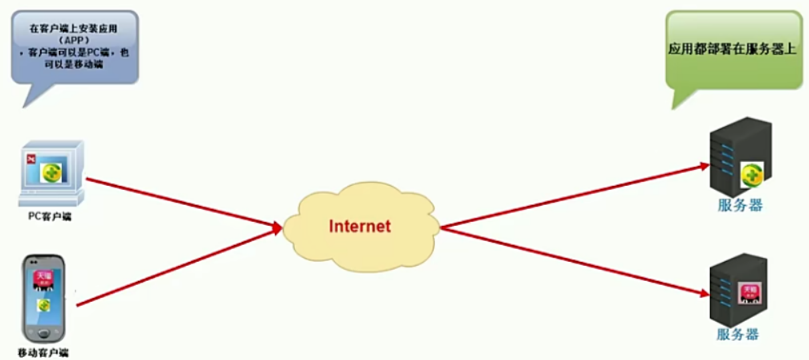
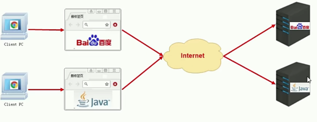

# JavaEE规范

## JavaEE简介
* JavaEE：Java企业版
* 它是由SUN公司领导、各个厂家共同制定的并得到广泛认可的工业标准。
* JavaEE早期叫做J2EE，但是没有继续采用其命名规则，J2EE的版本从1.0开始到1.4结束，而JavaEE版本是从JavaEE 5版本开始，目前最新的版本是JavaEE 8
* JavaEE 规范是很多Java技术的总称，这些技术都是沿用自J2EE的。一共包括了13个技术规范
* 包括：JDBC JNDI EJB RMI IDL/CORBA JSP XML JMS JTA JTS JavaMail JAF
  
## WEB概述
* WEB在计算机领域中代表网络
* 像我们以前使用的WWW 他是World Wide Web三个单词的缩写，称为：万维网
* 网络相关技术的出现都是为了让我们在网络世界中获取资源，这些资源的存放之处，我们把它称之为网站
* 我们通过输入网站的地址，就可以访问网站中提供的资源

## 资源分类
* 静态资源：网站中提供给人们的资源是一成不变的，也就是说不同人或者在不同的时间，看到的内容是一样的。作为开发者来说，我们编写的HTML、CSS、JavaScript都属于静态资源
* 动态资源：网站中提供给人们展示的资源都是由程序产生的，在不同的时间或不同的人由于身份的不同，所看到的内容是不一样的，作为开发者来说，我们编写的JSP、Servlet等都属于动态资源

## 系统结构
* 基础结构划分：
  CS结构
  BS结构

* 技术选型划分：
  Model1模型
  Model2模型
  MVC模型
  三层结构+MVC模型

* 部署方式划分：
  一体化结构
  垂直化结构
  分布式结构
  微服务结构

CS结构：客户端+服务器的方式

  

BS结构：浏览器+服务器的方式
  

