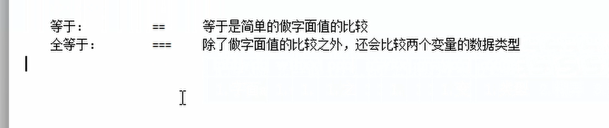

# JavaScript详解

## 一、概述

JavaScript语言诞生主要是完成页面的数据验证。因此它运行在客户端，需要运行浏览器来解析执行JavaScript代码。

JS是Netscape网景公司的产品，最早取名为LiveScript;为了吸引更多的java程序员。更名为JavaScript.

JS是弱类型，Java是强类型


特点：

1. 交互性（他可以做的就是信息的动态交互）
2. 安全性（不允许直接访问本地硬盘）
3. 跨平台性（只要是可以解释JS的浏览器都可以执行，和平台无关）


## 二、JavaScript和html代码的结合方式

### 2.1 第一种方式
&emsp;只需要在head标签中，或者在body标签中，使用script标签来书写javascript代码

测试代码：

```javascript
<!DOCTYPE html>
<html lang="en">
<head>
    <meta charset="UTF-8">
    <title>Test1</title>
    <script type = "text/javascript">

        //alert 是JavaScript语言提供的一个警告框函数。
        //它可以接受任意类型的参数，这个参数就是警告框的提示信息
        alert("Hello javaScript!");
    </script>
    
</head>
<body>

</body>
</html>
```

  


### 2.2 第二种方式
&emsp;使用script标签引入单独的JavaScript

测试代码：

```javascript
<!DOCTYPE html>
<html lang="en">
<head>
    <meta charset="UTF-8">
    <title>Test1</title>
<!--    <script type = "text/javascript">

        //alert 是JavaScript语言提供的一个警告框函数。
        //它可以接受任意类型的参数，这个参数就是警告框的提示信息
        alert("Hello javaScript!");
    </script>-->

    <!--
        现在需要使用script引入外部的js文件来执行
         src属性专门用来引入js文件路径（可以是相对路径，也可以是绝对路径）

         script标签可以用来定义js代码，也可以用来引入js文件
         但是，两个功能二选一使用，不可以同时使用两个功能
    -->
    
    <script type = "text/javascript" src="js1.js"></script>

</head>
<body>

</body>
</html>
```

## 三、变量

JavaScript的变量类型：

| 变量类型    |    名称 |
| ---         | ---    |
|  数值类型    | number |
|字符串类型  |    string |
| 对象类型 |  object |
| 布尔类型 | boolean |
| 函数类型 |  function |

JavaScript里特殊的值：

| 类型    |   含义|
| ---     | ---  |
| undefined| 未定义，所有js变量未赋予初始值的时候，默认值都是undefined |
| null   | 空值  |
| NAN  |  全称是： Not a Number。非数字。非数值|


JS中的定义变量格式：

var 变量名;
var 变量名 = 值;

测试代码：

```javascript
<!DOCTYPE html>
<html lang="en">
<head>
    <meta charset="UTF-8">
    <title>Test1</title>
<!--    <script type = "text/javascript">

        //alert 是JavaScript语言提供的一个警告框函数。
        //它可以接受任意类型的参数，这个参数就是警告框的提示信息
        alert("Hello javaScript!");
    </script>-->

    <!--
        现在需要使用script引入外部的js文件来执行
         src属性专门用来引入js文件路径（可以是相对路径，也可以是绝对路径）

         script标签可以用来定义js代码，也可以用来引入js文件
         但是，两个功能二选一使用，不可以同时使用两个功能
    -->


    <script type = "text/javascript">
        // var i;
        // i = 12;
        // alert(i);
        // alert(typeof(i)) // 取出变量的数据类型  number

        var a = 12;
        var b = "abc"
        alert(a * b)   // NAN是非数字，非数值

    </script>

</head>
<body>

</body>
</html>
```


javascript的关系运算符和java的关系运算符有略微的区别：（其他的都一样）

  


测试代码：

```javascript
<!DOCTYPE html>
<html lang="en">
<head>
    <meta charset="UTF-8">
    <title>Test1</title>
<!--    <script type = "text/javascript">

        //alert 是JavaScript语言提供的一个警告框函数。
        //它可以接受任意类型的参数，这个参数就是警告框的提示信息
        alert("Hello javaScript!");
    </script>-->

    <!--
        现在需要使用script引入外部的js文件来执行
         src属性专门用来引入js文件路径（可以是相对路径，也可以是绝对路径）

         script标签可以用来定义js代码，也可以用来引入js文件
         但是，两个功能二选一使用，不可以同时使用两个功能
    -->


    <script type = "text/javascript">
        // var i;
        // i = 12;
        // alert(i);
        // alert(typeof(i)) // 取出变量的数据类型  number

        // var a = 12;
        // var b = "abc"
        // alert(a * b)   // NAN是非数字，非数值


        var a = "12"
        var b = 12

        alert(a == b)  //仅仅是字面上的比较  true
        alert(a === b)  // 字面上的比较 还有 数值类型的比较 false

    </script>

</head>
<body>

</body>
</html>
```

## 四、逻辑运算

且运算：&&
或运算：||
取反运算：!


&emsp; 在javascript语言中，所有的变量，都可以作为一个boolean类型的变量去使用。

**0、null、undefined、空串**都认为是false


javascript的逻辑运算与java的逻辑运算符还有些不一样：

&& 且运算。
第一种：当表达式全为真的时候，返回最后一个表达式的值
第二种：当表达式有一个为假的时候。返回第一个为假的表达式

|| 或运算
第一种：当表达式全为假的时候，返回最后一个表达式的值
第二种：只要表达式有一个为真，返回第一个为真的表达式


并且&&运算与||运算有短路：有一个有了结果 后面的逻辑运算都不执行

测试代码：

```javascript
<!DOCTYPE html>
<html lang="en">
<head>
    <meta charset="UTF-8">
    <title>Test1</title>
<!--    <script type = "text/javascript">

        //alert 是JavaScript语言提供的一个警告框函数。
        //它可以接受任意类型的参数，这个参数就是警告框的提示信息
        alert("Hello javaScript!");
    </script>-->

    <!--
        现在需要使用script引入外部的js文件来执行
         src属性专门用来引入js文件路径（可以是相对路径，也可以是绝对路径）

         script标签可以用来定义js代码，也可以用来引入js文件
         但是，两个功能二选一使用，不可以同时使用两个功能
    -->


    <script type = "text/javascript">
        // var i;
        // i = 12;
        // alert(i);
        // alert(typeof(i)) // 取出变量的数据类型  number

        // var a = 12;
        // var b = "abc"
        // alert(a * b)   // NAN是非数字，非数值

        /*var a = "12"
        var b = 12

        alert(a == b)  //仅仅是字面上的比较  true
        alert(a === b)  // 字面上的比较 还有 数值类型的比较 false*/
        
        var a = "abc"
        var b = true;
        var d = false;
        var c = null;

        // alert(b && a)
        // alert(c && a)

        alert(a || d)
        alert(d || c)
        
    </script>

</head>
<body>

</body>
</html>
```

## 五、数组

数组定义方式：

JS中数组的定义：
 格式：var 数组名 = []; // 空数组
       var 数组名 = [1,'abc',true]; // 定义数组同时赋值元素

测试代码：
```javascript
<!DOCTYPE html>
<html lang="en">
<head>
    <meta charset="UTF-8">
    <title>Test1</title>
<!--    <script type = "text/javascript">

        //alert 是JavaScript语言提供的一个警告框函数。
        //它可以接受任意类型的参数，这个参数就是警告框的提示信息
        alert("Hello javaScript!");
    </script>-->

    <!--
        现在需要使用script引入外部的js文件来执行
         src属性专门用来引入js文件路径（可以是相对路径，也可以是绝对路径）

         script标签可以用来定义js代码，也可以用来引入js文件
         但是，两个功能二选一使用，不可以同时使用两个功能
    -->


    <script type = "text/javascript">
        var arr = [];//定义一个空数组

        arr[0] = 12;

        arr[2] = "abc"

        // javascript语言中的数组，只要我们通过数组下标赋值，那么最大的下标值，就会自动给数组进行扩容
        
        alert(arr.length);  // 数组长度3

    </script>

</head>
<body>

</body>
</html>
```


测试代码：
```javascript
<!DOCTYPE html>
<html lang="en">
<head>
    <meta charset="UTF-8">
    <title>Test1</title>
<!--    <script type = "text/javascript">

        //alert 是JavaScript语言提供的一个警告框函数。
        //它可以接受任意类型的参数，这个参数就是警告框的提示信息
        alert("Hello javaScript!");
    </script>-->

    <!--
        现在需要使用script引入外部的js文件来执行
         src属性专门用来引入js文件路径（可以是相对路径，也可以是绝对路径）

         script标签可以用来定义js代码，也可以用来引入js文件
         但是，两个功能二选一使用，不可以同时使用两个功能
    -->


    <script type = "text/javascript">
        var arr = [];//定义一个空数组

        arr[0] = 12;

        arr[2] = "abc"

        // javascript语言中的数组，只要我们通过数组下标赋值，那么最大的下标值，就会自动给数组进行扩容

        alert(arr.length);  // 数组长度3

        for (var i = 0; i < arr.length; i++) {
            alert(arr[i])
        }

    </script>

</head>
<body>

</body>
</html>
```


## 六、函数

### 1.使用function关键字定义函数

```
function 函数名(形参列表){
    函数体
}

```

测试代码：
```javascript
<!DOCTYPE html>
<html lang="en">
<head>
    <meta charset="UTF-8">
    <title>Test1</title>
<!--    <script type = "text/javascript">

        //alert 是JavaScript语言提供的一个警告框函数。
        //它可以接受任意类型的参数，这个参数就是警告框的提示信息
        alert("Hello javaScript!");
    </script>-->

    <!--
        现在需要使用script引入外部的js文件来执行
         src属性专门用来引入js文件路径（可以是相对路径，也可以是绝对路径）

         script标签可以用来定义js代码，也可以用来引入js文件
         但是，两个功能二选一使用，不可以同时使用两个功能
    -->


    <script type = "text/javascript">
         function fun(){
             alert("无参函数被调用");
         }

         fun();

         function fun2(a,b){
             alert("a=" + a + ",b=" + b);
         }

         fun2(1,2)

         //定义带有返回值的函数
         function fun3(a,b){
             var result = a + b;
             return result;
         }
         alert(fun3(1,2))

    </script>

</head>
<body>

</body>
</html>
```


### 2.函数定义第二种方式

就是把函数名调到前面

var 函数名 = function(形参列表){函数体}

测试代码：

```javascript
<!DOCTYPE html>
<html lang="en">
<head>
    <meta charset="UTF-8">
    <title>JavaScript测试</title>

    <script  type = "text/javascript">


        var fun = function (a,b){
            alert(a + b)
        }

        fun(1,2)
        
    </script>
    
</head>
<body>

</body>
</html>
```


说明：JS不允许函数重载,会直接覆盖上一次的函数定义

### 3.函数的arguments隐形参数（只在function函数内部）
就是在function函数中不需要定义，但是却可以直接用来获取所有参数的变量。我们管它叫做隐形参数。

隐形参数特别想java基础的可变长参数一样。可变长参数其实是一个数组。那么js中的隐形参数也跟java的可变长参数一样。操作类似于数组。


测试代码：

```javascript
<!DOCTYPE html>
<html lang="en">
<head>
    <meta charset="UTF-8">
    <title>JavaScript测试</title>
    <script  type = "text/javascript">
        var fun = function (){
            alert(arguments[0])
            alert(arguments[1])
            alert(arguments[2])
            alert(arguments.length)  // 查看数组的长度
        }
        // alert(arguments.length())
        fun(1,2,3)

    </script>

</head>
<body>
</body>
</html>
```

测试代码：
```javascript
<!DOCTYPE html>
<html lang="en">
<head>
    <meta charset="UTF-8">
    <title>JavaScript测试</title>

    <script  type = "text/javascript">


        // var fun = function (){
        //     alert(arguments[0])
        //     alert(arguments[1])
        //     alert(arguments[2])
        //
        //     alert(arguments.length)  // 查看数组的长度
        //
        //
        //     for (var i = 0; i < arguments.length; i++) {
        //         alert(arguments[i])
        //     }
        //
        //
        // }
        // // alert(arguments.length())
        // fun(1,2,3)

        function sum(num1,num2){

            var result = 0;
            for (var i = 0; i < arguments.length; i++) {
                result += arguments[i];
            }

            return result;
        }
        alert(sum(1,2,3,4,54,56));
    </script>

</head>
<body>

</body>
</html>
```


## 七、object自定义对象

### 7.1 方法一
对象的定义：
&emsp;var 变量名 = new object();// 对象实例（空对象）
&emsp;变量名.属性名 = 值 ; // 定义一个属性
&emsp;变量名.函数名 = function(){}  //定义一个函数


对象的访问：
&emsp; 变量名.属性/函数名();

测试代码：

```javascript
<!DOCTYPE html>
<html lang="en">
<head>
    <meta charset="UTF-8">
    <title>JavaScript测试</title>
    <script type = "text/javascript">

        var obj = new Object();
        obj.name = "华仔";
        obj.age = 18;

        obj.fun = function (){
            alert("姓名： " + this.name + ",年龄" + this.age)
        }

        obj.fun();
    </script>

</head>
<body>

</body>
</html>
```

### 7.2 方法二
{}花括号形式的自定义对象

var 变量名 = {
    属性名: 值,  
    属性名: 值,
    函数名: function(){}   // 定义一个函数
}; 


对象的访问：
    变量名.属性/函数名()


测试代码：

```javascript
<!DOCTYPE html>
<html lang="en">
<head>
    <meta charset="UTF-8">
    <title>JavaScript测试</title>
    <script type = "text/javascript">
        var obj = {
            name: "张三",
            age:19,
            fun:function(){

                alert("姓名：" + this.name + ", 年龄：" + this.age);
            }
        };
        alert(typeof(obj));
        alert(obj.age);
        obj.fun();
    </script>
</head>
<body>

</body>
</html>
```


## 八、js中的事件

什么是事件？事件是电脑输入设备与页面进行交互的响应。我们称之为事件。

常用的事件：

onload加载完成事件：页面加载完成之后，常用于做页面**js代码初始化操作**
onclick单击事件：常用于按钮的点击响应操作
onblur失去焦点事件：常用于输入框失去焦点后验证输入内容是否合法
onchange内容发生改变事件：常用于下拉列表和输入框内容发生改变之后的操作
onsubmit表单提交事件：常用于表单提交前，验证所有表单项是否合法

事件的注册又分为静态注册和动态注册两种：

静态注册事件：通过html标签的事件属性直接赋予事件响应后的代码，这种方式我们叫做静态注册。

动态注册事件：是指先通过js代码得到标签的dom对象，然后再通过dom对象.时间名 = function(){} 这种形式赋予事件响应后的代码，叫做动态注册。

&emsp; 动态注册基本步骤：
        * 获取标签对象
        * 标签对象.事件名 = function(){}


## 九、onload事件

测试代码：静态事件
```javascript
<!DOCTYPE html>
<html lang="en">
<head>
    <meta charset="UTF-8">
    <title>Title</title>
    <script type = "text/javascript">
        // onload事件的方法
        function onloadfun()
        {
            alert('静态注册onload事件')
        }
    </script>
</head>

<!--静态注册onload事件 onload事件是浏览器解析完页面之后就会自动触发的事件-->

<body onload = "onloadfun();">

</body>
</html>
```


测试代码：动态事件
```javascript
<!DOCTYPE html>
<html lang="en">
<head>
    <meta charset="UTF-8">
    <title>Title</title>
    <script type = "text/javascript">
        // onload事件的方法
        // function onloadfun()
        // {
        //     alert('静态注册onload事件')
        // }

        window.onload = function (){
            alert("动态注册的onload事件");
        }

    </script>
</head>

<!--静态注册onload事件 onload事件是浏览器解析完页面之后就会自动触发的事件-->

<!--<body onload = "onloadfun();">-->

<body>

</body>
</html>
```

## 十、onclick事件

测试代码：静态注册事件

```javascript

<!DOCTYPE html>
<html lang="en">
<head>
    <meta charset="UTF-8">
    <title>Title</title>
    <script type = "text/javascript">
        function onclickFun(){
            alert("静态注册onclick事件");
        }

    </script>


</head>
<body>
    <button onclick= "onclickFun();">按钮1</button>
    <button>按钮2</button>

</body>
</html>
```


测试代码：动态注册

```javascript
<!DOCTYPE html>
<html lang="en">
<head>
    <meta charset="UTF-8">
    <title>Title</title>
    <script type = "text/javascript">
        window.onload = function(){
            // 1获取标签对象
            /*
            * docunment 是javascript语言提供的一个对象  表示整个页面
            *
            * */
            var btnObj = document.getElementById("btn01");  // 根据id获取标签对象

            // 2 通过标签对象.事件名 = function(){}
            btnObj.onclick = function(){
                alert("动态注册的onclick事件");
            }
        }
    </script>


</head>
<body>
    <button onclick= "onclickFun();">按钮1</button>
    <button id = “btn01">按钮2</button>
</body>
</html>
```


## 十一、onblur事件

测试代码：静态注册
```javascript
<!DOCTYPE html>
<html lang="en">
<head>
    <meta charset="UTF-8">
    <title>Title</title>

    <script type = "text/javascript">
        // 静态注册失去焦点事件
        function onblurFun(){
            // console 是控制台对象 是由javascript语言提供，专门用来向浏览器的console进行打印输出，用于测试使用
            //log 是打印的方法
            console.log("静态注册失去焦点事件");  // 文本框失去焦点时候 F12 看到console打印这条语句
        }
        
    </script>

</head>
<body>
    用户名:<input type = "text" onblur = "onblurFun();"><br/>
    密码:<input type = "text">

</body>
</html>
```

测试代码：动态注册

```javascript
<!DOCTYPE html>
<html lang="en">
<head>
    <meta charset="UTF-8">
    <title>Title</title>

    <script type = "text/javascript">
        // 静态注册失去焦点事件
        function onblurFun(){
            // console 是控制台对象 是由javascript语言提供，专门用来向浏览器的console进行打印输出，用于测试使用
            //log 是打印的方法
            console.log("静态注册失去焦点事件");  // 文本框失去焦点时候 F12 看到console打印这条语句
        }

        // 动态注册onblur事件
        window.onload = function (){
            //获取标签对象
            var passwordobj = document.getElementById("password");  // 根据id获取标签对象

            passwordobj.onblur = function (){

                console.log("动态注册失去焦点事件");
            }
        }

    </script>
</head>
<body>
    用户名:<input type = "text" onblur = "onblurFun();"><br/>
    密码:<input id = "password" type = "text"><br/>  

</body>
</html>
```

效果图：

  


## 十二：onchange事件

测试代码：静态注册

```javascript
<!DOCTYPE html>
<html lang="en">
<head>
    <meta charset="UTF-8">
    <title>Title</title>

    <script type = "text/javascript">
        function onchangeFun(){
            alert("不 你不喜欢");
        }
    </script>
</head>
<body>
    请选择你心目中的男神
    <!--静态注册onchange事件-->
    <select onchange="onchangeFun();">
        <option>--男神--</option>
        <option>张一鸣</option>
        <option>马云</option>
        <option>乔布斯</option>
        <option>马斯克</option>
    </select>
</body>
</html>
```


测试代码：动态注册

```javascript
<!DOCTYPE html>
<html lang="en">
<head>
    <meta charset="UTF-8">
    <title>Title</title>

    <script type = "text/javascript">
        function onchangeFun(){
            alert("不 你不喜欢");
        }

        window.onload = function (){

            var nvshen = document.getElementById("01");

            nvshen.onchange = function (){
                alert("你的女神根本不是她们！")
            }
        }


    </script>
</head>
<body>
    请选择你心目中的男神
    <!--静态注册onchange事件-->
    <select onchange="onchangeFun();">

        <option>--男神--</option>
        <option>张一鸣</option>
        <option>马云</option>
        <option>乔布斯</option>
        <option>马斯克</option>
    </select>

    请选择你心目中的女神
    <select id = "01">
        <option>--女神--</option>
        <option>李飞飞</option>
        <option>蘇姿丰</option>
        <option>凤姐</option>
    </select>


</body>
</html>
```

## 十三、onsubmit事件

测试代码：静态注册

```javascript
<!DOCTYPE html>
<html lang="en">
<head>
    <meta charset="UTF-8">
    <title>Title</title>

    <script type = "text/javascript">

        // 静态注册表单提交事件
        // 提交表单  需要验证所有的表单项  如果有一个不合法 就阻止表单提交
        function onsubmitFun(){
            alert("静态注册表单提交事件--输入不合法");
            return false;
        }

    </script>


</head>
<body>
    <form action = "http://localhost:8080" method = "get" onsubmit = "return onsubmitFun();">
        <input type = "submit" value = "静态注册"/>
    </form>

</body>
</html>
```

测试代码：动态注册

```javascript
<!DOCTYPE html>
<html lang="en">
<head>
    <meta charset="UTF-8">
    <title>Title</title>

    <script type = "text/javascript">
        // 静态注册表单提交事件
        // 提交表单  需要验证所有的表单项  如果有一个不合法 就阻止表单提交
        function onsubmitFun(){
            alert("静态注册表单提交事件--输入不合法");
            return false;
        }

        window.onload = function (){
            // 获取标签对象
            var form1 = document.getElementById("form01")
            form1.onsubmit = function (){
                alert("动态注册表单提交事件--输入不合法");
                return false;
            }
        }

    </script>
    
</head>
<body>
    <form action = "http://localhost:8080" method = "get" onsubmit = "return onsubmitFun();">
        <input type = "submit" value = "静态注册"/>
    </form>

    <form action = "http://localhost:8080" id = "form01">
        <input type = "submit" value = "动态注册"/>
    </form>

</body>
</html>
```


## 十四、document对象概念的介绍

### 1.DOM模型
DOM全称就是Document Object Model文档对象模型

大白话，就是把文档中的标签，属性，文本，转换成为对象来管理
那么，他们是如何是先把标签，属性，文本转换成对象来管理。这就是我们马上要学习的重点


### 2.Document对象

* Document他管理了所有的html文档内容
* document它是一种树结构的文档。有层级关系
* 她让我们把所有的标签都对象化
* 我们可以通过document访问所有的标签对象
  
  


测试代码：

```javascript
<!DOCTYPE html>
<html lang="en">
<head>
    <meta charset="UTF-8">
    <title>Title</title>

    <script type = "text/javascript">
        // 需求：当用户点击校验按钮，要获取输出框中的内容。然后验证是否合法
        // 验证的规则：必须有字母，数字，下划线组成。长度是5 ~ 12 位
        function onclickFun(){
            // 当我们需要操作一个标签的时候  一定要先获取这个标签对象
            var username = document.getElementById("username");
            // alert(username.value);  // 获取输入框的值

            var username_text = username.value();

            // 验证字符串是否符合某一个规则  需要使用正则表达式
            var patt = /^\w{5,12}$/;
            /*
            * test() 方法用于测试某个字符串  是不是匹配规则
            * */

            if(patt.test(username_text)){
                alert("用户名合法");
            }
            else{
                alert("用户名不合法！");
            }

        }
    </script>

</head>
<body>
    用户名:<input type = "text" id = "username"/>
    <button onclick = "onclickFun();">校验</button>

</body>
</html>
```


### 3. 正则表达式(具体用法 查看文档)

正则表达式是描述字符模式的对象

正则表达式用于对字符串模式匹配以及检索替换，是对字符串执行模式匹配的强大工具

语法：

  

测试代码：

```javascript
<!DOCTYPE html>
<html lang="en">
<head>
    <meta charset="UTF-8">
    <title>正则表达式</title>

    <script type = "text/javascript">
        // 表示要求字符串中，是否包含字母e
        // var patt = new RegExp("e");


        // var patt = /e/;  // 表示字符串包含字母e
        // var patt = /[abc]/;  // 表示要求字符串中，是否包含字母a或b或c

        var patt = /[a-z]/; // 表示要求字符串是否包含小写字母
        var str = "abcde";
        alert(patt.test(str));
    </script>
</head>

<body>

</body>
</html>
```


\w 元字符用于查找单词字符。
单词字符包括：a-z、A-Z、0-9，以及下划线，包含_(下划线)字符。

语法
```javascript
new RegExp("\w")

更加简单的方式：
/\w/

```

测试代码：
```javascript
<!DOCTYPE html>
<html lang="en">
<head>
    <meta charset="UTF-8">
    <title>正则表达式</title>

    <script type = "text/javascript">
        // 表示要求字符串中，是否包含字母e
        // var patt = new RegExp("e");


        // var patt = /e/;  // 表示字符串包含字母e
        // var patt = /[abc]/;  // 表示要求字符串中，是否包含字母a或b或c

        // var patt = /[a-z]/; // 表示要求字符串是否包含小写字母
        var patt = /\w/;  // 表示字符串是否包含字母
        var str = "abcde";

        alert(patt.test(str));

    </script>

</head>

<body>

</body>
</html>
```

关于量词:
  

测试代码：
```javascript
<!DOCTYPE html>
<html lang="en">
<head>
    <meta charset="UTF-8">
    <title>正则表达式</title>

    <script type = "text/javascript">
        // 表示要求字符串中，是否包含字母e
        // var patt = new RegExp("e");


        // var patt = /e/;  // 表示字符串包含字母e
        // var patt = /[abc]/;  // 表示要求字符串中，是否包含字母a或b或c

        // var patt = /[a-z]/; // 表示要求字符串是否包含小写字母
        // var patt = /\w/;  // 表示字符串是否包含字母

        var patt = /a+/;//  字符串至少包含一个a
        var str = "abcde";


        alert(patt.test(str));
    </script>

</head>

<body>

</body>
</html>
```


测试代码：
```javascript
<!DOCTYPE html>
<html lang="en">
<head>
    <meta charset="UTF-8">
    <title>正则表达式</title>

    <script type = "text/javascript">
        // 表示要求字符串中，是否包含字母e
        // var patt = new RegExp("e");
        // var patt = /e/;  // 表示字符串包含字母e
        // var patt = /[abc]/;  // 表示要求字符串中，是否包含字母a或b或c

        // var patt = /[a-z]/; // 表示要求字符串是否包含小写字母
        // var patt = /\w/;  // 表示字符串是否包含字母

        // var patt = /a+/;//  字符串至少包含一个a

        // 要求字符串是否包含至少连续三个a 最多五个a
        var patt = /^a{3,5}$/;


        var str = "abcde";


        alert(patt.test(str));

    </script>
</head>

<body>

</body>
</html>
```


### 4.表单提交验证提示效果

```javascript
<!DOCTYPE html>
<html lang="en">
<head>
    <meta charset="UTF-8">
    <title>Title</title>

    <script type = "text/javascript">
        // 需求：当用户点击校验按钮，要获取输出框中的内容。然后验证是否合法
        // 验证的规则：必须有字母，数字，下划线组成。长度是5 ~ 12 位
        function onclickFun(){
            // 当我们需要操作一个标签的时候  一定要先获取这个标签对象
            var username = document.getElementById("username");

            // 获取标签对象
            var usernameSpan = document.getElementById("usernameSpan")

            // alert(username.value);  // 获取输入框的值

            var username_text = username.value;


            // 验证字符串是否符合某一个规则  需要使用正则表达式
            var patt = /^\w{5,12}$/;
            /*
            * test() 方法用于测试某个字符串  是不是匹配规则
            * */

            if(patt.test(username_text)){
                // alert("用户名合法");

                // span对象的属性innerHtml  可读 可写 表示其实标签与结束标签中的内容
                usernameSpan.innerHTML = "用户名合法！";

            }
            else{
                // alert("用户名不合法！");
                usernameSpan.innerHTML = "用户名不合法！";
            }

        }
    </script>


</head>
<body>
    用户名:<input type = "text" id = "username"/>
    <span id = "usernameSpan" style="color:red;"></span>
    <button onclick = "onclickFun();">校验</button>

</body>
</html>

```

  


### 5.getElementsByName(str)


测试代码：

```javascript
<!DOCTYPE html>
<html lang="en">
<head>
    <meta charset="UTF-8">
    <title>快速入门</title>

    <script>
        //全选
        function checkAll(){
            // 让所有的复选框都选中
            // document.getElementsByName(); 是根据指定的name属性查询返回多个标签对象集合
            // 这个集合的操作跟数组一样
            // 集合中的每一个元素都是dom对象

            // 取出所有name属性是hobby的标签  返回一个数组
            var hobbies = document.getElementsByName("hobby");

            // checked表示复选框的选中状态。如果选中的是true,不选中是false
            // 这个属性可读,可写
            // alert(hobbies[1].checked);

            for (var i = 0; i < hobbies.length; i++) {
                hobbies[i].checked = true;
            }


        }

        // 全不选
        function checkNo(){
            // 让所有的复选框都选中
            // document.getElementsByName(); 是根据指定的name属性查询返回多个标签对象集合
            // 这个集合的操作跟数组一样
            // 集合中的每一个元素都是dom对象

            // 取出所有name属性是hobby的标签  返回一个数组
            var hobbies = document.getElementsByName("hobby");

            // checked表示复选框的选中状态。如果选中的是true,不选中是false
            // 这个属性可读,可写
            // alert(hobbies[1].checked);

            for (var i = 0; i < hobbies.length; i++) {
                hobbies[i].checked = false;
            }

        }

        // 反选
        function checkReverse(){
            // 取出所有name属性是hobby的标签  返回一个数组
            var hobbies = document.getElementsByName("hobby");

            // checked表示复选框的选中状态。如果选中的是true,不选中是false
            // 这个属性可读,可写
            // alert(hobbies[1].checked);

            for (var i = 0; i < hobbies.length; i++) {
                if(hobbies[i].checked)
                {
                    hobbies[i].checked = false;
                }
                else
                {
                    hobbies[i].checked = true;
                }
            }

        }


    </script>


</head>
<body>

    兴趣爱好：
    <input type="checkbox" name="hobby" value="cpp" checked="checked">C++
    <input type="checkbox" name="hobby" value="java">Java
    <input type="checkbox" name="hobby" value="js">JavaScript
    <br/>

    <button onclick="checkAll()">全选</button>
    <button onclick="checkNo()">全不选</button>
    <button onclick="checkReverse()">反选</button>


</body>
</html>
```


### 6.getElementsByTagName(str)

```javascript
<!DOCTYPE html>
<html lang="en">
<head>
    <meta charset="UTF-8">
    <title>test11</title>

    <script type = "text/javascript">
        //document.getElementsByTagName("input")  按照标签名来选取对象
        //返回一个集合  集合中都是dom对象

        var inputs = document.getElementsByTagName("input");

        for (var i = 0; i < inputs.length; i++) {
            inputs[i].checked = true;
        }

    </script>


</head>
<body>
    兴趣爱好：
    <input type="checkbox" name="hobby" value="cpp" checked="checked">C++
    <input type="checkbox" name="hobby" value="java">Java
    <input type="checkbox" name="hobby" value="js">JavaScript
    <br/>

<button onclick="checkAll()">全选</button>


</body>
</html>
```

注意：document对象的三个查询方法，如果有id属性，优先使用getElementById方法来进行查询，其次是getElementsByName方法进行查询
  


补充说明方法：

```javascript
<!DOCTYPE html>
<html lang="en">
<head>
    <meta charset="UTF-8">
    <title>test11</title>

    <script type = "text/javascript">


        window.onload = function (){
            // 现在需要我们使用js代码来创建html标签，并显示在页面上
            //标签的内容是:


            var div1 = document.createElement("div");//创建一个div dom对象

            div1.innerHTML = "姐姐，你可以和我一起做爱心巧克力吗？" ;// 设置文本内容  但是div只是在内存中

            document.body.appendChild(div1);// 添加子节点   加载div标签
            
        }
        

    </script>


</head>
<body>

</body>
</html>
```


