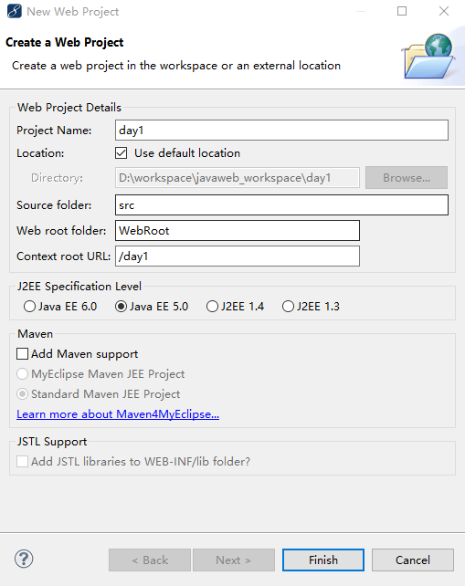
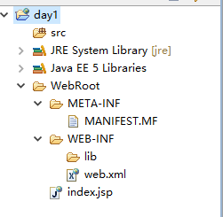
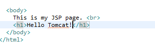
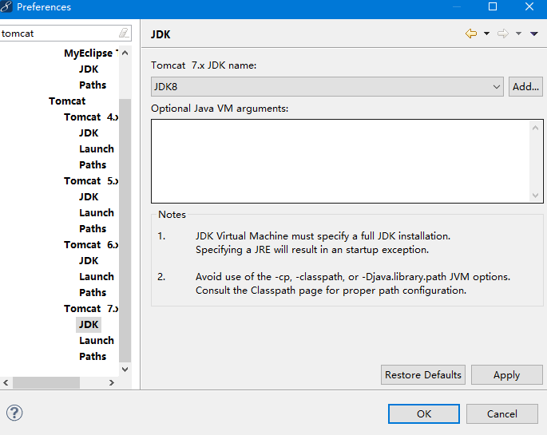
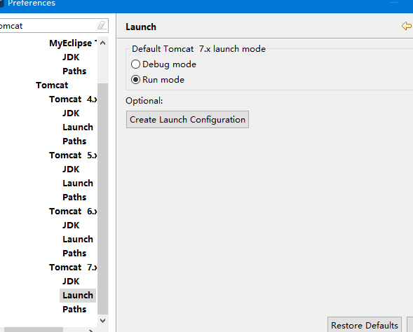
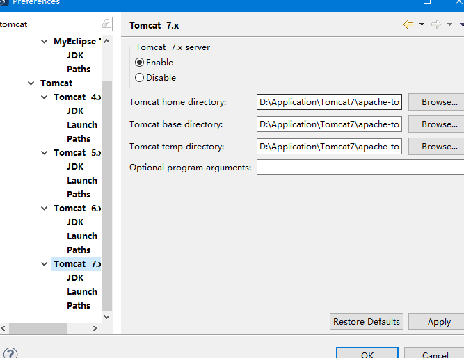
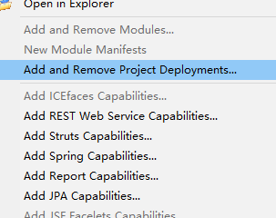
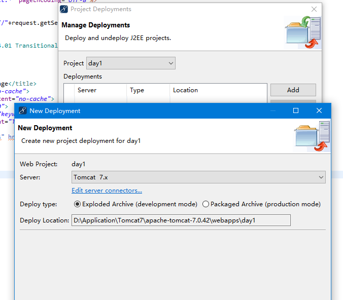
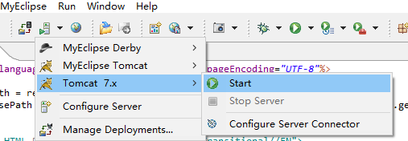
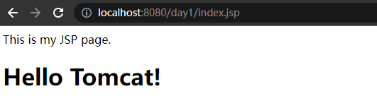

# MyEclipse下编写web应用程序

JavaWeb项目是在Tomcat上运行，我们使用MyEclipse是来编写JavaWeb项目，但是最终发布到Tomcat的webapps目录下。
* MyEclipse是开发环境
* Tomcat是运行环境

打开MyEclipse 选择新建->web project
  

创建好的工程如下：
  

在Index.jsp中添加一个标签
  

将tomcat关联到Myeclipse

1.选择windows->preferences 搜索tomcat，配置jdk
  

2.将Launch调成runmode
  

3.最后，选择enable,将tomcat关联起来，点击ok
  

4.选择  MyEclipse 选择Add and Remove Project Deployments
  

5.点击add 将项目添加到tomcat中
  

6.运行tomcat
  

7.打开浏览器 输入
  
