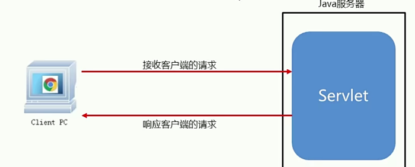

# Servlet的初步介绍与使用

## 概述
* Servlet是运行在java服务器端的程序，用于接收和相应来自客户端基于HTTP协议的请求
* 如果想实现Servlet的功能，可以通过实现javax.servlet.Servlet接口或者继承他的实现类
* 核心方法：service(),任何客户端的请求都会经过该方法

  

## Servlet发布动态资源

实现步骤：
* 创建一个JavaWeb项目
* 将静态页面所需要的资源导入到项目的web目录下面
* 修改web.xml配置文件，默认修改主页
* 在项目的src路径下编写一个类，实现Servlet接口
* 重写service方法，输出一句话即可
* 修改web.xml配置文件，配置sevlet相关资源
* 将项目部署到tomcat
* 启动tomcat
* 打开浏览器测试功能
  
 

