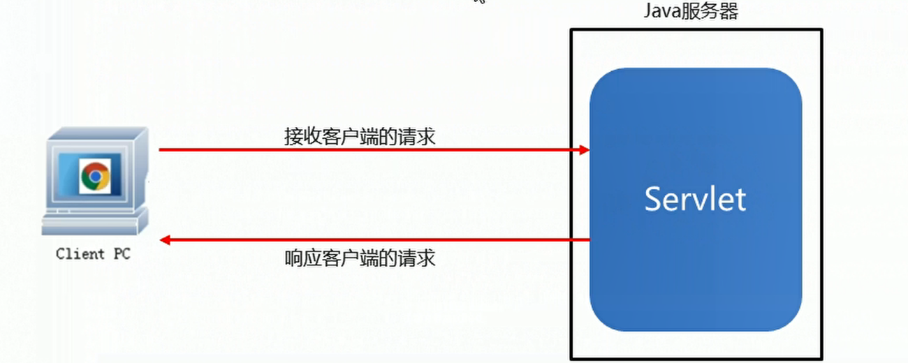

# Servlet详解

## 一、概述
* Servlet是运行在Java服务器端的程序，用于接受和响应来自客户端基于HTTP协议的请求
* 如果想实现Servlet的功能可以通过实现javax.servlet.Servlet接口或者继承它的实现类(GenericServlet)
* 核心方法：service(),任何客户端的请求都会经过该方法

  

## 二、Servlet快速入门

* 创建一个WEB项目
* 创建一个类继承GenericServlet
* 重写service方法
* 在web.xml中配置Servlet
* 部署并启动项目
* 通过浏览器测试

