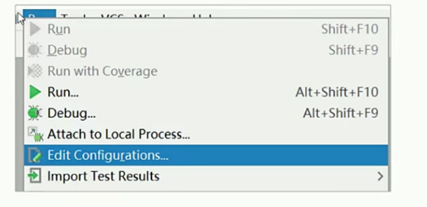
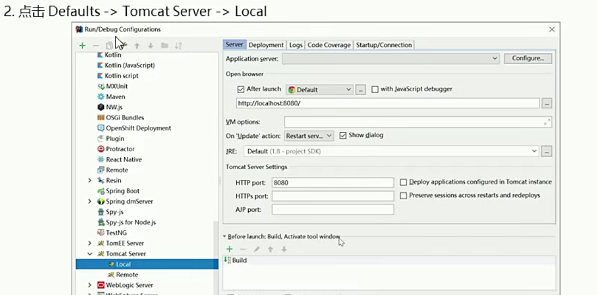
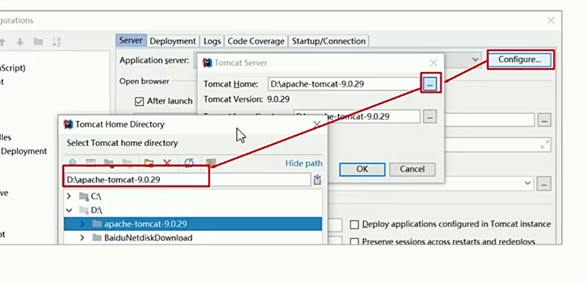
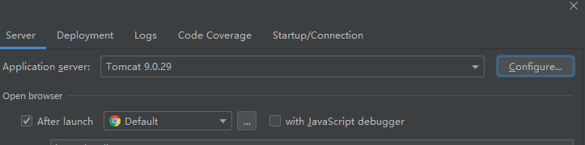
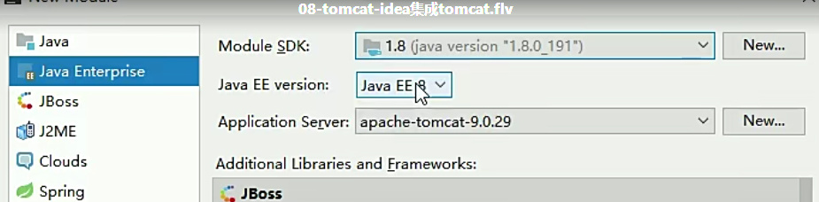
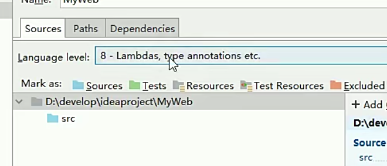
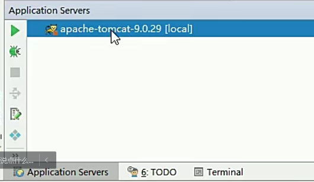

# IDEA集成Tomcat  IDEA专业版

* 点击Run-Edit Configurations
  

* 点击Defaults->TomcatServer ->Local

  

点击Configure 关联tomcat路径
  

集成完毕
  

此时新建一个工程，java企业版
  

之后还要确认jdk版本 还有默认的语言级别
  

点击application server 查看tomcat
  

