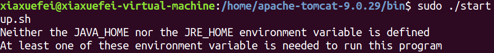
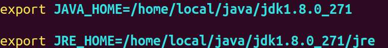
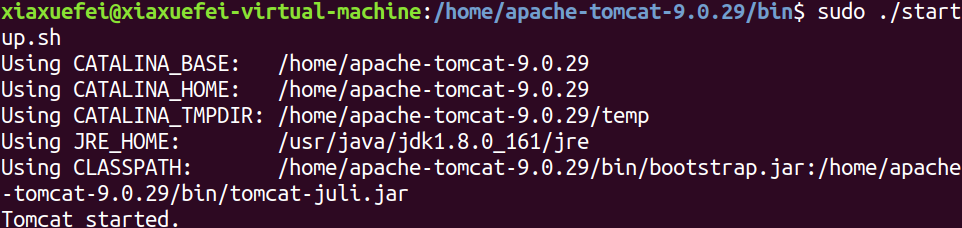

# linux下安装Tomcat

* 上传压缩包/home路径：put d:/apache-tomcat-9.0.29.tar.gz（请安装secureCRT工具 可以直接复制）
* 解压压缩包：tar -zxvf apache-tomcat-9.0.29.tar.gz
* 进入bin目录下：cd apache-tomcat-9.0.29/bin
* 启动tomcat服务：./startup.sh
* 使用浏览器测试：

记得安装jdk,请参考这篇博文：https://blog.csdn.net/qq_39390545/article/details/111769675?ops_request_misc=%257B%2522request%255Fid%2522%253A%2522163936689816780274136384%2522%252C%2522scm%2522%253A%252220140713.130102334..%2522%257D&request_id=163936689816780274136384&biz_id=0&utm_medium=distribute.pc_search_result.none-task-blog-2~all~top_positive~default-3-111769675.first_rank_v2_pc_rank_v29&utm_term=linux%E5%AE%89%E8%A3%85jdk&spm=1018.2226.3001.4187

启动出现错误：
  

解决办法：
* vi catalina.sh
* 在如下图位置添加以下两句，这是你自己配置的jdk（jdk配置参考上面的文章）  输入java查看自己的jdk

  

再次尝试启动，启动成功
  

之后使用ifconfig命令查看虚拟机的ip地址，在本地电脑输入：https://虚拟机的ip地址:8080

