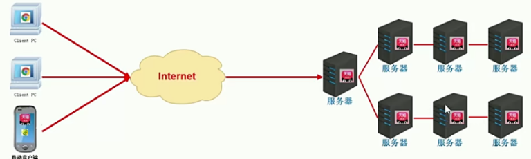
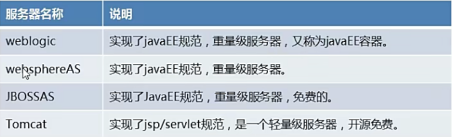
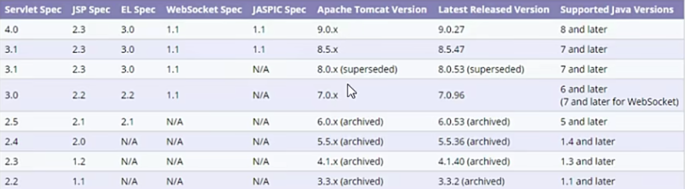
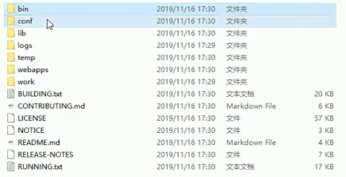
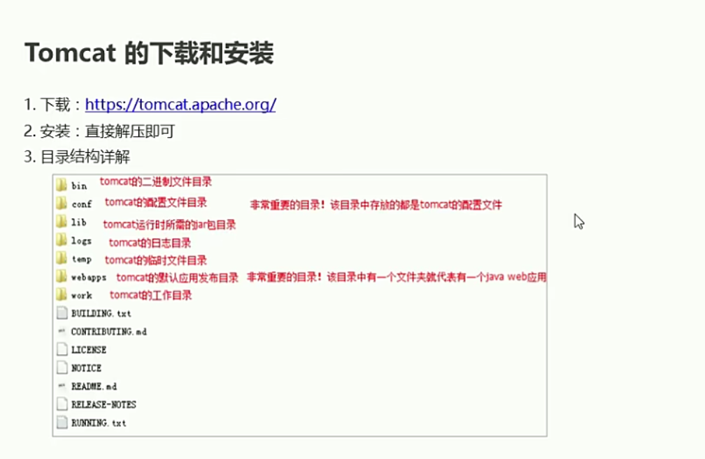
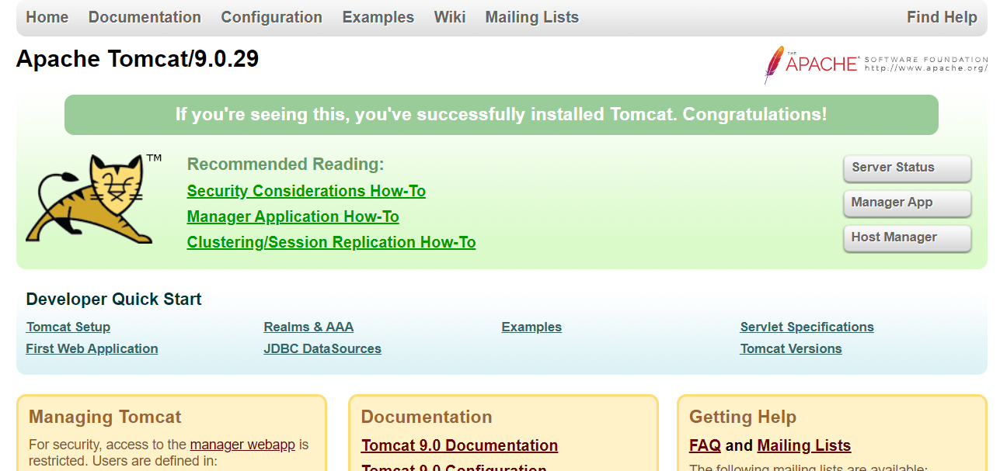

# Tomcat概述

## 服务器的介绍
* 服务器是计算机的一种，它比普通的计算机运行更快、负载更高、价格更贵。服务器在网络中为其他客户机提供计算或者应用服务。服务器具有高速的CPU运算能力、长时间的可靠运行、强大的I/O外部数据吞吐能力以及更好的扩展性。
* 而我们这里所说的服务器，其实是web服务器，或者应用服务器，他本质上就是一个软件，通过和硬件的相结合，从而达到帮助我们来发布应用的功能，让用户通过客户机访问我们的应用

  

## 常用的服务器
重量级服务器是指实现了JavaEE规范，轻量级服务器是指实现部分JavaEE规范
  

## Tomcat的介绍
* Tomcat是Apache软件基金会的Jakarta项目组中的一个核心项目，由Apache、Sun公司以及其他一些公司共同开发而成，由于有了Sun公司的支持，最新的Servlet、JSP规范总是能在Tomcat中得到体现，因为Tomcat技术先进、性能稳定，而且免费，所以深受java爱好者的喜爱并得到了部分软件开发商的认可，成为目前比较流行的web应用服务器

* Tomcat版本
  

## Tomcat基本使用
  

bin目录：保存tomcat可执行的二进制文件，conf保存配置文件的路径
lib:Tomcat运行时所需要的java包
logs：日志目录
temp:临时目录
webapps:项目发布目录，每一个文件夹都是代表一个应用

  

1.启动
* Startup.bat windows下启动执行文件
* startup.sh linux下启动执行文件

2.停止
* shutdown.bat windows下关闭执行的文件
* shutdown.sh linux下关闭执行文件

3.启动问题
* 启动窗口一闪而过：没有配置jdk环境变量
* java.net.BindException:8080端口被占用
  
4. 部署自己的项目
* 在webapps目录先创建一个文件夹
* 将资源放到该文件夹
* 启动tomcat，输入正确的路径

点击bin目录下startup.bat

在浏览器中输入：http://localhost:8080 

  

在webapps目录文件下创建一个hello文件夹，随便写一个html文件，打开浏览器，输入：http://localhost:8080/hello/hello.html

  

