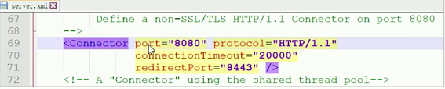
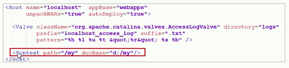
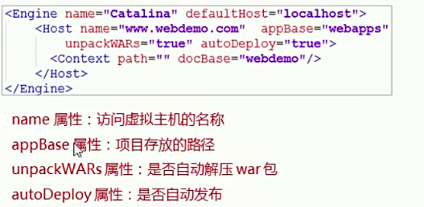
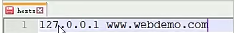
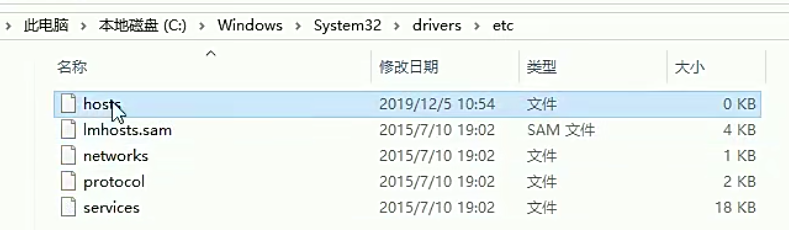
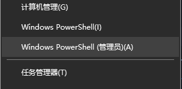
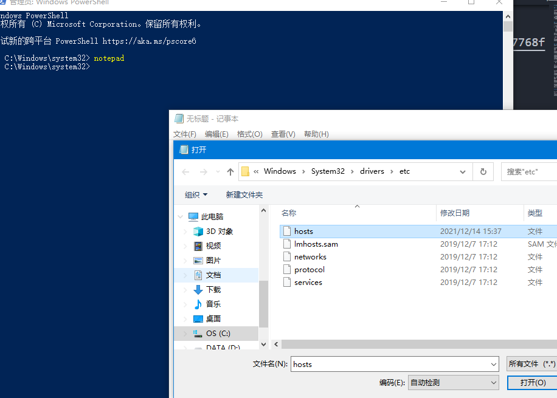

# Tomcat虚拟目录与配置文件介绍

## 1.主配置文件 server.xml

conf文件夹中包含server.xml配置文件
  

* 8080 端口：tomcat服务默认端口号。访问url地址后必须手动写：8080
* 80端口：http协议采用的端口号。访问url地址后不用写：80

## 2.虚拟目录
虚拟目录的作用：可以发布任意目录下的项目

* 编辑server.xml配置文件，找到<host>标签
* 加入以下内容
    

path属性：访问资源的虚拟目录名称
docbase属性：项目真实存在的路径

再次启动tomcat 
  

## tomcat配置虚拟主机
虚拟主机的作用：可以指定访问路径

1、编辑server.xml配置文件，找到<Endine>标签
2、加入以下内容
  

name：表示访问虚拟主机的名称
appBase:项目存放的路径
unpackWARS:是否自动解压war包
autoDeploy:是否自动发布

3.修改hosts文件
加入 127.0.0.1 www.webdemo.com

  

host文件位置
  

关于如何修改hosts文件，这里需要权限：
可以鼠标右键windows，选择powershell(管理员)
  

然后输入notepad 这时会弹出一个窗口，txt文件，选择打开，打开上述hosts文件，在尾部添加127.0.0.1(这个ip地址代表本机ip)
www.webdemo.com

  

4.浏览器中输入www.webdemo.com:8080
  

