# idea中创建javaweb项目并发布

## 一、创建javaweb项目步骤

* 在idea中创建一个工程，选择java enterprise 
* 配置好jdk tomcat
* 选择javaee版本 默认最新的javaee8
* 选择web application 勾选create web.xml
  
简单介绍目录：
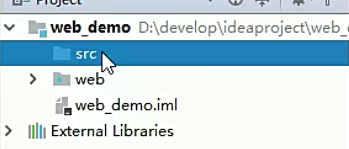  

src:保存源代码
web:放置 html css javascript 图片
web-inf:存放相关配置

## 二、将idea创建的javaweb项目进行发布
1. 选择run->edit Configurations
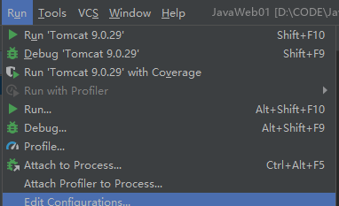  

2. open browser中的浏览器默认为谷歌浏览器，web项目启动之后会自动打开浏览器，下面就是网址
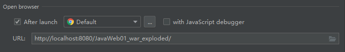  

3. 打开deployment 可以看到创建的javaweb项目自动被压缩成一个war包，可以通过下面的application context更改web项目访问路径
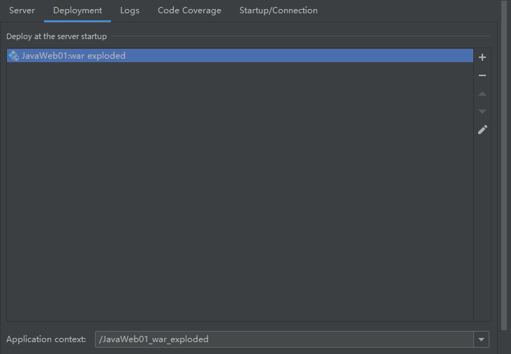  

3. 勾选两个update resources 意味着当我们更新web项目，页面会自动进行更新
  

4. 点击确定之后，可以看到web项目被自动打包成一个压缩包
  

5. 点击左边的运行按钮，项目开始运行，右边一开始会有许多红色信息，不是报错，当看到connect server 说明项目启动成功，浏览器自动打开
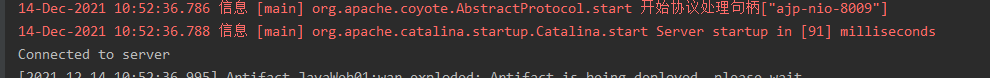  
  

6. 修改访问路径
还是选择run-> edit configurations
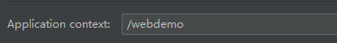  
  
 1](../../../images/d7738a98ca1f8c92df72a85da36c1856144e3abec9a3c2373acbee8e3a4b258a.png)  

可以看到访问路径发生了变化
  

7.关于为什么显示$end$

打开index.jsp 可以看到一个类似于index
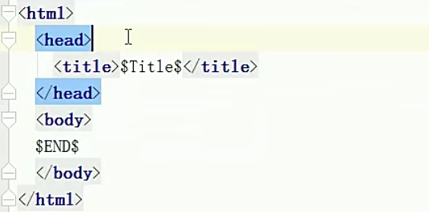  

修改标签
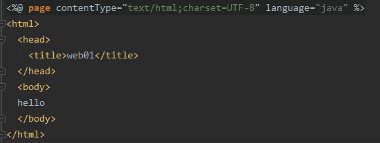  

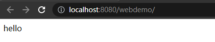  

## 三、通过war包将tomcat项目进行发布

1. 在项目的web路径下面打war包：jar -cvf javaweb01.war(注意是你创建的web项目)

web目录右键，选择show in explorer 看到我的web项目
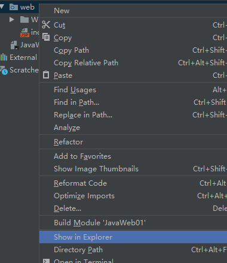  

在这个目录下进行打包
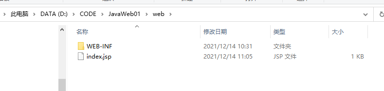  

输入如下命令进行打包
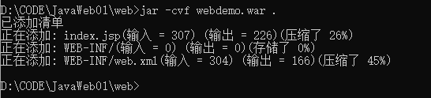  

2. 将打好的war包剪切到tomcat的webapps路径下面
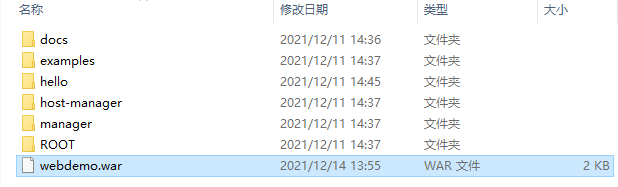  

3. 启动tomcat服务，自动解压war包,然后打开startup.bat 输入网址，会发现自动解压war包
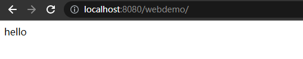  
