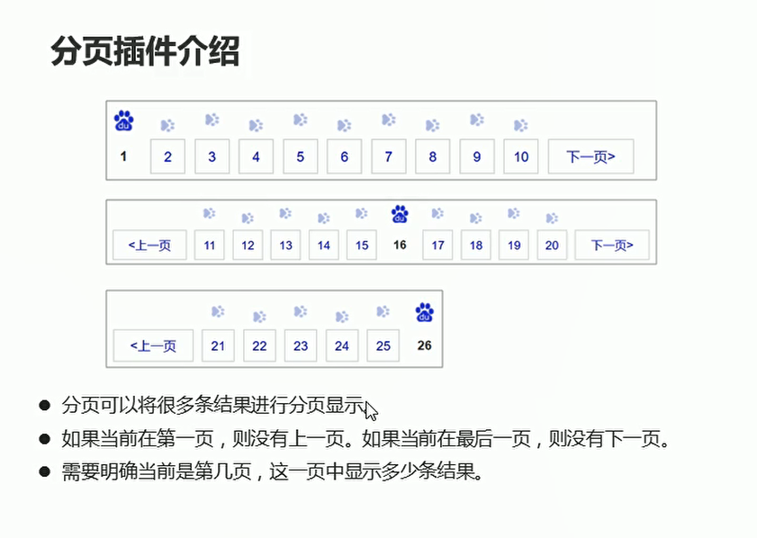
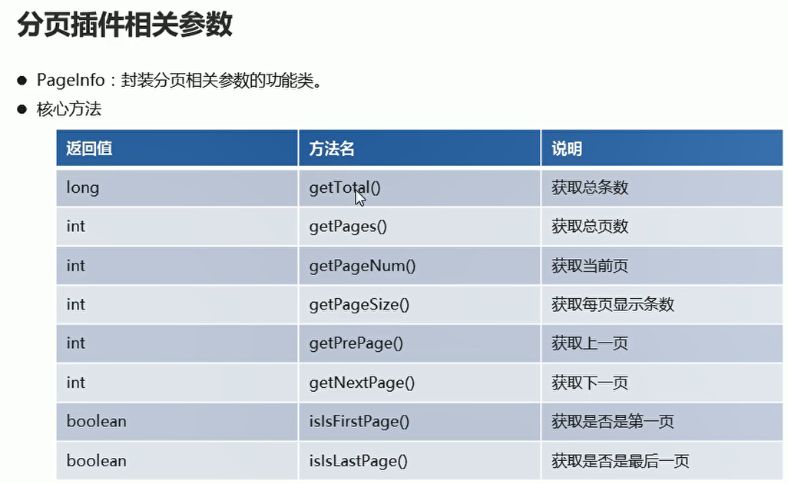
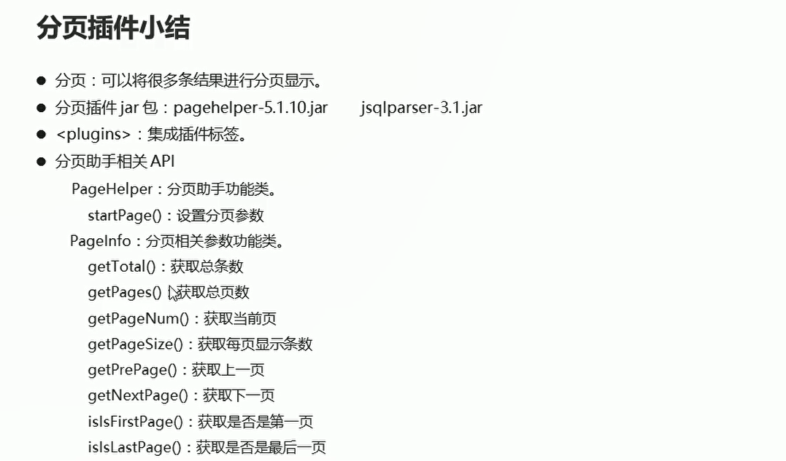

# 分页插件

## 介绍

  

  

使用SQL语句进行分页操作

```sql
-- 第一页：显示三条数据  （当前页-1 * 每页显示条数）,每页显示条数
-- SELECT * FROM student LIMIT 0,3

-- 第二页显示三条数据
SELECT * FROM student LIMIT 3,3

```
## 分页插件的实现步骤

* 导入jar包
* 在核心配置文件中集成分页助手插件
* 在测试类中使用分页助手相关API实现分页功能

核心配置文件中集成分页助手插件功能
```xml
    <!--集成分页助手插件-->
    <plugins>
        <plugin interceptor="com.github.pagehelper.PageInterceptor"></plugin>
    </plugins>
```

```java
public void selectPaging() throws IOException {
        // 加载核心配置文件
        InputStream is = Resources.getResourceAsStream("MyBatisConfig.xml");

        // 获取sqlSession工厂对象
        SqlSessionFactory build = new SqlSessionFactoryBuilder().build(is);

        // 通过工厂对象获取sqlSession对象
        SqlSession sqlSession = build.openSession(true);

        // 获取mapper接口的实现类对象
        StudentMapper mapper = sqlSession.getMapper(StudentMapper.class);

        // 通过分页助手来实现分页功能  第一页显示三条数据
        PageHelper.startPage(1,3);

        // 第二页显示三条数据
        PageHelper.startPage(2,3);


        // 第三页显示三条数据
        PageHelper.startPage(3,3);

        // 调用实现类方法  接受结果
        List<Student> students = mapper.selectAll();// 查询结果 返回一个student数组

        // 处理结果
        for (Student student : students) {
            System.out.println(student);
        }


    }

```


## 分页参数的获取

  

```java
    @Test
    public void selectPaging() throws IOException {
        // 加载核心配置文件
        InputStream is = Resources.getResourceAsStream("MyBatisConfig.xml");

        // 获取sqlSession工厂对象
        SqlSessionFactory build = new SqlSessionFactoryBuilder().build(is);

        // 通过工厂对象获取sqlSession对象
        SqlSession sqlSession = build.openSession(true);

        // 获取mapper接口的实现类对象
        StudentMapper mapper = sqlSession.getMapper(StudentMapper.class);

        // 通过分页助手来实现分页功能  第一页显示三条数据
//        PageHelper.startPage(1,3);
//
//        // 第二页显示三条数据
//        PageHelper.startPage(2,3);
//
//
//        // 第三页显示三条数据
//        PageHelper.startPage(3,3);

        // 调用实现类方法  接受结果
        List<Student> students = mapper.selectAll();// 查询结果 返回一个student数组

        PageInfo<Student> info = new PageInfo<>(students);// 获取分页对象

        // 获取分页的相关参数
        System.out.println("总条数:" + info.getTotal());
        System.out.println("总页数" + info.getPages());
        System.out.println("当前页"+ info.getPageNum());
        System.out.println("每条显示页数" + info.getPageSize());
        System.out.println("上一页：" + info.getPrePage());
        System.out.println("下一页： " + info.getNextPage());


    }

```


## 分页插件的总结
  

