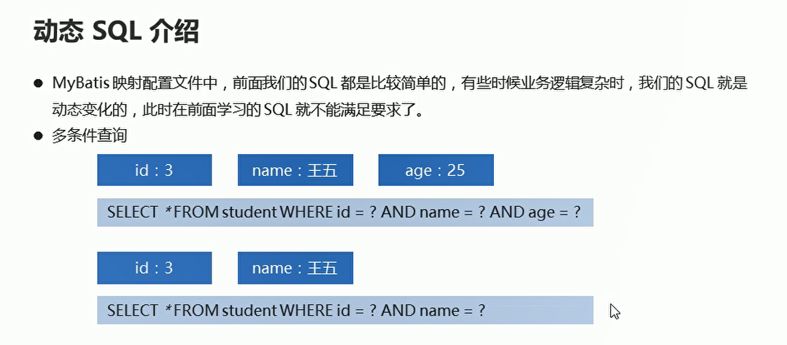
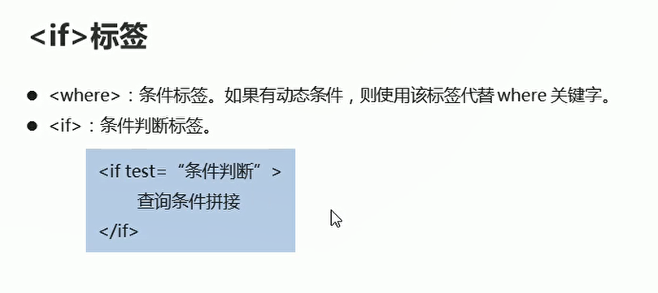
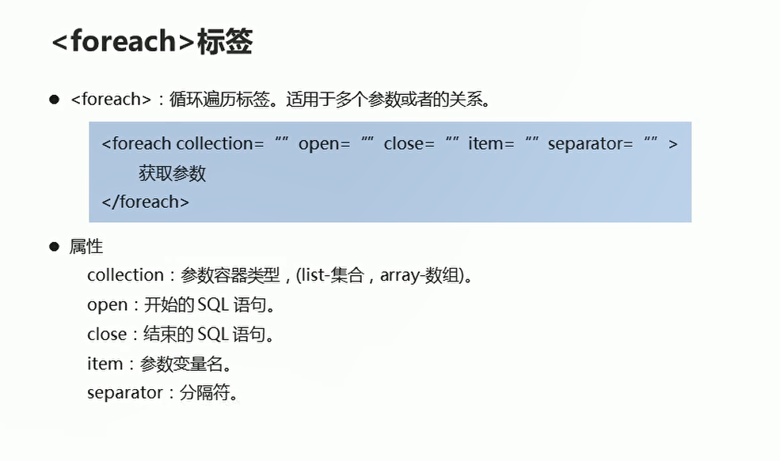
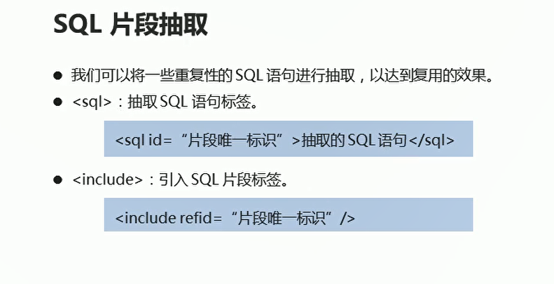
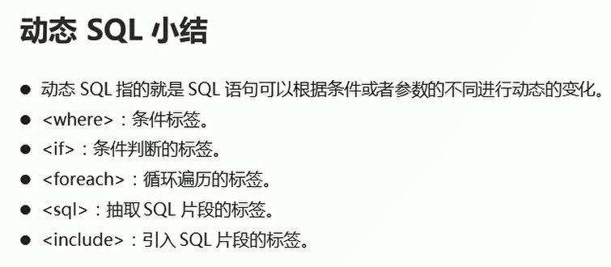

# 动态SQL

## 介绍

  

**有条件的查询  需要在映射配置文件中提前写好sql语句，需要配置好参数  同时mapper接口也需要补充一下该方法**

```java
<!--    参数从student对象中进行获取-->
    <select id="selectCondition1" resultType="student" parameterType="student">
        SELECT * FROM student WHERE id = #{id} AND name = #{name} AND age = #{age}
    </select>

```

```java
    // 多条件查询
    public  abstract List<Student> selectCondition1(Student stu);

```

编写测试类
```java
package com.itheima.dynamic;

import com.itheima.bean.Student;
import com.itheima.mapper.StudentMapper;
import org.apache.ibatis.io.Resources;
import org.apache.ibatis.session.SqlSession;
import org.apache.ibatis.session.SqlSessionFactory;
import org.apache.ibatis.session.SqlSessionFactoryBuilder;
import org.junit.Test;

import java.io.InputStream;
import java.util.List;

public class Test02 {
    @Test
    public void selectCondition1() throws Exception{
        // 测试一下 多条件查询语句
        // 获取核心配置文件连接数据库
        InputStream is = Resources.getResourceAsStream("MyBatisConfig.xml");
        SqlSessionFactory build = new SqlSessionFactoryBuilder().build(is);

        // 获取SqlSession对象
        SqlSession sqlSession = build.openSession(true);// 自动提交事务

        StudentMapper mapper = sqlSession.getMapper(StudentMapper.class);// 获取指定接口的mapper对象

        // 调用多条件查询的方法
        Student stu = new Student();
        stu.setId(2);
        stu.setName("314");
        stu.setAge(2);

        List<Student> students = mapper.selectCondition1(stu);//调用多条件查询的方法

        // 增强for循环遍历
        for (Student student : students) {
            System.out.println(student);
        }

        sqlSession.close();


        is.close();


    }
}


```

## if标签的使用

  

使用if标签改写映射配置文件中的sql语句
```xml
 <select id="selectCondition1" resultType="student" parameterType="student">
        SELECT * FROM student
        <where>
            <if test = "id != null">
                id = #{id}
            </if>

            <if test = "name != null">
                AND name = #{name}
            </if>

            <if test = "age != null">
                AND age = #{age}
            </if>
        </where>
</select>

```
## foreach标签

* 循环遍历标签，适用于多个参数或者的关系

  

```xml
<!--    根据多个id进行查询  参数类型 list 代表多个参数  返回值类型student-->
    <select id="selectByIds1" resultType="student" parameterType="list">
        SELECT * FROM student
        <where>
            <foreach collection="list" open = "id IN(" close=")" item = "id" separator=",">
                #{id}
            </foreach>
        </where>
    </select>

```
## sql片段的抽取

将重复性的sql语句进行抽取 达到复用的效果

  

```xml
    <sql id="select" >SELECT * FROM student</sql>

    <!--
        select：查询功能的标签
        id属性：唯一标识
        resultType属性：指定结果映射对象类型  返回值类型
        parameterType属性：指定参数映射对象类型
    -->

<!--    id必须和方法名保持一致-->
    <select id="selectAll" resultType="student">
        <include refid="select"/>
    </select>

```

## 总结

  


