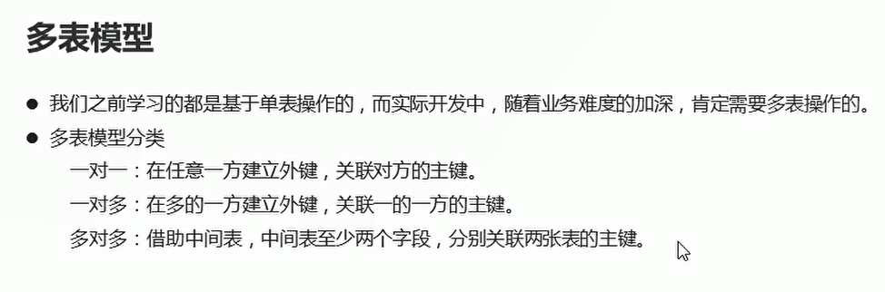
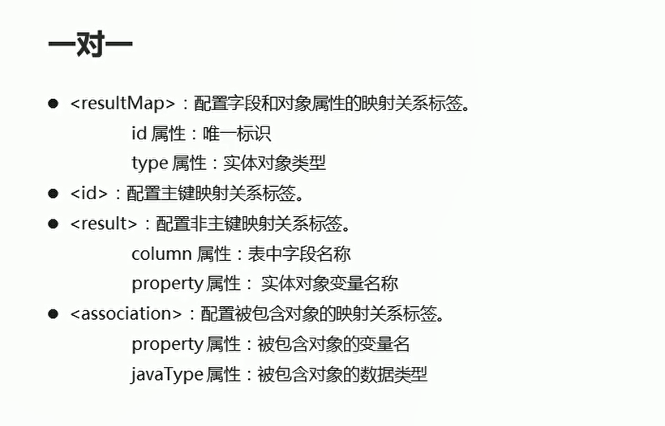
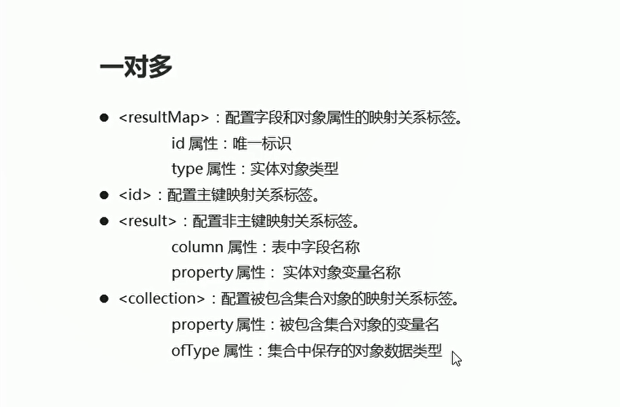
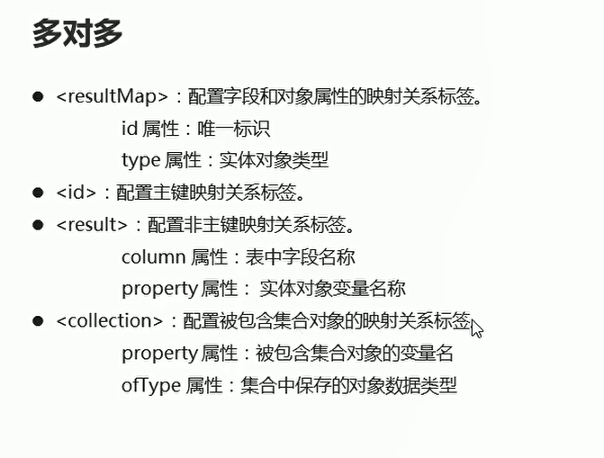

# 多表操作

## 介绍
  


## 一对一

  

* 一对一的映射配置文件

```xml
<?xml version="1.0" encoding="UTF-8" ?>
<!--MyBatis的DTD约束-->
<!DOCTYPE mapper
        PUBLIC "-//mybatis.org//DTD Mapper 3.0//EN"
        "http://mybatis.org/dtd/mybatis-3-mapper.dtd">

<!--
    mapper：核心根标签
    namespace属性：名称空间
-->

<!--名称空间要和接口的路径保持一致-->
<!--路径名称填写接口的全路径-->
<mapper namespace="com.itheima.table01.OneToOneMapper">

<!--    配置字段和实体对象属性的映射关系  column 表示数据库字段  property表示实体对象的属性-->
<!--    结果保存的是card对象-->
    <resultMap id="oneToOne" type="card">
<!--        id配置的是主键属性-->
        <id column="cid" property="id"/>
        <result column="number" property="number"/>

<!--        association 配置被包含对象的映射关系
            property:被包含对象的变量名
            javaType:被包含对象的数据类型
-->
        <association property="p" javaType="person">
            <id column="pid" property="id"/>
            <result column="name" property="name"/>
            <result column="age" property="age"/>
        </association>
    </resultMap>

<!--    查询所有信息 结果封装成两个实体对象-->
    <select id="selectAll" resultMap = "oneToOne">
        SELECT c.id cid,number,pid,NAME,age FROM card c,person p WHERE c.pid = p.id
    </select>


</mapper>

```

* 将映射配置文件引入到核心配置文件中

```xml
<!--    将映射配置文件引入到核心板配置文件中-->
    <mappers>
        <mapper resource="com/itheima/one_to_one/OneToOneMapper.xml"/>
    </mappers>

```

* 测试类

```java
package com.itheima.table01;

import com.github.pagehelper.PageInfo;
import com.itheima.bean.Card;
import com.itheima.bean.Student;
import com.itheima.mapper.StudentMapper;
import org.apache.ibatis.io.Resources;
import org.apache.ibatis.session.SqlSession;
import org.apache.ibatis.session.SqlSessionFactory;
import org.apache.ibatis.session.SqlSessionFactoryBuilder;
import org.junit.Test;

import java.io.IOException;
import java.io.InputStream;
import java.util.ArrayList;
import java.util.List;

public class Test01 {

    @Test
    public void selectAll() throws IOException {
        // 查询所有的信息
        // 加载核心配置文件
        InputStream is = Resources.getResourceAsStream("MyBatisConfig.xml");
        // 获取工厂对象
        SqlSessionFactory build = new SqlSessionFactoryBuilder().build(is);

        // 通过工厂对象获取sqlSession对象
        SqlSession sqlSession = build.openSession(true);// 自动提交事务

        // 获取一对一接口的实现类对象
        OneToOneMapper mapper = sqlSession.getMapper(OneToOneMapper.class);
        
        // 调用实现类的方法  接受结果  保存的是card对象
        List<Card> list = mapper.selectAll();

        // 打印结果
        for (Card card : list) {
            System.out.println(list);
        }

        // 释放资源
        sqlSession.close();
        is.close();
    }

    @Test
    public void selectPaging() throws IOException {
        // 加载核心配置文件
        InputStream is = Resources.getResourceAsStream("MyBatisConfig.xml");

        // 获取sqlSession工厂对象
        SqlSessionFactory build = new SqlSessionFactoryBuilder().build(is);

        // 通过工厂对象获取sqlSession对象
        SqlSession sqlSession = build.openSession(true);

        // 获取mapper接口的实现类对象
        StudentMapper mapper = sqlSession.getMapper(StudentMapper.class);

        // 调用实现类方法  接受结果
        List<Student> students = mapper.selectAll();// 查询结果 返回一个student数组

        PageInfo<Student> info = new PageInfo<>(students);// 获取分页对象

        // 获取分页的相关参数
        System.out.println("总条数:" + info.getTotal());
        System.out.println("总页数" + info.getPages());
        System.out.println("当前页"+ info.getPageNum());
        System.out.println("每条显示页数" + info.getPageSize());
        System.out.println("上一页：" + info.getPrePage());
        System.out.println("下一页： " + info.getNextPage());
    }

    public void selectByIds1() throws IOException {
        // 加载核心配置文件
        InputStream is = Resources.getResourceAsStream("MyBatisConfig.xml");

        // 获取sqlSession工厂对象
        SqlSessionFactory build = new SqlSessionFactoryBuilder().build(is);
        // 通过工厂对象获取SqlSession
        SqlSession sqlSession = build.openSession(true);

        // 获取StudentMapper接口的实现类对象
        StudentMapper mapper = sqlSession.getMapper(StudentMapper.class);

        List<Integer> ids = new ArrayList<>();
        ids.add(1);
        ids.add(2);
        ids.add(3);

        // 调用实现类的方法  接受结果  方法名要和id进行对应
        List<Student> list = mapper.selectByIds1(ids);

        // 处理结果
        for (Student student : list) {
            System.out.println(student);
        }

        // 释放资源
        sqlSession.close();
        is.close();
    }

    @Test
    public void selectByIds() throws Exception{
        //1.加载核心配置文件
        InputStream is = Resources.getResourceAsStream("MyBatisConfig.xml");

        //2.获取SqlSession工厂对象
        SqlSessionFactory sqlSessionFactory = new SqlSessionFactoryBuilder().build(is);

        //3.通过工厂对象获取SqlSession对象
        SqlSession sqlSession = sqlSessionFactory.openSession(true);

        //4.获取StudentMapper接口的实现类对象
        StudentMapper mapper = sqlSession.getMapper(StudentMapper.class);

        List<Integer> ids = new ArrayList<>();
        ids.add(1);
        ids.add(2);
        ids.add(3);

        //5.调用实现类的方法，接收结果
        List<Student> list = mapper.selectByIds(ids);

        //6.处理结果
        for (Student student : list) {
            System.out.println(student);
        }

        //7.释放资源
        sqlSession.close();
        is.close();
    }

    @Test
    public void selectCondition() throws Exception{
        //1.加载核心配置文件
        InputStream is = Resources.getResourceAsStream("MyBatisConfig.xml");

        //2.获取SqlSession工厂对象
        SqlSessionFactory sqlSessionFactory = new SqlSessionFactoryBuilder().build(is);

        //3.通过工厂对象获取SqlSession对象
        SqlSession sqlSession = sqlSessionFactory.openSession(true);

        //4.获取StudentMapper接口的实现类对象
        StudentMapper mapper = sqlSession.getMapper(StudentMapper.class);

        Student stu = new Student();
        stu.setId(2);
        stu.setName("李四");
        //stu.setAge(24);

        //5.调用实现类的方法，接收结果
        List<Student> list = mapper.selectCondition(stu);

        //6.处理结果
        for (Student student : list) {
            System.out.println(student);
        }

        //7.释放资源
        sqlSession.close();
        is.close();
    }
}


```

## 一对多映射关系

**数据库中一个表对应一个实体类**

  

* 映射配置文件

```xml
<?xml version="1.0" encoding="UTF-8" ?>
<!--MyBatis的DTD约束-->
<!DOCTYPE mapper
        PUBLIC "-//mybatis.org//DTD Mapper 3.0//EN"
        "http://mybatis.org/dtd/mybatis-3-mapper.dtd">

<!--
    mapper：核心根标签
    namespace属性：名称空间
-->

<!--名称空间要和接口的路径保持一致-->
<!--路径名称填写接口的全路径-->
<mapper namespace="com.itheima.table02.OneToManyMapper">
    <resultMap id="oneToMany" type="classes">
        <id column="cid" property="id"/>
        <result column="cname" property="name"/>
<!--        collection 配置被包含的集合对象映射关系  property 被包含对象的变量名 ofType被包含的实际数据类型-->
        <collection property="students" ofType = "student">
            <id column="sid" property="id"/>
            <result column="sname" property="name"/>
            <result column="sage" property="age"/>
        </collection>
    </resultMap>

    <select id="selectAll" resultMap="oneToMany">
        SELECT c.id cid,c.name cname,s.id sid,s.name sname,s.age sage FROM classes c,student s WHERE c.id = s.cid
    </select>


</mapper>

```

* 测试类

```java
package com.itheima.table02;

import com.itheima.bean.Card;
import com.itheima.bean.Classes;
import com.itheima.bean.Student;
import com.itheima.table01.OneToOneMapper;
import org.apache.ibatis.io.Resources;
import org.apache.ibatis.session.SqlSession;
import org.apache.ibatis.session.SqlSessionFactory;
import org.apache.ibatis.session.SqlSessionFactoryBuilder;
import org.junit.Test;
import java.io.IOException;
import java.io.InputStream;
import java.sql.SQLOutput;
import java.util.List;

public class Test02 {
    @Test
    public void selectAll() throws IOException {
        // 查询所有的信息
        // 加载核心配置文件
        InputStream is = Resources.getResourceAsStream("MyBatisConfig.xml");
        // 获取工厂对象
        SqlSessionFactory build = new SqlSessionFactoryBuilder().build(is);

        // 通过工厂对象获取sqlSession对象
        SqlSession sqlSession = build.openSession(true);// 自动提交事务

        // 获取一对一接口的实现类对象
        OneToManyMapper mapper = sqlSession.getMapper(OneToManyMapper.class);

        // 调用实现类的方法  接受结果  保存的是card对象
        List<Classes> classes = mapper.selectAll();     

        // 打印结果
        for (Classes aClass : classes) {
            System.out.println(aClass.getId() + "," + aClass.getName());
            List<Student> students = aClass.getStudents();

            for (Student student : students) {
                System.out.println(student);
            }
        }

        // 释放资源
        sqlSession.close();
        is.close();
    }
}


```

## 多对多

学生选课：选课表，学生表，课程表

  


* 映射配置文件操作
```xml
<?xml version="1.0" encoding="UTF-8" ?>
<!--MyBatis的DTD约束-->
<!DOCTYPE mapper
        PUBLIC "-//mybatis.org//DTD Mapper 3.0//EN"
        "http://mybatis.org/dtd/mybatis-3-mapper.dtd">

<!--
    mapper：核心根标签
    namespace属性：名称空间
-->

<!--名称空间要和接口的路径保持一致-->
<!--路径名称填写接口的全路径-->
<mapper namespace="com.itheima.table03.ManyToManyMapper">
    <resultMap id="manyToMany" type="student">
        <id column="sid" property="id"/>
        <result column="sname" property="name"/>
        <result column="sage" property="age"/>


        <collection property="courses" ofType="course">
            <id column="cid" property="id"/>
            <result column="cname" property="name"/>
        </collection>
        
    </resultMap>

    <select id="selectAll" resultMap="manyToMany">
        SELECT sc.id,s.name sname,s.age sage,sc.cid, c.name cname FROM student s,course c, stu_cr sc WHERE sc.sid = sid AND sc.cid = c.id
    </select>
</mapper>
```


* 测试类
```java
package com.itheima.table03;

import com.itheima.bean.Card;
import com.itheima.bean.Course;
import com.itheima.bean.Student;
import com.itheima.table01.OneToOneMapper;
import org.apache.ibatis.io.Resources;
import org.apache.ibatis.session.SqlSession;
import org.apache.ibatis.session.SqlSessionFactory;
import org.apache.ibatis.session.SqlSessionFactoryBuilder;
import org.junit.Test;

import java.io.IOException;
import java.io.InputStream;
import java.util.List;

public class Test03 {

    @Test
    public void selectAll() throws IOException {
        // 查询所有的信息
        // 加载核心配置文件
        InputStream is = Resources.getResourceAsStream("MyBatisConfig.xml");
        // 获取工厂对象
        SqlSessionFactory build = new SqlSessionFactoryBuilder().build(is);

        // 通过工厂对象获取sqlSession对象
        SqlSession sqlSession = build.openSession(true);// 自动提交事务

        // 获取一对一接口的实现类对象
        ManyToManyMapper mapper = sqlSession.getMapper(ManyToManyMapper.class);

        // 调用实现类的方法  接受结果  保存的是card对象
        List<Student> students = mapper.selectAll();

        // 打印结果
        for (Student student : students) {
            List<Course> courses = student.getCourses();
            for (Course cours : courses) {
                System.out.println(cours);
            }
        }

        // 释放资源
        sqlSession.close();
        is.close();
    }
}

```


