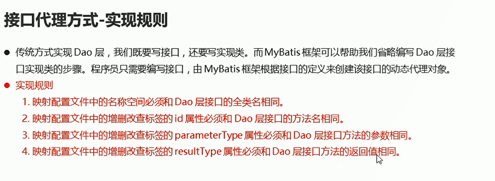
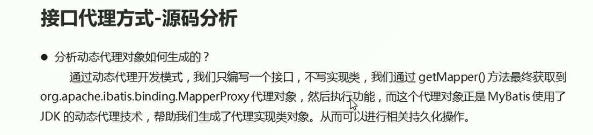

# 接口代理的方式实现Dao层

## 实现规则

  

* 映射配置文件中的名称空间必须和Dao层接口的全类名相同
* 映射配置文件的增删改查标签的id属性必须和Dao层接口方法的参数相同
* 映射配置文件中的增删改查标签的parameterType属性必须和Dao层接口方法的参数相同
* 映射配置文件中的增删改查标签中的resultType属性必须和Dao层接口方法的返回值相同

## 代码实现

* 删除mapper层接口的实现类
* 修改映射配置文件
* 修改service层接口的实现类 采用接口代理方式实现功能

* mapper层接口
```java
package com.itheima.mapper;

import com.itheima.bean.Student;

import java.util.List;

/*
    持久层接口
 */

// 接口的名称要和namespace一样
public interface StudentMapper {
    //查询全部
    public abstract List<Student> selectAll();

    //根据id查询
    public abstract Student selectById(Integer id);

    //新增数据
    public abstract Integer insert(Student stu);

    //修改数据
    public abstract Integer update(Student stu);

    //删除数据
    public abstract Integer delete(Integer id);

    //多条件查询
    public abstract List<Student> selectCondition(Student stu);

    //根据多个id查询
    public abstract List<Student> selectByIds(List<Integer> ids);
}


```


* 映射配置文件

```xml
<?xml version="1.0" encoding="UTF-8" ?>
<!--MyBatis的DTD约束-->
<!DOCTYPE mapper
        PUBLIC "-//mybatis.org//DTD Mapper 3.0//EN"
        "http://mybatis.org/dtd/mybatis-3-mapper.dtd">

<!--
    mapper：核心根标签
    namespace属性：名称空间
-->

<!--名称空间要和接口的路径保持一致-->
<mapper namespace="com.itheima.mapper.StudentMapper">
    <sql id="select" >SELECT * FROM student</sql>

    <!--
        select：查询功能的标签
        id属性：唯一标识
        resultType属性：指定结果映射对象类型  返回值类型
        parameterType属性：指定参数映射对象类型
    -->

<!--    id必须和方法名保持一致-->
    <select id="selectAll" resultType="student">
        <include refid="select"/>
    </select>

    <select id="selectById" resultType="student" parameterType="int">
        <include refid="select"/> WHERE id = #{id}
    </select>

    <insert id="insert" parameterType="student">
        INSERT INTO student VALUES (#{id},#{name},#{age})
    </insert>

    <update id="update" parameterType="student">
        UPDATE student SET name = #{name},age = #{age} WHERE id = #{id}
    </update>

    <delete id="delete" parameterType="int">
        DELETE FROM student WHERE id = #{id}
    </delete>

    <select id="selectCondition" resultType="student" parameterType="student">
        <include refid="select"/>
        <where>
            <if test="id != null">
                id = #{id}
            </if>
            <if test="name != null">
                AND name = #{name}
            </if>
            <if test="age != null">
                AND age = #{age}
            </if>
        </where>
    </select>

    <select id="selectByIds" resultType="student" parameterType="list">
        <include refid="select"/>
        <where>
            <foreach collection="list" open="id IN (" close=")" item="id" separator=",">
                #{id}
            </foreach>
        </where>
    </select>
</mapper>

```

* StudentServiceImpl

```java
package com.itheima.service.impl;

import com.itheima.bean.Student;
import com.itheima.mapper.StudentMapper;
import com.itheima.service.StudentService;
import org.apache.ibatis.io.Resources;
import org.apache.ibatis.session.SqlSession;
import org.apache.ibatis.session.SqlSessionFactory;
import org.apache.ibatis.session.SqlSessionFactoryBuilder;

import java.io.IOException;
import java.io.InputStream;
import java.util.List;
/*
    业务层实现类
 */
public class StudentServiceImpl implements StudentService {

    @Override
    public List<Student> selectAll() throws IOException {
        List<Student> students = null;
        SqlSession sqlSession = null;
        InputStream is = null;

       // 没有了持久层实现对象  只有持久层的接口

        try{
            // 加载核心配置文件
            is = Resources.getResourceAsStream("MyBatisConfig.xml");// 返回一个字节输入流对象

            // 获取sqlSession工厂对象
            SqlSessionFactory build = new SqlSessionFactoryBuilder().build(is);

            // 通过工厂对象获取SqlSession对象
            sqlSession = build.openSession(true);// 代表自动提交事务

            // 获取StudentMapper接口的实现类对象
            // 父类的接口指向实现类对象
            StudentMapper mapper = sqlSession.getMapper(StudentMapper.class);

            // 通过实现类对象调用方法  接受结果
            students = mapper.selectAll();

            // 释放资源


            // 返回结果
        }catch(Exception e){
            e.printStackTrace();
        }finally {
            // 释放资源
            if(sqlSession != null){
                sqlSession.close();
            }
            
           if(is != null){
               is.close();
           }
        }
        // 返回结果
        return students;
    }

    @Override
    public Student selectById(Integer id) throws IOException {
        // 根据id来查询对象
        Student stu = null;
        SqlSession sqlSession = null;
        InputStream is = null;

        try{
            // 加载核心配置文件
            is = Resources.getResourceAsStream("MyBatisConfig.xml");
            
            //获取工厂对象
            SqlSessionFactory build = new SqlSessionFactoryBuilder().build(is);

            // 通过工厂对象获取SqlSession
            sqlSession = build.openSession(true);// 代表自动提交事务

            // 获取StudentMapper接口的实现类对象
            StudentMapper mapper = sqlSession.getMapper(StudentMapper.class);

            // 通过实现类对象调用方法  接受结果
            stu = mapper.selectById(id);// 获取学生对象

        }catch (Exception e){
            e.printStackTrace();
        }finally {
            if(sqlSession != null){
                sqlSession.close();
            }

            if(is != null){
                is.close();
            }
        }

        // 获取学生对象
        return stu;
    }


    // 新增学生对象
    @Override
    public Integer insert(Student stu) throws IOException {
        // 根据id来查询对象
        Integer result = null;
        SqlSession sqlSession = null;
        InputStream is = null;

        try{
            // 加载核心配置文件
            is = Resources.getResourceAsStream("MyBatisConfig.xml");

            //获取工厂对象
            SqlSessionFactory build = new SqlSessionFactoryBuilder().build(is);

            // 通过工厂对象获取SqlSession
            sqlSession = build.openSession(true);// 代表自动提交事务

            // 获取StudentMapper接口的实现类对象
            StudentMapper mapper = sqlSession.getMapper(StudentMapper.class);

            // 通过实现类对象调用方法  接受结果
            result = mapper.insert(stu);// 返回影响的行数

        }catch (Exception e){
            e.printStackTrace();
        }finally {
            if(sqlSession != null){
                sqlSession.close();
            }

            if(is != null){
                is.close();
            }
        }

        // 获取学生对象
        return result;
    }


    @Override
    public Integer update(Student stu) throws IOException {
        // 根据id来查询对象
        Integer result = null;
        SqlSession sqlSession = null;
        InputStream is = null;

        try{
            // 加载核心配置文件
            is = Resources.getResourceAsStream("MyBatisConfig.xml");

            //获取工厂对象
            SqlSessionFactory build = new SqlSessionFactoryBuilder().build(is);

            // 通过工厂对象获取SqlSession
            sqlSession = build.openSession(true);// 代表自动提交事务

            // 获取StudentMapper接口的实现类对象
            StudentMapper mapper = sqlSession.getMapper(StudentMapper.class);

            // 通过实现类对象调用方法  接受结果
            result = mapper.update(stu);// 返回影响的行数

        }catch (Exception e){
            e.printStackTrace();
        }finally {
            if(sqlSession != null){
                sqlSession.close();
            }

            if(is != null){
                is.close();
            }
        }

        // 获取学生对象
        return result;
    }

    @Override
    public Integer delete(Integer id) throws IOException {
        // 根据id来查询对象
        Integer result = null;
        SqlSession sqlSession = null;
        InputStream is = null;

        try{
            // 加载核心配置文件
            is = Resources.getResourceAsStream("MyBatisConfig.xml");

            //获取工厂对象
            SqlSessionFactory build = new SqlSessionFactoryBuilder().build(is);

            // 通过工厂对象获取SqlSession
            sqlSession = build.openSession(true);// 代表自动提交事务

            // 获取StudentMapper接口的实现类对象
            StudentMapper mapper = sqlSession.getMapper(StudentMapper.class);

            // 通过实现类对象调用方法  接受结果
            result = mapper.delete(id);// 返回影响的行数

        }catch (Exception e){
            e.printStackTrace();
        }finally {
            if(sqlSession != null){
                sqlSession.close();
            }

            if(is != null){
                is.close();
            }
        }

        // 获取学生对象
        return result;
    }
}


```

## 代理对象分析

  

## 接口代理方式小结

* 接口代理方式可以让我们之编写接口即可，而实现类对象由MyBatis生成
* 实现规则
  * 映射配置文件中的名称空间必须和Dao层接口的全类名相同
  * 映射配置文件中的增删改查标签的id属性必须和Dao层接口的方法名相同
  * 映射配置文件中的增删改查标签的parameterType属性必须和Dao层接口方法的参数相同
  * 映射配置文件中的增删改查标签的resultType属性必须和Dao层接口方法的返回值相同

* 获取动态代理对象
  * SqlSession功能类中的getMapper()方法


