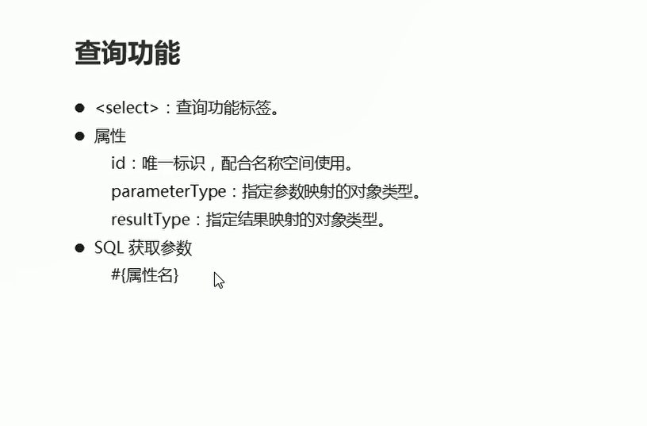
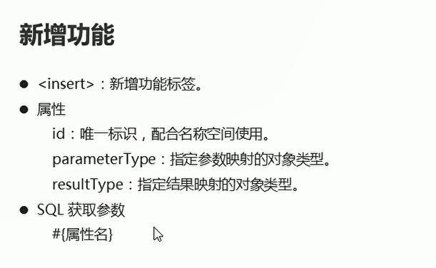
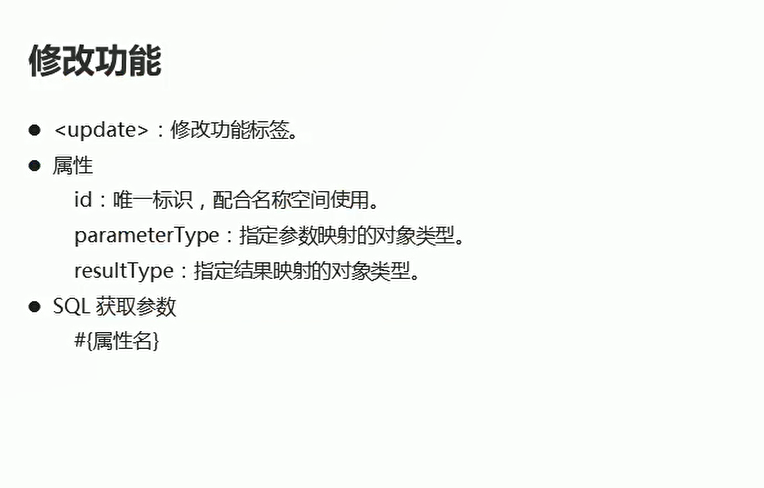
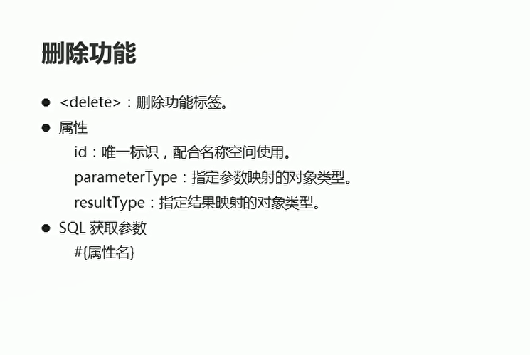
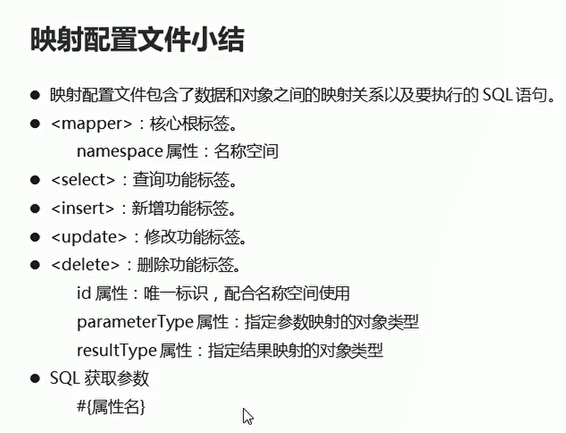

# 映射配置文件

## 介绍

```java
<?xml version="1.0" encoding="UTF-8" ?>
<!--MyBatis的DTD约束-->
<!DOCTYPE mapper
        PUBLIC "-//mybatis.org//DTD Mapper 3.0//EN"
        "http://mybatis.org/dtd/mybatis-3-mapper.dtd">
<!--mapper:核心根标签
namespace属性:名称空间-->
<mapper namespace="StudentMapper">
<!--    select:查询功能标签
        id属性:代表唯一的标识
        resultType属性:指定结果映射对象类型
        parameterType:指定参数映射对象的类型
        -->
    <select id="selectAll" resultType="com.itheima.bean.Student">
        SELECT * FROM student
    </select>
</mapper>

```


## 查询功能的使用

**根据Id进行查询**

```java
package com.itheima.dao;

import com.itheima.bean.Student;
import org.apache.ibatis.io.Resources;
import org.apache.ibatis.session.SqlSession;
import org.apache.ibatis.session.SqlSessionFactory;
import org.apache.ibatis.session.SqlSessionFactoryBuilder;
import org.junit.Test;

import java.io.IOException;
import java.io.InputStream;
import java.util.List;

public class Test01 {
    @Test
    public void test2() throws IOException {
        // 加载核心配置文件  连接数据库的一些配置
        InputStream is = Resources.getResourceAsStream("MyBatisConfig.xml");// 获取配置文件的输入流对象
        
        // 获取SqlSessionFactory对象
        SqlSessionFactory build = new SqlSessionFactoryBuilder().build(is);

        // 获取sqlsession对象
        SqlSession sqlSession = build.openSession();

        // 执行映射配置文件中的sql语句  并且接受结果  根据Id进行查询
        Student o = sqlSession.selectOne("StudentMapper.select1",2);

        // 处理结果  释放资源
        System.out.println(o);

        // 释放资源
        sqlSession.close();
        is.close();
    }

    public void test1() throws IOException {
        // 加载核心配置文件  里面包含连接数据库的相关配置
        InputStream is = Resources.getResourceAsStream("MyBatisConfig.xml");// 获取配置文件的输入流对象

        // 原始的加载配置文件的方法
        InputStream resourceAsStream = Test01.class.getClassLoader().getResourceAsStream("MyBatisConfig.xml");

        // 获取SQLSession工厂对象
        SqlSessionFactory sqlSessionFactory = new SqlSessionFactoryBuilder().build(is);

        // 通过SQLSession工厂对象获取SqlSesssion对象
        SqlSession sqlSession = sqlSessionFactory.openSession();

        // 执行映射配置文件中的sql语句 并且接受结果 参数：namespace.id  执行指定的sql语句
        List<Student> list = sqlSession.selectList("StudentMapper.selectAll");// 返回一个list集合 包含student对象
        // 处理结果
        for (Student student : list) {
            System.out.println(student);
        }
        // 释放资源
        sqlSession.close();
        is.close();
    }

}


```

  

## 新增功能的使用

  

```java
    public void test3() throws IOException {
        // 加载核心配置文件
        InputStream is = Resources.getResourceAsStream("MyBatisConfig.xml"); // 获取配置文件的输入流对象

        // 获取SqlSession工厂对象
        SqlSessionFactory build = new SqlSessionFactoryBuilder().build(is);

        // 通过工厂对象获取SqlSession对象
        SqlSession sqlSession = build.openSession();// 没有填写布尔类型的参数 表示手动提交事务

        // 执行映射配置文件中的sql语句  并且接受结果
        Student stu = new Student(4,"赵六",26);

        // 执行sql语句 新增学生记录
        int insert = sqlSession.insert("StudentMapper.insert", stu);// 返回影响的行数

        // 提交事务
        sqlSession.commit();

        // 处理结果
        System.out.println(insert);

        // 释放资源
        sqlSession.close();
        is.close();
    }

```

## 修改功能

  


```java
    public void test4() throws IOException {
        // 加载核心配置文件  获取映射配置文件的输入流对象
        InputStream is = Resources.getResourceAsStream("MyBatisConfig.xml");

        // 获取工程对象
        SqlSessionFactory build = new SqlSessionFactoryBuilder().build(is);
        // 获取sqlSession对象
        SqlSession sqlSession = build.openSession();

        // 执行配置文件中的sql语句 并且传递参数
        Student stu = new Student(1,"hhhh",32);
        int update = sqlSession.update("StudentMapper.update", stu);

        // 提交事务
        sqlSession.commit();

        // 处理结果
        System.out.println(update);

        // 释放资源
        is.close();
        sqlSession.close();
    }
```

## 删除功能

  

```java
    public void test5() throws IOException {
        // 加载核心配置文件 获取映射配置文件的输入流对象
        InputStream is = Resources.getResourceAsStream("MyBatisConfig.xml");

        // 获取工厂对象
        SqlSessionFactory build = new SqlSessionFactoryBuilder().build(is);

        // 获取sqlSession对象
        SqlSession sqlSession = build.openSession();

        // 执行配置文件中的sql语句 并且传递参数
        int delete = sqlSession.delete("StudentMapper.delete", 1);// 返回成功执行的记录数目


        // 提交事务
        sqlSession.commit();

        // 处理结果
        System.out.println(delete);

        // 释放资源
        sqlSession.close();
        is.close();
    }
```

## 小结

  

