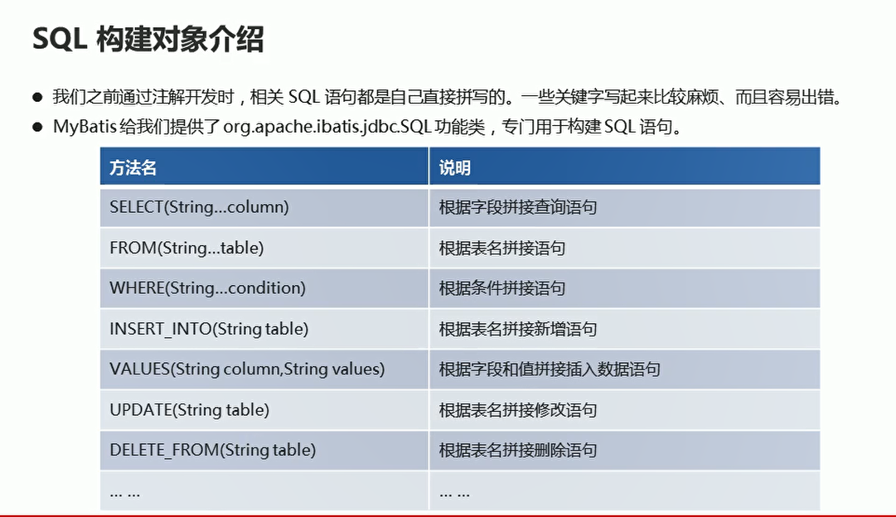
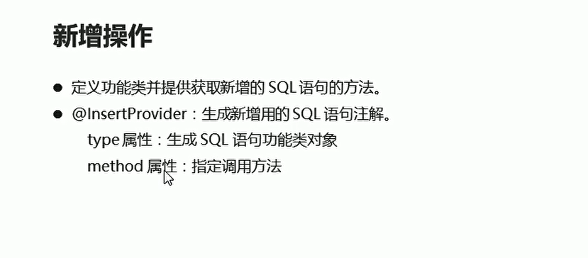
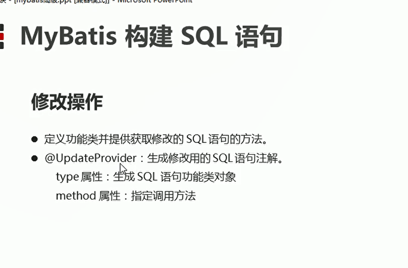

# 构建SQL


## 简单介绍

  


## 查询功能实现

* sql类

```java
package com.itheima.sql;

import org.apache.ibatis.jdbc.SQL;

public class ReturnSql {

    // 定义方法 返回查询的sql语句
    public String getSelectAll(){
        return new SQL(){
            {
                SELECT("*");
                FROM("student");
            }
        }.toString();
    }
}


```


* StudentMapper

```java
package com.itheima.mapper;

import com.itheima.bean.Student;
import com.itheima.sql.ReturnSql;
import org.apache.ibatis.annotations.*;

import java.util.List;

public interface  StudentMapper {

    // 映射接口文件

    // 注解操作 实现接口对象的创建  不需要为每一个接口写xml映射文件
//    @Select("SELECT * FROM student")
    @SelectProvider(type = ReturnSql.class,method = "getSelectAll")
    public List<Student> selectAll();

    // 新增功能
    @Insert("INSERT INTO student VALUES (#{id},#{name},#{age}")
    public abstract Integer insert(Student stu);

    // 修改功能
    @Update("UPDATE student SET name = #{name} ,age = #{age} WHERE id = #{id}")
    public abstract Integer update(Student stu);

    // 删除功能
    @Delete("Delete FROM student WHERE id = #{id}")
    public abstract Integer delete(Integer id);
}


```


* 测试类

```java
package com.itheima.test;

import com.itheima.bean.Student;
import com.itheima.mapper.StudentMapper;
import org.apache.ibatis.annotations.Result;
import org.apache.ibatis.annotations.ResultType;
import org.apache.ibatis.io.Resources;
import org.apache.ibatis.session.SqlSession;
import org.apache.ibatis.session.SqlSessionFactory;
import org.apache.ibatis.session.SqlSessionFactoryBuilder;
import org.junit.Test;

import java.io.IOException;
import java.io.InputStream;
import java.util.List;

public class Test01 {
    @Test
    public void selectAll() throws IOException {
        // 加载核心配置文件
        InputStream is = Resources.getResourceAsStream("MyBatisConfig.xml");

        // 获取sqlSession对象
        SqlSessionFactory build = new SqlSessionFactoryBuilder().build(is);
        // 通过工厂对象获取sqlSession
        SqlSession sqlSession = build.openSession(true);
        
        // 获取StudentMapper接口实现对象
        StudentMapper mapper = sqlSession.getMapper(StudentMapper.class);
        // 调用实现类对象的方法  接受结果

        List<Student> students = mapper.selectAll();

        for (Student student : students) {
            System.out.println(student);
        }

        sqlSession.close();
        is.close();
    }
}


```

## 新增功能实现

  


* 新增sql语句

```java
// 定义方法  返回新增的sql语句
    public String getInsert(Student stu){

        // 语句 括号里面写参数
        return new SQL(){
            {
                INSERT_INTO("student");
                INTO_VALUES("#{id},#{name},#{age}");
            }
        }.toString();
    }

```

* StudentMapper

```java
    @InsertProvider(type = ReturnSql.class,method = "getInsert")
    public abstract Integer insert(Student stu);
```


## 修改功能实现

  

* StudentMapper
```java
    // 修改功能
//    @Update("UPDATE student SET name = #{name} ,age = #{age} WHERE id = #{id}")
    @UpdateProvider(type = ReturnSql.class,method = "getUpdate")
    public abstract Integer update(Student stu);

```

* update

```java
    public String getUpdate(Student stu){
        return new SQL(){
            {
                UPDATE("student");
                SET("name = #name","age = #{age}");
                WHERE("id=#{id}");
            }
        }.toString();
    }

```
