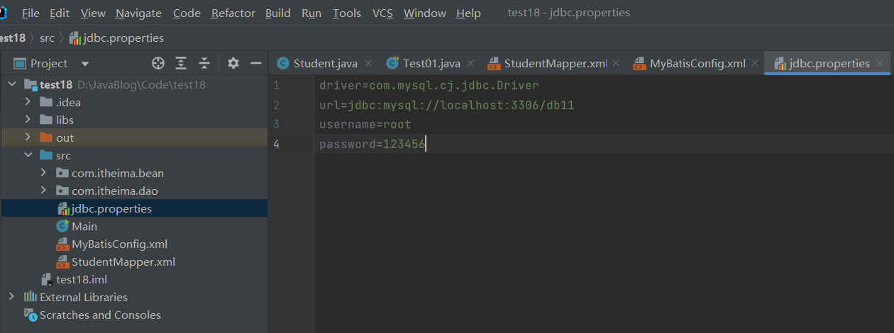
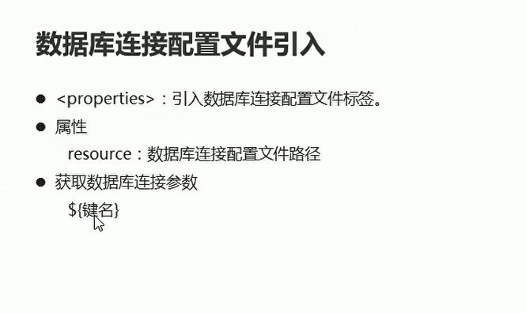
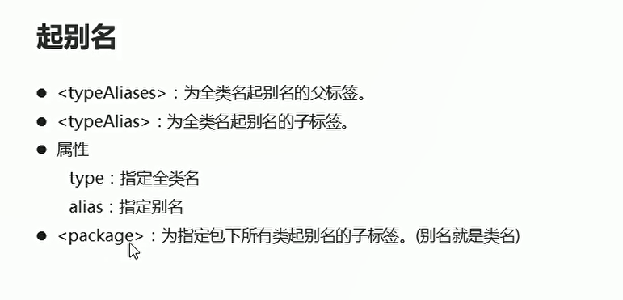
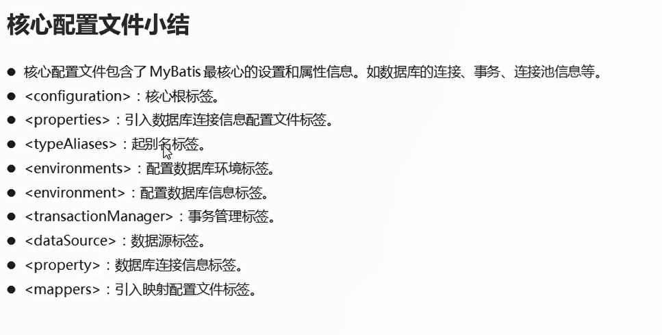

# 核心配置文件

## 介绍

* 核心配置文件包含了MyBatis最核心的设置和属性信息 比如数据库的连接 事务 连接池的信息

```java
<?xml version="1.0" encoding="UTF-8" ?>
<!--DTD约束-->
<!DOCTYPE configuration PUBLIC "-//mybatis.org//DTD Config 3.0//EN" "http://mybatis.org/dtd/mybatis-3-config.dtd">

<!--configuration 核心根标签-->
<configuration>
<!--    environments用来配置数据库环境  这个环境是有多个的-->
    <environments default="mysql">
<!--        子环境  Id代表子环境的唯一标识-->
        <environment id="mysql">
<!--            事务管理  type属性 采用JDBC默认的事务处理-->
            <transactionManager type="JDBC"></transactionManager>

<!--            dataSource 数据源信息   pooled代表连接池-->
            <dataSource type="POOLED">
<!--                property代表获取数据库连接的配置信息-->
                <property name="driver" value="com.mysql.cj.jdbc.Driver"/>
                <property name="url" value="jdbc:mysql://localhost:3306/db11"/>
                <property name="username" value="root"/>
                <property name="password" value="123456"/>
            </dataSource>
        </environment>
    </environments>

<!--    mappers引入映射配置文件-->
    <mappers>
<!--        resource属性 指定映射配置文件的路径-->
        <mapper resource="StudentMapper.xml"/>
    </mappers>
</configuration>

```

## Properties标签的使用

**在Properties文件中将数据库连接信息的相关配置写入,比如driver url username password,然后再核心配置文件中将这些信息从properties文件中读取出来**

  

  


```properties

driver=com.mysql.cj.jdbc.Driver
url=jdbc:mysql://localhost:3306/db11
username=root
password=123456
```

```xml
<?xml version="1.0" encoding="UTF-8" ?>
<!--DTD约束-->
<!DOCTYPE configuration PUBLIC "-//mybatis.org//DTD Config 3.0//EN" "http://mybatis.org/dtd/mybatis-3-config.dtd">

<!--configuration 核心根标签-->
<configuration>

<!--    引入数据库连接的配置文件-->
    <properties resource="jdbc.properties"/>

<!--    environments用来配置数据库环境  这个环境是有多个的-->
    <environments default="mysql">
<!--        子环境  Id代表子环境的唯一标识-->
        <environment id="mysql">
<!--            事务管理  type属性 采用JDBC默认的事务处理-->
            <transactionManager type="JDBC"></transactionManager>

<!--            dataSource 数据源信息   pooled代表连接池-->
            <dataSource type="POOLED">
<!--                property代表获取数据库连接的配置信息-->
                <property name="driver" value="${driver}"/>
                <property name="url" value="${url}"/>
                <property name="username" value="${username}"/>
                <property name="password" value="${password}"/>
            </dataSource>
        </environment>
    </environments>

<!--    mappers引入映射配置文件-->
    <mappers>
<!--        resource属性 指定映射配置文件的路径-->
        <mapper resource="StudentMapper.xml"/>
    </mappers>
</configuration>

```


## 起别名的使用

  

**在核心配置文件中添加起别名的语句,然后再映射配置文件中将相关语句变换成别名**

核心配置文件
```xml
<?xml version="1.0" encoding="UTF-8" ?>
<!--DTD约束-->
<!DOCTYPE configuration PUBLIC "-//mybatis.org//DTD Config 3.0//EN" "http://mybatis.org/dtd/mybatis-3-config.dtd">

<!--configuration 核心根标签-->
<configuration>

<!--    引入数据库连接的配置文件-->
    <properties resource="jdbc.properties"/>

<!--    起别名-->
    <typeAliases>
        <typeAlias type="com.itheima.bean.Student" alias="student"/>
    </typeAliases>

<!--    environments用来配置数据库环境  这个环境是有多个的-->
    <environments default="mysql">
<!--        子环境  Id代表子环境的唯一标识-->
        <environment id="mysql">
<!--            事务管理  type属性 采用JDBC默认的事务处理-->
            <transactionManager type="JDBC"></transactionManager>

<!--            dataSource 数据源信息   pooled代表连接池-->
            <dataSource type="POOLED">
<!--                property代表获取数据库连接的配置信息-->
                <property name="driver" value="${driver}"/>
                <property name="url" value="${url}"/>
                <property name="username" value="${username}"/>
                <property name="password" value="${password}"/>
            </dataSource>
        </environment>
    </environments>

<!--    mappers引入映射配置文件-->
    <mappers>
<!--        resource属性 指定映射配置文件的路径-->
        <mapper resource="StudentMapper.xml"/>
    </mappers>
</configuration>
```

映射配置文件

```xml

<?xml version="1.0" encoding="UTF-8" ?>
<!--MyBatis的DTD约束-->
<!DOCTYPE mapper
        PUBLIC "-//mybatis.org//DTD Mapper 3.0//EN"
        "http://mybatis.org/dtd/mybatis-3-mapper.dtd">
<!--mapper:核心根标签
namespace属性:名称空间-->
<mapper namespace="StudentMapper">
<!--    select:查询功能标签
        id属性:代表唯一的标识
        resultType属性:指定结果映射对象类型
        parameterType:指定参数映射对象的类型
        -->
    <select id="selectAll" resultType="student">
        SELECT * FROM student
    </select>

<!--    根据id进行 查询参数类型是包装类Integer  传入的参数是id  #{id}-->
    <select id="select1"  resultType="student" parameterType="java.lang.Integer">
        SELECT * FROM student WHERE id = #{id}
    </select>

<!--    传入三个参数 参数映射对象 从学生对象那边获取  传入三个参数-->
    <insert id="insert" parameterType="student">
        INSERT INTO student VALUES (#{id},#{name},#{age})
    </insert>

<!--    修改的sql  参数映射对象  从学生对象获取三个参数-->
    <update id="update" parameterType="student">
        UPDATE student SET name = #{name},age = #{age} WHERE id = #{id}
    </update>

<!--    删除sql语句-->
    <delete id="delete" parameterType="java.lang.Integer">
        DELETE FROM student WHERE id = #{id}
    </delete>
</mapper>

```


## 核心配置文件小结

  


