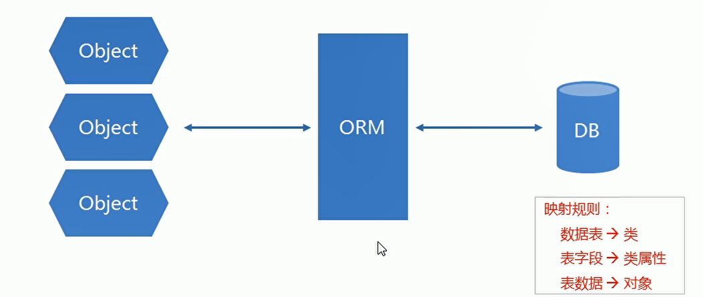
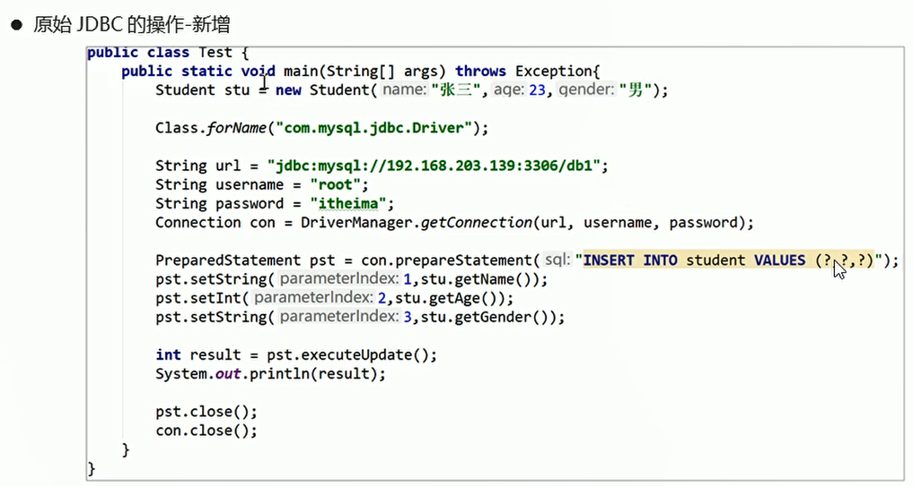
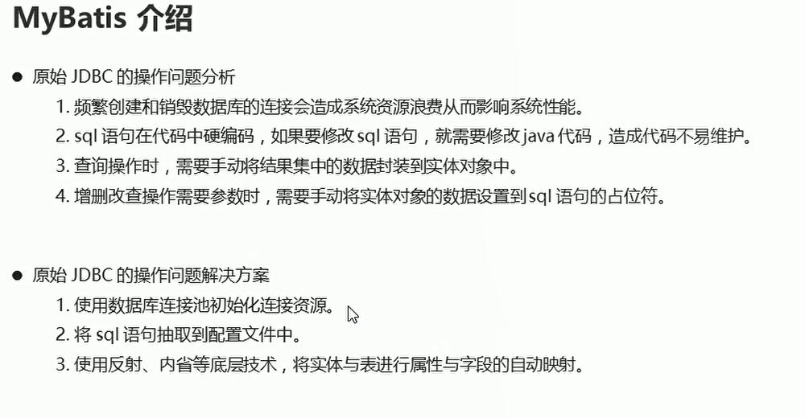
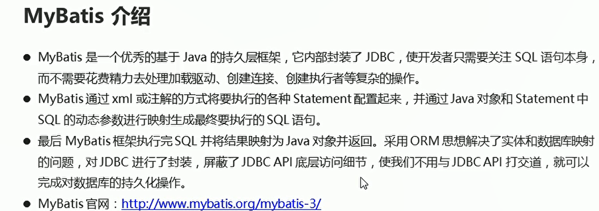
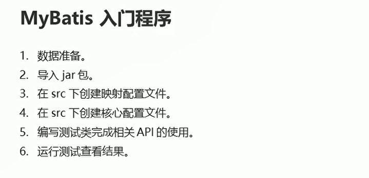
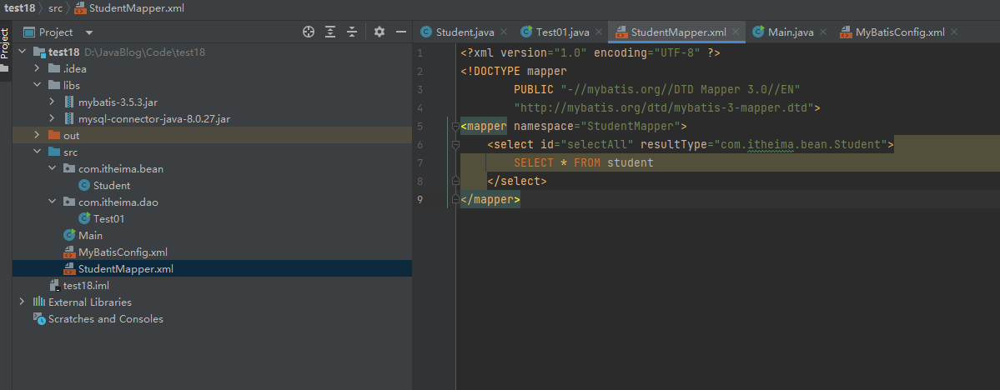

# MyBatis快速入门

## 框架的介绍

* 框架是一款半成品软件，我们可以基于这个半成品软件继续开发，来完成我们的个性化的需求

## ORM介绍

* ORM：对象关系映射
* 指的是持久化数据和实体对象的映射模式，为了解决面向对象与与关系型数据库存在的胡不匹配的现象的技术


  


## MyBatis介绍

  

  

  

## 入门程序

  

* Student

```java
package com.itheima.bean;

public class Student {
    private Integer id;
    private String name;
    private Integer age;

    public Student() {
    }

    public Student(Integer id, String name, Integer age) {
        this.id = id;
        this.name = name;
        this.age = age;
    }

    public Integer getId() {
        return id;
    }

    public void setId(Integer id) {
        this.id = id;
    }

    public String getName() {
        return name;
    }

    public void setName(String name) {
        this.name = name;
    }

    public Integer getAge() {
        return age;
    }

    public void setAge(Integer age) {
        this.age = age;
    }

    @Override
    public String toString() {
        return "Student{" +
                "id=" + id +
                ", name='" + name + '\'' +
                ", age=" + age +
                '}';
    }
}


```

* Test01

```java
package com.itheima.dao;

import com.itheima.bean.Student;
import org.apache.ibatis.io.Resources;
import org.apache.ibatis.session.SqlSession;
import org.apache.ibatis.session.SqlSessionFactory;
import org.apache.ibatis.session.SqlSessionFactoryBuilder;

import java.io.IOException;
import java.io.InputStream;
import java.util.List;

public class Test01 {
    public static void main(String[] args) throws IOException {
        // 加载核心配置文件  里面包含连接数据库的相关配置
        InputStream is = Resources.getResourceAsStream("MyBatisConfig.xml");// 获取配置文件的输入流对象

        // 获取SQLSession工厂对象
        SqlSessionFactory sqlSessionFactory = new SqlSessionFactoryBuilder().build(is);

        // 通过SQLSession工厂对象获取SqlSesssion对象
        SqlSession sqlSession = sqlSessionFactory.openSession();

        // 执行映射配置文件中的sql语句 并且接受结果 参数：namespace.id  执行指定的sql语句
        List<Student> list = sqlSession.selectList("StudentMapper.selectAll");// 返回一个list集合 包含student对象

        // 处理结果
        for (Student student : list) {
            System.out.println(student);
        }

        // 释放资源
        sqlSession.close();
        is.close();
    }
}

```

* MyBatisConfig.xml

数据库连接的配置
```java
<?xml version="1.0" encoding="UTF-8" ?>
<!DOCTYPE configuration PUBLIC "-//mybatis.org//DTD Config 3.0//EN" "http://mybatis.org/dtd/mybatis-3-config.dtd">

<configuration>
    <environments default="mysql">
        <environment id="mysql">
            <transactionManager type="JDBC"></transactionManager>
            <dataSource type="POOLED">
                <property name="driver" value="com.mysql.cj.jdbc.Driver"/>
                <property name="url" value="jdbc:mysql://localhost:3306/db11"/>
                <property name="username" value="root"/>
                <property name="password" value="123456"/>
            </dataSource>
        </environment>
    </environments>

    <mappers>
        <mapper resource="StudentMapper.xml"/>
    </mappers>
</configuration>

```

* StudentMapper.xml

数据库映射文件的配置，通过namespace.id可以执行特定的sql语句


```java
<?xml version="1.0" encoding="UTF-8" ?>
<!DOCTYPE mapper
        PUBLIC "-//mybatis.org//DTD Mapper 3.0//EN"
        "http://mybatis.org/dtd/mybatis-3-mapper.dtd">
<mapper namespace="StudentMapper">
    <select id="selectAll" resultType="com.itheima.bean.Student">
        SELECT * FROM student
    </select>
</mapper>
```

  


