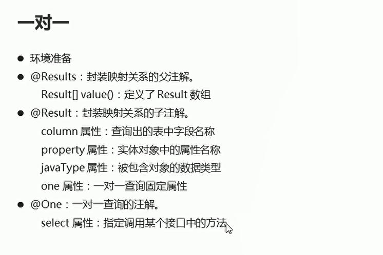
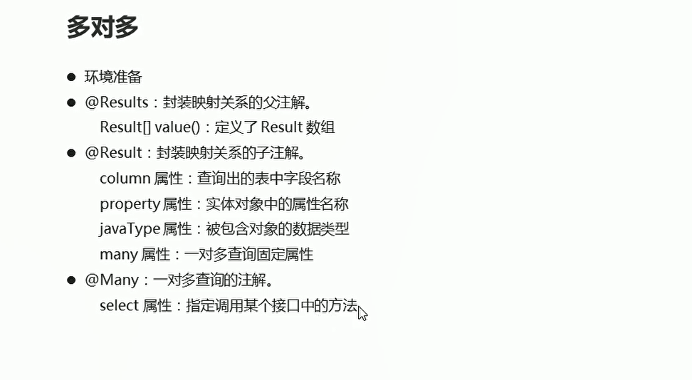
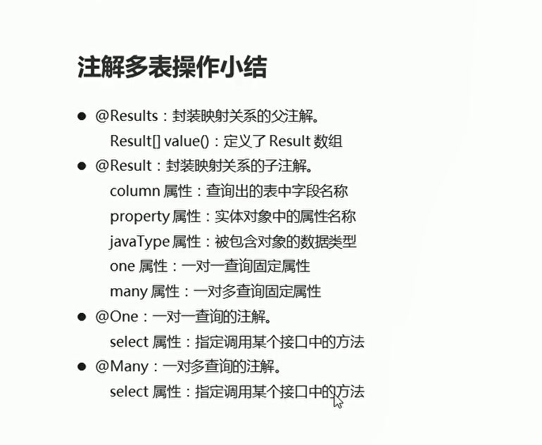

# 注解多表操作

## 注解多表操作-一对一的实现

  

* CardMapper

```java
package com.itheima.one_to_one;

import com.itheima.bean.Card;
import com.itheima.bean.Person;
import org.apache.ibatis.annotations.*;

import java.util.List;

public interface CardMapper {
    @Select("SELECT * FROM card")
    @Results({
            @Result(column = "id",property = "id"),
            @Result(column = "number",property = "number"),
            @Result(
                    property = "p",// 被包含对象的变量名,
                    javaType = Person.class, // 被包含对象的实际数据类型
                    column = "pid",// 根据查询出的card表中的pid字符段来查询person表

                    // @One 一对一固定用法
                    // select属性：指定调用哪个接口中的哪个方法
                    one = @One(select = "com.itheima.one_to_one.PersonMapper.selectById")
            )
    })
    // 查询全部
    public abstract List<Card> selectAll();
}

```

* PersonMapper

```java
package com.itheima.one_to_one;

import com.itheima.bean.Person;
import org.apache.ibatis.annotations.Select;

public interface PersonMapper {
    // 根据id查询
    @Select("SELECT * FROM person WHERE id = #{id}")
    public abstract Person selectById(Integer id);
}
```

* 测试类

```java
package com.itheima.one_to_one;

import com.itheima.bean.Card;
import org.apache.ibatis.io.Resources;
import org.apache.ibatis.session.SqlSession;
import org.apache.ibatis.session.SqlSessionFactory;
import org.apache.ibatis.session.SqlSessionFactoryBuilder;
import org.junit.Test;

import java.io.IOException;
import java.io.InputStream;
import java.util.List;

public class Test01 {

    @Test
    public void selectAll() throws IOException {
        // 加载核心配置文件
        InputStream is = Resources.getResourceAsStream("MyBatisConfig.xml");

        // 获取sqlSession工厂对象
        SqlSessionFactory build = new SqlSessionFactoryBuilder().build(is);

        // 通过工厂对象获取sqlSession对象
        SqlSession sqlSession = build.openSession(true);

        // 获取cardMapper接口的实现类对象
        CardMapper mapper = sqlSession.getMapper(CardMapper.class);
        // 调用实现类对象中的方法 接受结果

        List<Card> cards = mapper.selectAll();

        for (Card card : cards) {
            System.out.println(card);
        }

        sqlSession.close();
        is.close();
    }
}

```


## 注解操作一对多的实现

* ClassesMapper
```java
package com.itheima.one_to_many;

import com.itheima.bean.Classes;
import org.apache.ibatis.annotations.Many;
import org.apache.ibatis.annotations.Result;
import org.apache.ibatis.annotations.Results;
import org.apache.ibatis.annotations.Select;

import java.util.List;

public interface ClassesMapper {
    @Select("SELECT * FROM classes")
    @Results({
            @Result(column = "id",property = "id"),
            @Result(column = "name",property = "name"),
            @Result(
                    property = "students",
                    javaType = List.class,
                    column = "id",
                    many = @Many(select = "com.itheima.one_to_many.StudentMapper.selectByCid")
            )
    }
    )
    // 查询全部
    public abstract List<Classes> selectAll();
}
```

* StudentMapper

```java
package com.itheima.one_to_many;

import com.itheima.bean.Student;
import org.apache.ibatis.annotations.Select;

import java.util.List;

public interface StudentMapper {

    // 根据cid查询student表
    @Select("SELECT * FROM student WHERE cid = #{cid}")
    public abstract List<Student> selectByCid(Integer cid);
}


```

* 测试类

```java
package com.itheima.one_to_many;

import com.itheima.bean.Card;
import com.itheima.bean.Classes;
import com.itheima.bean.Student;
import com.itheima.one_to_one.CardMapper;
import org.apache.ibatis.io.Resources;
import org.apache.ibatis.session.SqlSession;
import org.apache.ibatis.session.SqlSessionFactory;
import org.apache.ibatis.session.SqlSessionFactoryBuilder;
import org.junit.Test;

import java.io.IOException;
import java.io.InputStream;
import java.util.List;

public class Test01 {

    @Test
    public void selectAll() throws IOException {
        // 加载核心配置文件
        InputStream is = Resources.getResourceAsStream("MyBatisConfig.xml");

        // 获取sqlSession工厂对象
        SqlSessionFactory build = new SqlSessionFactoryBuilder().build(is);

        // 通过工厂对象获取sqlSession对象
        SqlSession sqlSession = build.openSession(true);

        // 获取cardMapper接口的实现类对象
        ClassesMapper mapper = sqlSession.getMapper(ClassesMapper.class);
        // 调用实现类对象中的方法 接受结果

        List<Classes> classes = mapper.selectAll();

        for (Classes aClass : classes) {
            List<Student> students = aClass.getStudents();

            for (Student student : students) {
                System.out.println(student);
            }

        }


        sqlSession.close();
        is.close();
    }
}


```


## 多对多注解操作
  

* courseMapper
```java
package com.itheima.many_to_many;

import com.itheima.bean.Course;
import org.apache.ibatis.annotations.Select;

import java.util.List;

public interface CourseMapper {

    // 根据学生Id查询所选课程
    @Select("SELECT c.id,c.name FROM stu_cr sc,course c WHERE sc.cid = c.id AND sc.sid = #{id}")
    public abstract List<Course> selectBySid(Integer id);

}


```

* StudentMapper
```java
package com.itheima.many_to_many;

import com.itheima.bean.Student;
import org.apache.ibatis.annotations.Many;
import org.apache.ibatis.annotations.Result;
import org.apache.ibatis.annotations.Results;
import org.apache.ibatis.annotations.Select;

import java.util.List;

public interface StudentMapper {

    // 查询全部信息
    @Select("SELECT * FROM student")
    @Results({
            @Result(column = "id",property = "id"),
            @Result(column = "name",property = "name"),
            @Result(column = "age",property = "age"),
            @Result(
                   property = "courses",// 被包含对象的变量名
                    javaType = List.class,// 被包含对象的实际数据类型
                    column = "id",// 根据查询出的studnet表的id来作为关联条件  去查询中间表和课程表
//                    select属性  指定调用哪个接口中的哪个查询方法
                    many = @Many(select = "com.itheima.many_to_many.CourseMapper.selectBySid")

            )
    })

    // 查询全部
    public abstract List<Student> selectAll();
}

```

## 小结

  


