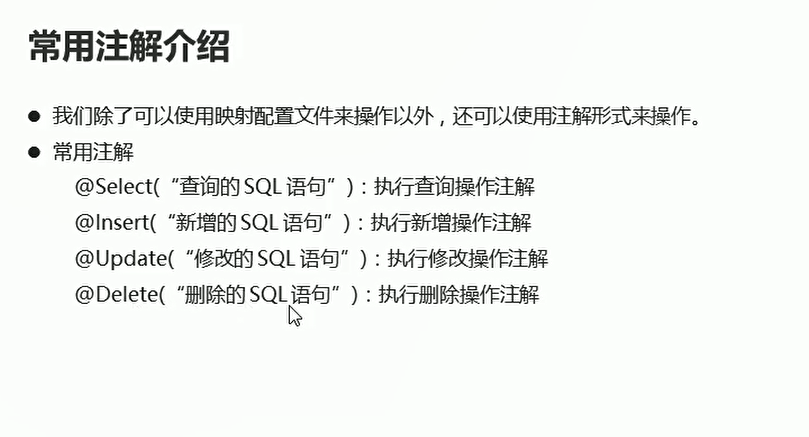
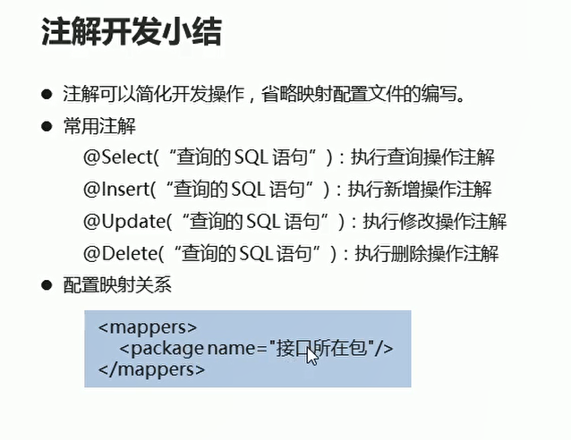

## 注解开发

## 常用注解开发的介绍

**好处：不需要写xml映射配置文件，但是仍然需要在核心配置文件中配置映射配置文件，直接在mapper接口方法的上方指定需要的sql操作**

  

## 注解实现查询的操作

  

* 接口方法中使用注解

```java
package com.itheima.bean.mapper1;
import com.itheima.bean.Student;
import org.apache.ibatis.annotations.Select;
import java.util.List;

public interface StudentMapper {

    // 查询全部操作  使用注解查询操作
    @Select("SELECT * FROM student")
    public abstract List<Student> selectAll();
}

```

* 核心配置文件中配置映射关系

```xml
    
    <mappers>
        <package name="com.itheima.mapper1"/>
    </mappers>

```

* 测试类

```java
package com.itheima.dynamic;

import com.itheima.bean.Student;
import com.itheima.bean.mapper1.StudentMapper1;
import org.apache.ibatis.io.Resources;
import org.apache.ibatis.session.SqlSession;
import org.apache.ibatis.session.SqlSessionFactory;
import org.apache.ibatis.session.SqlSessionFactoryBuilder;
import org.junit.Test;

import java.io.IOException;
import java.io.InputStream;
import java.util.List;

public class Test03 {


    @Test
    public void selectAll() throws IOException {
        // 加载核心配置文件
        InputStream is = Resources.getResourceAsStream("MyBatisConfig.xml");

        // 获取sqlSession工厂对象
        SqlSessionFactory build = new SqlSessionFactoryBuilder().build(is);// 自动提交事务

        // 通过工厂对象获取sqlSession对象
        SqlSession sqlSession = build.openSession(true);

        // 获取StudentMapper接口的实现类对象
        StudentMapper1 mapper = sqlSession.getMapper(StudentMapper1.class);

        // 调用实现类对象中的方法  接受结果
        List<Student> students = mapper.selectAll();


        // 处理结果
        for (Student student : students) {
            System.out.println(student);
        }

        // 释放资源

        sqlSession.close();
        is.close();
    }
}

```

## 注解实现新增操作

* 注解实现插入操作

```java
 // 插入学生操作
    @Insert("INSERT INTO student VALUES (#{id},#{name},#{age})")
    public abstract Integer insert(Student stu);

```

* 测试类

```java
 @Test
    public void insert() throws IOException {
        // 加载核心配置文件
        InputStream is = Resources.getResourceAsStream("MyBatisConfig.xml");

        // 获取sqlSession工厂对象
        SqlSessionFactory build = new SqlSessionFactoryBuilder().build(is);// 自动提交事务

        // 通过工厂对象获取sqlSession对象
        SqlSession sqlSession = build.openSession(true);

        // 获取StudentMapper接口的实现类对象
        StudentMapper1 mapper = sqlSession.getMapper(StudentMapper1.class);


        Student stu = new Student(1, "xxx", 23);
        Integer insert = mapper.insert(stu);// 返回影响的行数

        System.out.println(insert);
        // 释放资源

        sqlSession.close();
        is.close();


    }

```


## 注解实现修改操作

* 注解实现修改数据操作

```java
    @Update("UPDATE student SET name =#{name},age = #{age} WHERE id = #{id}")
    public abstract Integer update(Student stu);

```


* 测试方法
```java
@Test
    public void update() throws IOException {
        // 加载核心配置文件
        InputStream is = Resources.getResourceAsStream("MyBatisConfig.xml");

        // 获取sqlSession工厂对象
        SqlSessionFactory build = new SqlSessionFactoryBuilder().build(is);// 自动提交事务

        // 通过工厂对象获取sqlSession对象
        SqlSession sqlSession = build.openSession(true);

        // 获取StudentMapper接口的实现类对象
        StudentMapper1 mapper = sqlSession.getMapper(StudentMapper1.class);


        Student stu = new Student(1, "xxx", 23);
        Integer result = mapper.update(stu);// 返回影响的行数  修改数据

        System.out.println(result);
        // 释放资源

        sqlSession.close();
        is.close();


    }

```


## 注解实现删除操作

* 注解实现删除操作

```java
    // 删除操作
    @Delete("DELETE FROM student WHERE id = #{id}")
    public abstract Integer delete(Integer id);

```

* 测试类

```java

    public void delete() throws IOException {
        // 加载核心配置文件
        InputStream is = Resources.getResourceAsStream("MyBatisConfig.xml");

        // 获取sqlSession工厂对象
        SqlSessionFactory build = new SqlSessionFactoryBuilder().build(is);// 自动提交事务

        // 通过工厂对象获取sqlSession对象
        SqlSession sqlSession = build.openSession(true);

        // 获取StudentMapper接口的实现类对象
        StudentMapper1 mapper = sqlSession.getMapper(StudentMapper1.class);

        Integer result = mapper.delete(4);

        System.out.println(result);
        // 释放资源

        sqlSession.close();
        is.close();
    }


```


## 总结

  


