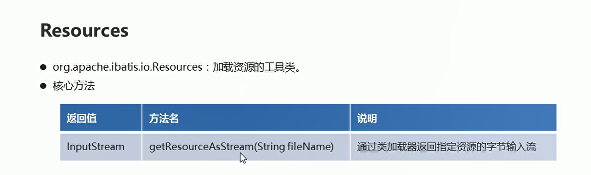
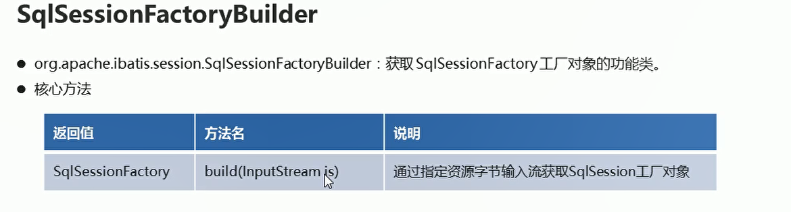
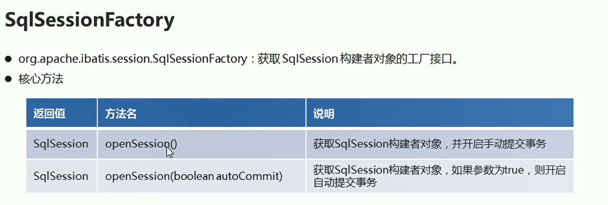
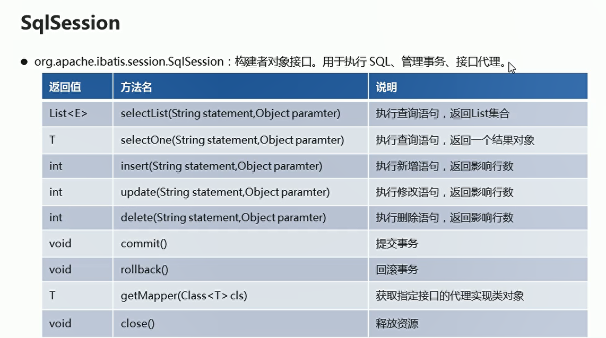
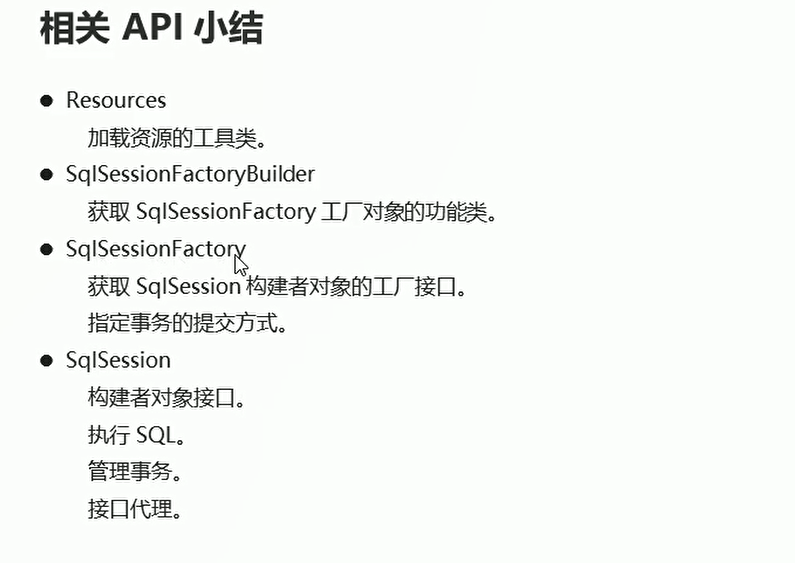

# 相关的API介绍

## 加载核心配置文件 Resources

  

```java
        // 加载核心配置文件  里面包含连接数据库的相关配置
        InputStream is = Resources.getResourceAsStream("MyBatisConfig.xml");// 获取配置文件的输入流对象
        
        // 原始的加载配置文件的方法
        InputStream resourceAsStream = Test01.class.getClassLoader().getResourceAsStream("MyBatisConfig.xml");

```

## 获取工厂对象的API-SqlSessionFactoryBuilder

  

## 获取SqlSession对象

  

## SqlSession中的方法

  

  


