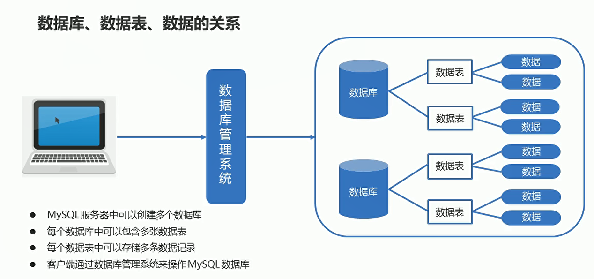
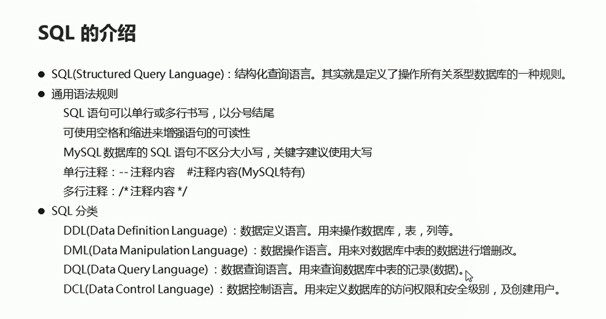
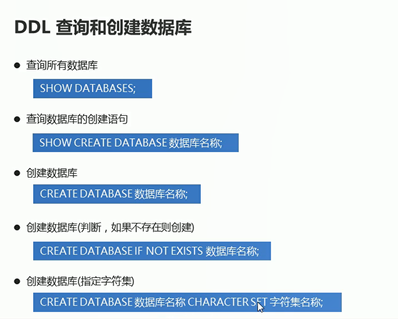
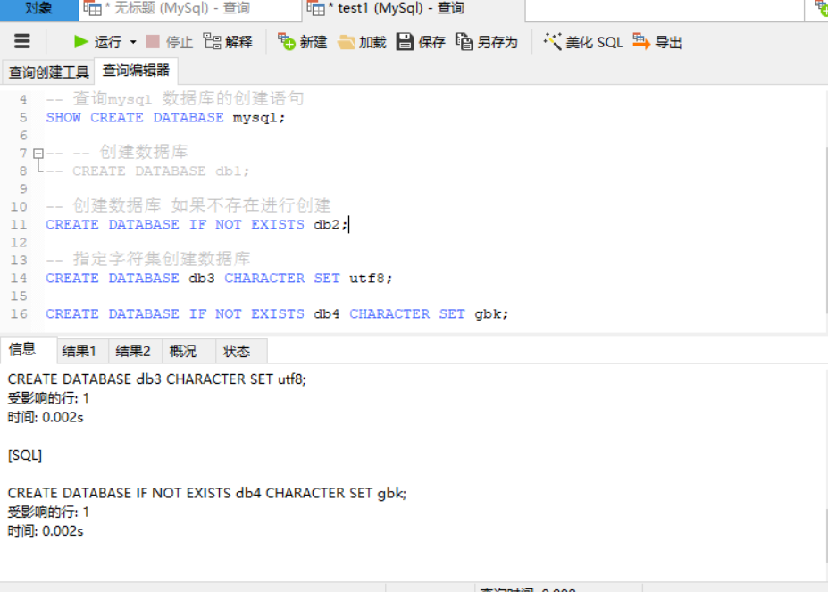
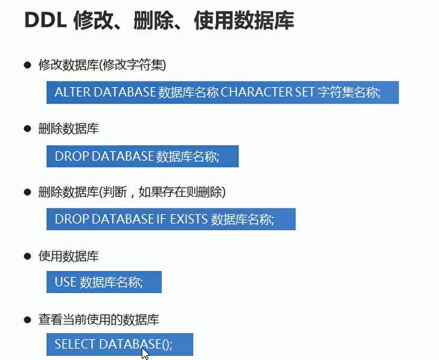
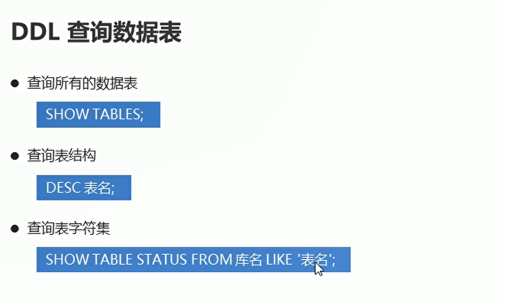
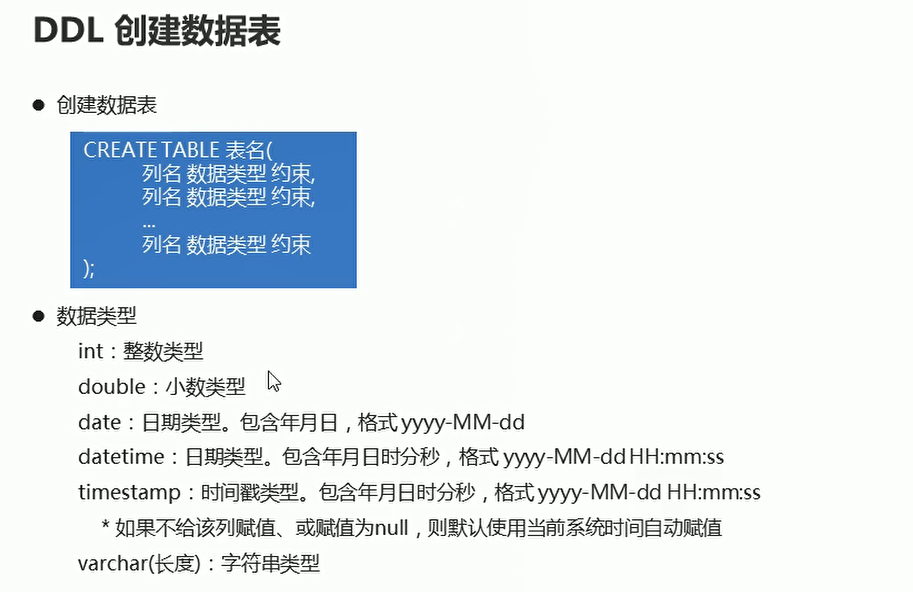
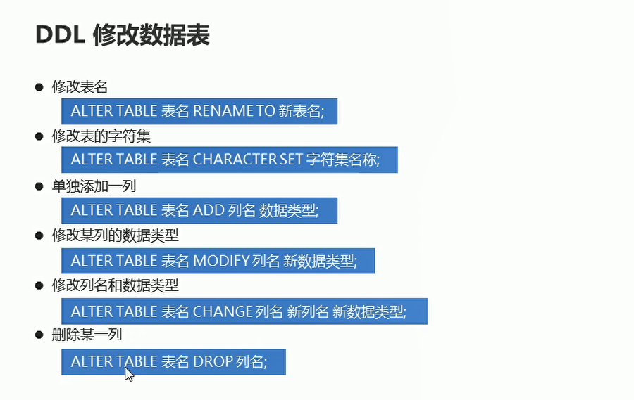
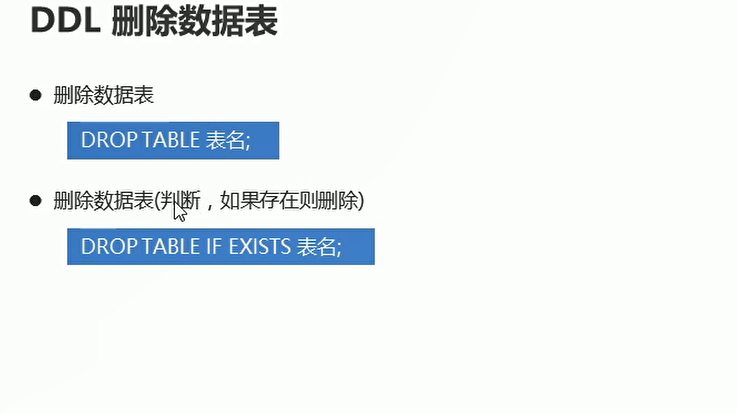

# DDL

## 数据库、数据表、数据之间的关系

  

## SQL介绍

  


## DDL 查询和创建数据库

  


```sql

-- 查询所有的数据库
SHOW DATABASES;

-- 查询mysql 数据库的创建语句
SHOW CREATE DATABASE mysql;

-- -- 创建数据库
-- CREATE DATABASE db1;

-- 创建数据库 如果不存在进行创建
CREATE DATABASE IF NOT EXISTS db2;

-- 指定字符集创建数据库
CREATE DATABASE db3 CHARACTER SET utf8;

CREATE DATABASE IF NOT EXISTS db4 CHARACTER SET gbk; 
```

  

## DDL 修改删除数据库

  

```sql
-- 修改数据库的字符集
ALTER DATABASE db4 CHARACTER SET utf8;

-- 查看db4数据库的字符集
SHOW CREATE DATABASE db4;

-- 删除指定数据库
-- DROP  DATABASE db1;

-- 如果数据库存在进行删除
DROP DATABASE IF EXISTS db2;

-- 使用数据库
USE db4;
```

## 数据表的查询

  

```sql
-- 使用数据库
USE mysql;

-- 展示db4有多少数据表
SHOW TABLES;

-- 查询表的结构
DESC USER;

-- 查看mysql数据库中user表字符集
SHOW TABLE STATUS FROM mysql LIKE 'user';

```

## DDL创建数据表

 

**最后一个字段不要加上逗号**

```sql
-- 创建表格
CREATE TABLE product1(
	id INT,
	NAME VARCHAR(20),
	price DOUBLE,
	stock INT,
	insert_time DATE
);

```

## DDL 修改数据表

  

```sql
-- 修改表名
ALTER TABLE product2 RENAME TO product3;

-- 查看db4数据库中product3数据表的字符集
SHOW TABLE STATUS FROM db3 LIKE 'product3';

-- 修改product3数据表的字符集gbk
ALTER TABLE product3 CHARACTER SET gbk;

-- 单独添加一列  product3
ALTER TABLE product3 ADD color VARCHAR(10);

-- 修改color 的数据类型
ALTER TABLE product3 MODIFY color INT;

-- 查看表的详细结构
DESC product3;


-- 将color 修改列名以及数据类型
ALTER TABLE product3 CHANGE color address VARCHAR(200);

-- 删除address
ALTER TABLE product3 DROP address;
```

## 删除数据表

  


