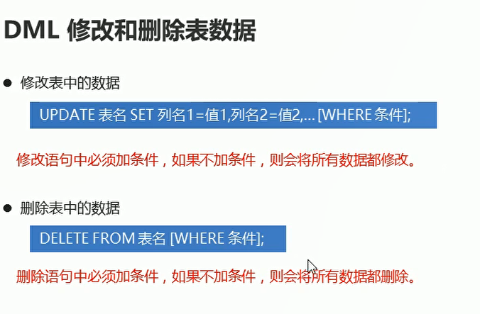

# DML


## DML 新增表数据
  

```sql
-- 查询表的结构
DESC product3;

-- 向product3 表中添加数据  除了数字类型 其他的都要加上引号
INSERT INTO product3 (id,NAME,price,stock,insert_time) VALUES (1,'手机',1999.99,25,'2022-10-10');

-- 指定列添加数据
INSERT INTO product3(id,NAME,price) VALUES (2,'电脑',2819.11);

-- 默认给全部的列添加数据
INSERT INTO product3 VALUES (6,'服务器',212312,11,'2022-10-11');

-- 批量添加所有列的数据
INSERT INTO product3 VALUES (7,'计算器',212312,11,'2022-10-11'),(8,'服务器',212312,11,'2022-10-11');

```

## DML 修改和删除表数据

  

```sql
-- 修改电脑的价格为1800 库存为36
UPDATE product3 SET price=1000,stock=25 WHERE NAME = '电脑';

-- 删除product 中服务器的信息
DELETE FROM product3 WHERE NAME = '服务器';

--  删除product 表中库存为10 的商品信息 
DELETE FROM product3 WHERE stock = 10;

```


