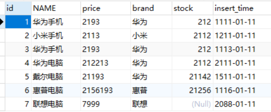
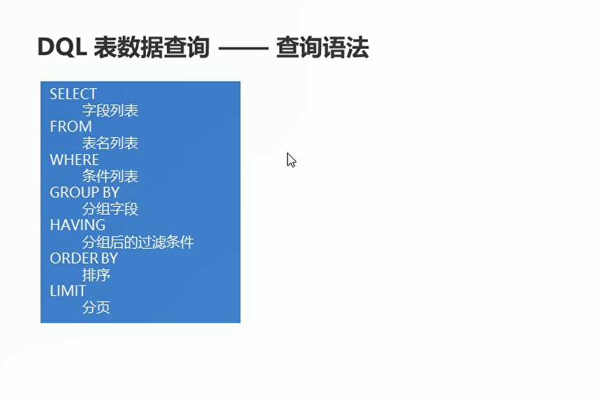
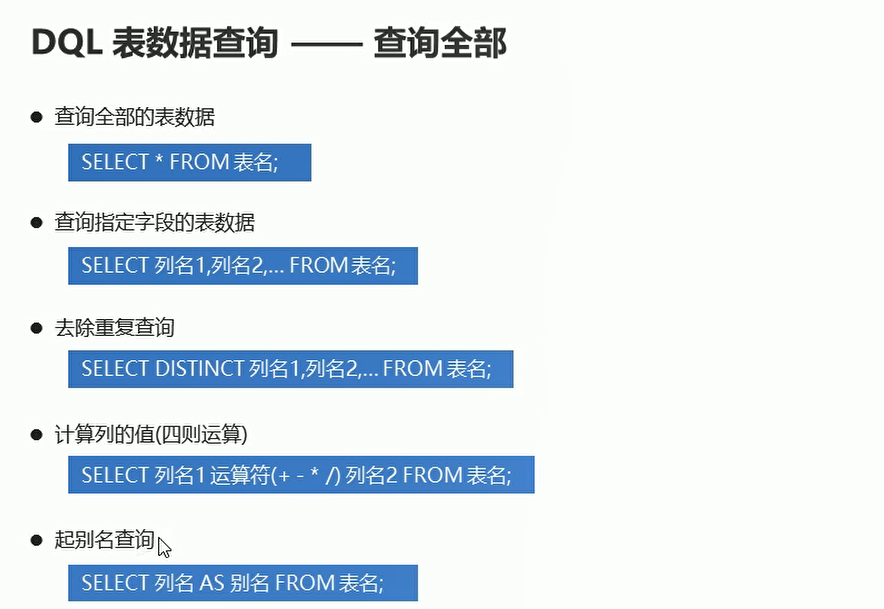
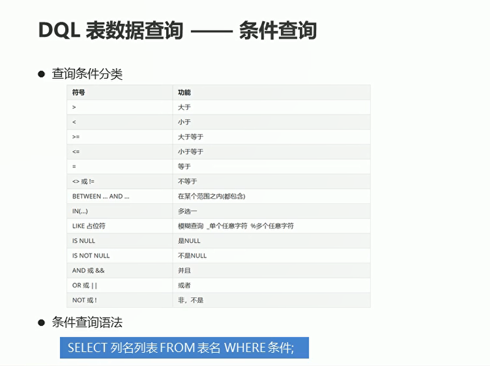
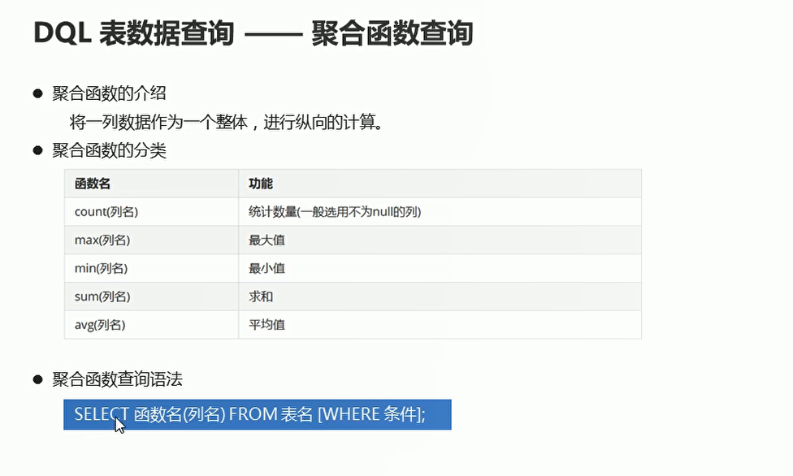
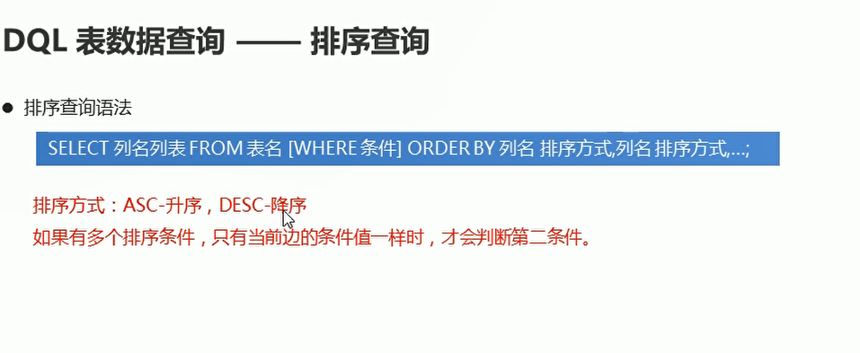
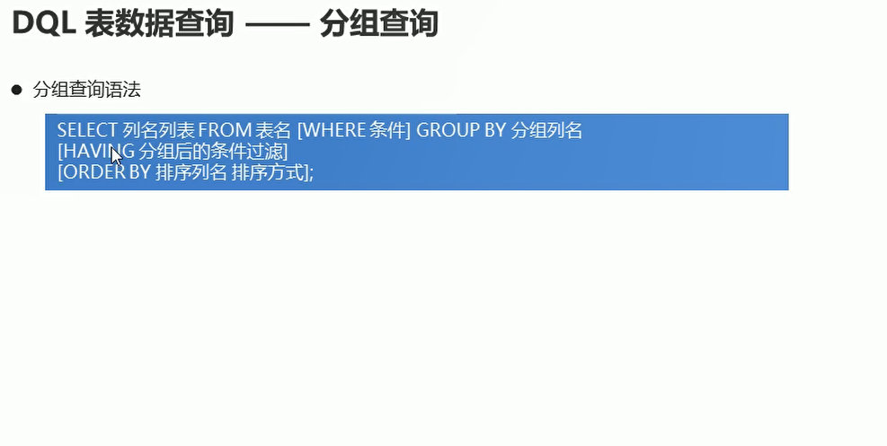

# DQL

## DQL表数据查询以及准备

```sql
-- 创建一个新的数据库dbs
CREATE DATABASE dbs;

-- 使用dbs数据库
USE dbs;

-- 创建数据表
CREATE TABLE product(
	id INT,     -- 商品编号
  NAME VARCHAR(20), -- 商品名称
  price DOUBLE, -- 商品价格
	brand VARCHAR(10), -- 商品品牌
  stock INT,-- 商品库存
  insert_time DATE -- 添加时间
);

-- 添加数据
INSERT INTO product VALUES
(1,'华为手机',2193,'华为',212,'1111-01-11'),
(2,'小米手机',2113,'小米',2112,'1211-01-11'),
(3,'华为手机',2193,'华为',212,'1113-01-11'),
(4,'华为电脑',212213,'华为',2112,'2111-01-11'),
(5,'戴尔电脑',21193,'华为',21142,'1511-01-11'),
(6,'惠普电脑',2156193,'惠普',21256,'1116-01-11'),
(7,'联想电脑',7999,'联想',NULL,'2088-01-11');

```

  


  

## DQL- 查询全部

  

```sql
USE dbs;
-- DQL查询语句
SELECT * FROM product;

-- 定向的查询一些列
SELECT NAME,price,brand FROM product;

-- 查询指定的列 去除 重复的数据  DISTINCT + 列名
SELECT DISTINCT brand FROM product;

-- 查询商品的名称以及库存  库存的数量在原有的基础之上加上10
SELECT NAME,stock+10 FROM product;

-- 查询商品的名称和库存 库存数量在原有的基础加上10  进行Null值判断 如果stock 为null 替换为0
SELECT NAME,IFNULL(stock,0) + 10 FROM product;

-- 查询商品名称和库存 库存数量在原有基础之上加上10 进行null值判断 起别名getSum
SELECT NAME,IFNULL(stock,0) + 10 AS getSum FROM product;

```

## DQL-条件查询

  

```sql
USE dbs;
-- 查询库存大于20的商品信息  条件查询
SELECT * FROM product WHERE stock > 20;

-- 查询品牌是华为的商品信息
SELECT * FROM product WHERE brand = '华为';

-- 查询金额在4000 ~ 6000之间的商品信息
SELECT * FROM product WHERE price >= 4000 AND price <= 6000;

-- between and 进行下查询
SELECT * FROM product WHERE price BETWEEN 4000 AND 10000;

-- 查询库存为14 30 20 的商品信息
SELECT * FROM product WHERE stock = 14 OR stock = 30 OR stock = 23;

-- 或关系 使用in进行替换
SELECT * FROM product WHERE stock IN(14,20,30);

-- 查询库存为null的商品信息
SELECT * FROM product WHERE stock IS NULL;

-- 查询名称是小米开头的商品信息
SELECT * FROM product WHERE NAME LIKE '小米%';

-- 查询名称第二个字是为的商品信息
SELECT * FROM product WHERE NAME LIKE '_为%';

```


## DQL-聚合函数查询

  


```sql
USE dbs;
-- 计算product 总记录条数
SELECT COUNT(*) FROM product;

-- 获取最高的价格
SELECT MAX(price) FROM product;

-- 获取最低库存
SELECT MIN(stock) FROM product;

-- 获取总库存数量
SELECT SUM(stock) FROM product;

-- 获取品牌为苹果的总库存数量
SELECT SUM(stock) FROM product WHERE brand = '苹果';

-- 获取品牌为小米的平均商品价格
SELECT AVG(price) FROM product WHERE brand = '小米';
 
```
## DQL-排序查询

  

```sql
USE dbs;

-- 按照库存的升序进行排序
SELECT * FROM product ORDER BY stock ASC;

-- 先过滤条件 然后进行排序
-- 查询名称中包含手机的商品信息  按照金额降序进行排序
SELECT * FROM product WHERE NAME LIKE '%手机%' ORDER BY price DESC;

-- 按照金额升序排序  如果金额相同 按照库存降序排列  前面条件一样 比较后面的条件
SELECT * FROM product ORDER BY price ASC,stock DESC;


```

## DQL-分组查询

  

```sql
-- 按照品牌进行分组  获取每一组商品的总金额
SELECT brand,SUM(price) FROM product GROUP BY brand;

-- 对金额大于4000元的商品 按照品牌分组 获取每组商品的总金额
SELECT brand,SUM(price) FROM product WHERE price > 4000 GROUP BY brand;

-- 对金额大于4000元的商品 按照品牌进行分组 获取每组商品的总金额  只显示总金额大于7000元的 分组之后筛选条件 使用HAVING
SELECT brand,SUM(price) as getSum FROM product WHERE price > 4000 GROUP BY brand HAVING getSum > 7000;

-- 起别名 getSum
SELECT brand,SUM(price) as getSum FROM product WHERE price > 4000 GROUP BY brand HAVING getSum > 7000 ORDER BY getSum DESC;

```
