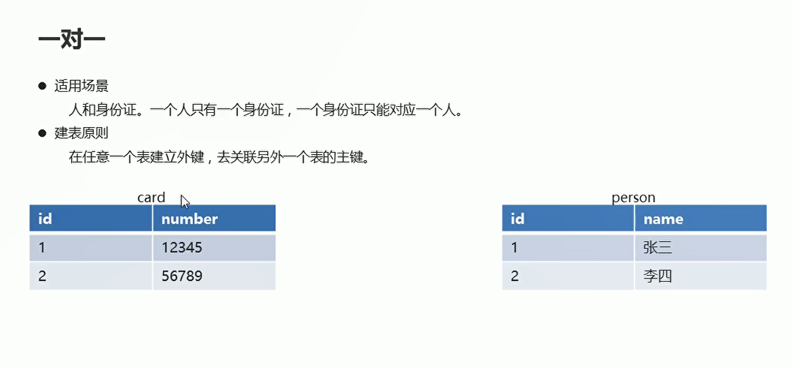
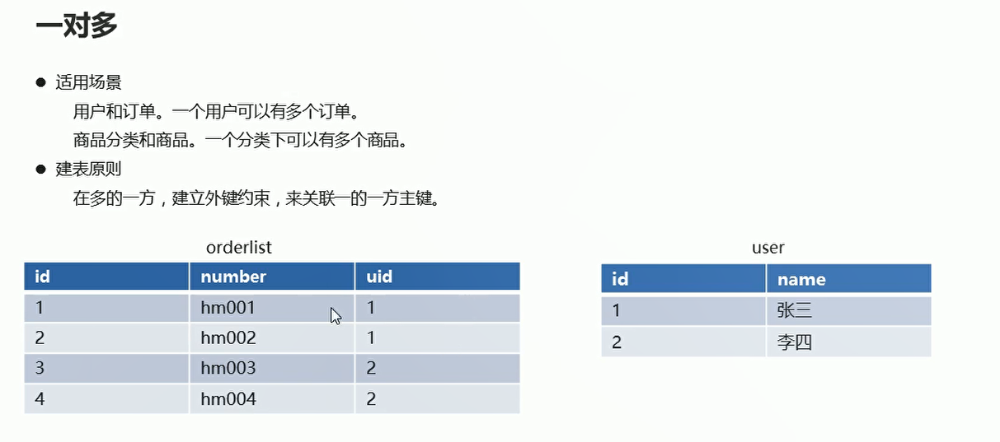
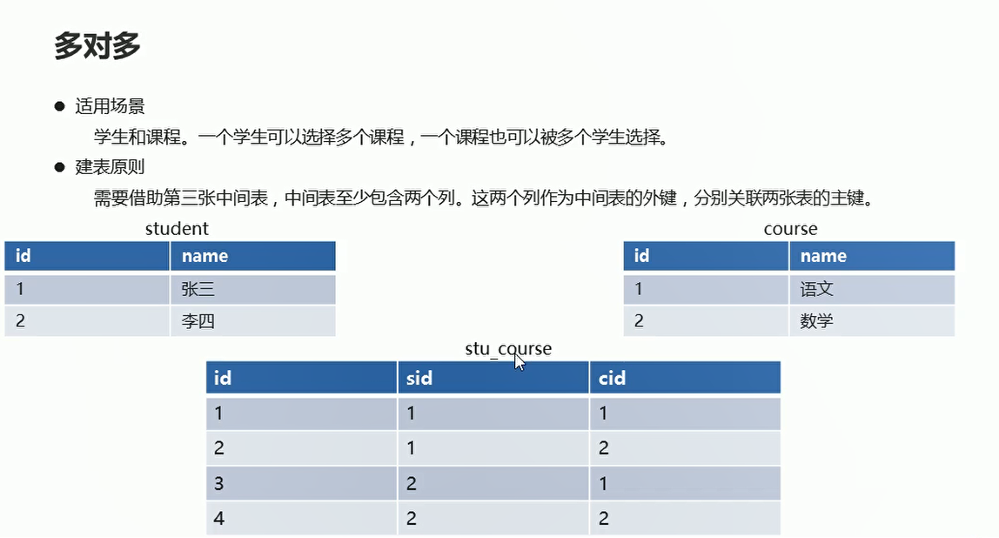
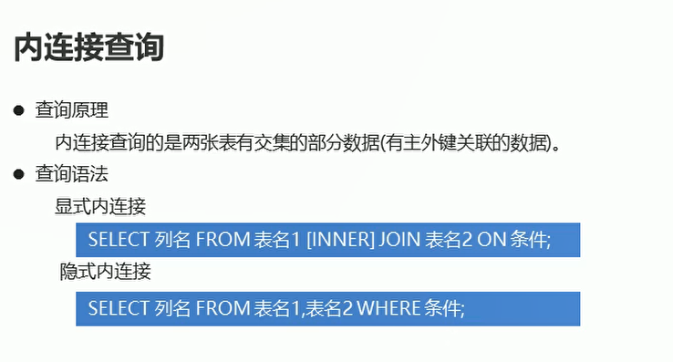
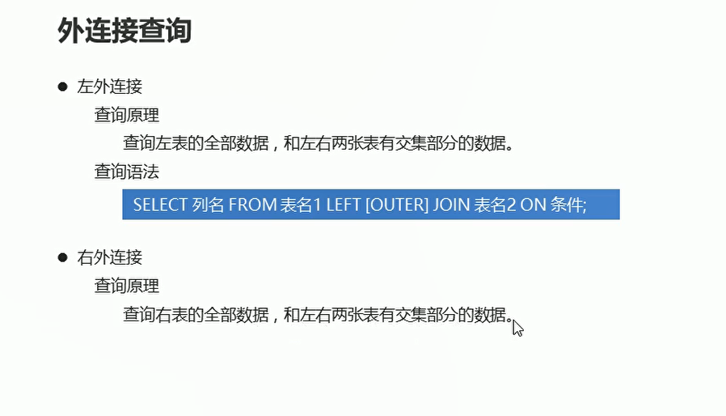

# 多表操作

## 一对一操作
  

```sql
USE db4;

-- 创建person表
CREATE TABLE person(
	id INT PRIMARY KEY AUTO_INCREMENT, -- 主键id
	NAME VARCHAR(20)   -- 姓名
);

-- 添加数据
INSERT INTO person VALUES (1,'zhangsan'),(2,'lisi');

-- 创建card表
CREATE TABLE card(
	id INT PRIMARY KEY AUTO_INCREMENT, -- 主键Id
	number VARCHAR(20) UNIQUE NOT NULL, -- 身份证号码
  pid INT UNIQUE, -- 外键列
CONSTRAINT cp_fk1 FOREIGN KEY (pid) REFERENCES person(id)

);

-- 添加数据
INSERT INTO card VALUES(1,'1234',1),(2,'1213',2);

```


## 一对多操作

**场景：一个用户可以有多个订单**

  

```sql
USE dbs;

-- 创建user用户表
 CREATE TABLE USER(
id INT PRIMARY KEY AUTO_INCREMENT, -- ID
     NAME VARCHAR(20) NOT NULL  -- 姓名
);

-- 添加用户数据
INSERT INTO USER VALUES (NULL,'张三'),(NULL,'李四');

-- 创建orderlist订单表
 CREATE TABLE orderlist(
	id INT PRIMARY KEY AUTO_INCREMENT,-- id
   number VARCHAR(20) NOT NULL, -- 订单编号
   uid INT, -- 外键列
  CONSTRAINT ou_fk1 FOREIGN KEY (uid) REFERENCES USER(id) -- 使用用户表的id作为外键
);
 
-- 添加数据 一个用户可以有多个多个订单   用户作为订单表的外键  可以重复
INSERT INTO orderlist VALUES (1,'001',1),(2,'002',1),(3,'003',2),(4,'004',2);
 

```

## 多对多操作

  

**借助于中间表，至少包含两个外键，指向其余两个表的主键**

```sql
USE dbs;

-- 创建student表
CREATE TABLE student(
	id INT PRIMARY KEY AUTO_INCREMENT, -- 主键id
  NAME VARCHAR(20)                  -- 学生姓名
);

-- 添加数据
INSERT INTO student VALUES (NULL,'张三'),(NULL,'李四');

-- 创建course表
CREATE TABLE course(
	id INT PRIMARY KEY AUTO_INCREMENT, -- 主键id
  NAME VARCHAR(10)   -- 课程名称
);


-- 添加数据
INSERT INTO course VALUES (NULL,'语文'),(NULL,'数学');

-- 创建中间表
CREATE TABLE stu_course(
	id INT PRIMARY KEY AUTO_INCREMENT, -- 主键id
  sid INT, -- 用于和student表中的id进行外键关联
  cid INT, -- 用于和course表中的id进行外键关联

--   多对多关联
  CONSTRAINT sc_fk1 FOREIGN KEY (sid) REFERENCES student(id), -- 添加外键约束
  CONSTRAINT sc_fk2 FOREIGN KEY (cid) REFERENCES course(id) -- 添加外键约束
);

-- 添加数据
INSERT INTO stu_course VALUES (NULL,1,1),(NULL,1,2),(NULL,2,1),(NULL,2,2);

```

## 内连接查询

  

### 显示内连接

```sql
-- 查询用户信息和对应的订单信息  显示内链接  找出两个表的公共信息
SELECT * FROM USER INNER JOIN orderlist ON orderlist.uid = `user`.id;
```

### 隐式内连接

```sql
-- 隐式内连接  查询用户姓名 年龄  和订单编号
SELECT u.name,u.age,o.number FROM USER u,orderlist o WHERE o.uid = u.id;

```

## 外连接查询

  

* 左外连接

```sql
-- 左外连接  查询所有用户信息  以及用户对应的订单信息  有些用户没有订单  但是仍然显示出来
SELECT u.*, o.number FROM USER u LEFT OUTER JOIN orderlist o ON o.uid = u.id;
```

* 右外连接
```sql
-- 右外连接
SELECT  o.*,u.name  FROM USER u RIGHT OUTER JOIN orderlist o ON o.uid = u.id;

```

## 子查询

  

* 结果是单行单列的
```sql
-- 查询年龄最高的用户姓名  嵌套查询
SELECT NAME,age FROM USER WHERE age=(SELECT MAX(age) FROM USER);

```

* 结果是多行单列的

```sql
-- 查询张三和李四的订单信息
SELECT * FROM orderlist WHERE uid IN (SELECT id FROM USER WHERE NAME IN('张三','李四'));

```


