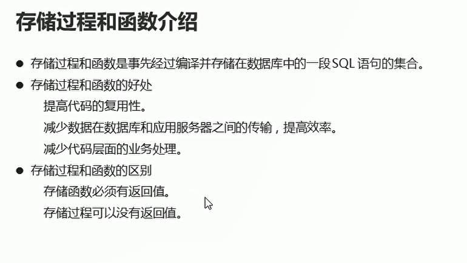
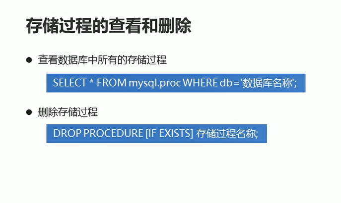
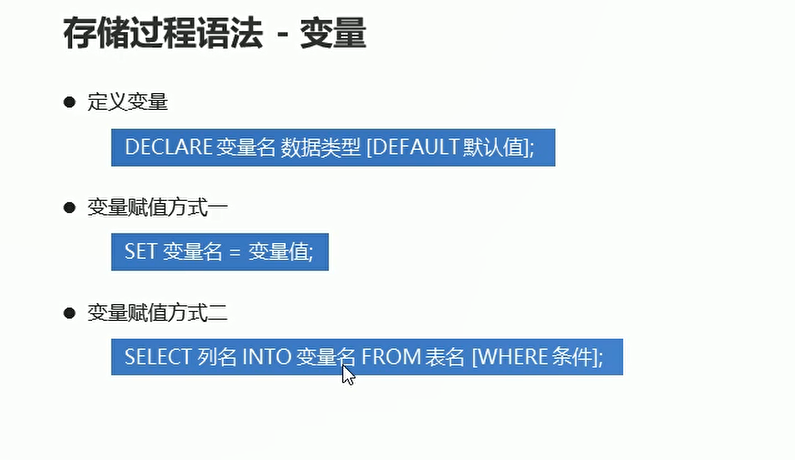
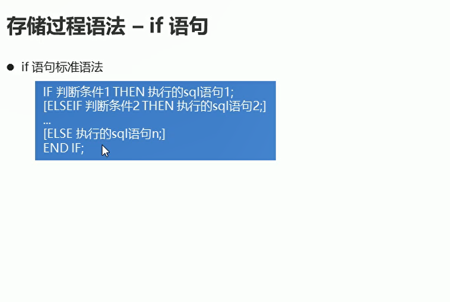
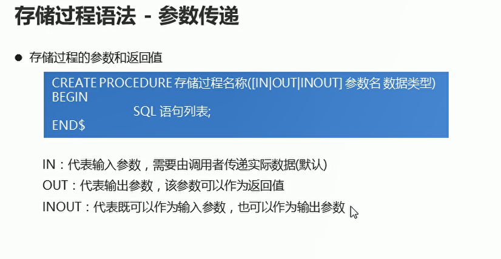
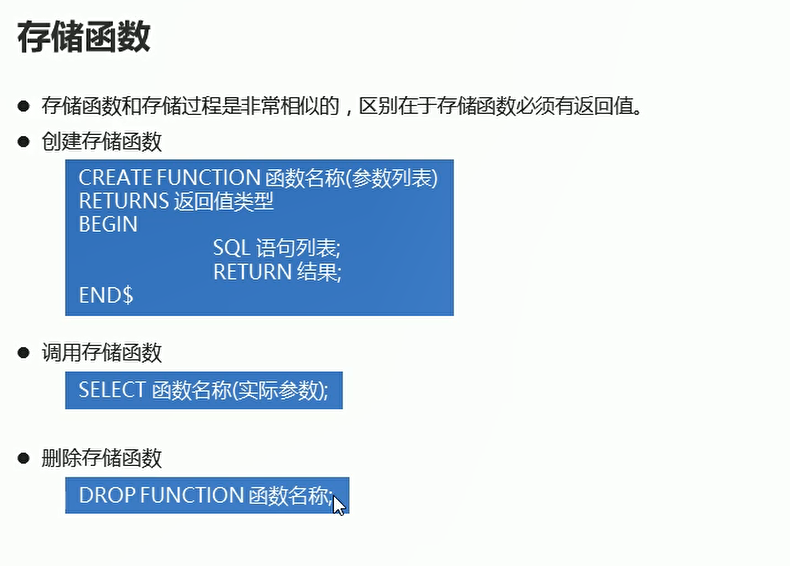

# 存储过程和函数

## 概述

  

## 存储过程的创建和调用过程

```sql
-- 创建stu_group() 存储过程 封装 分组查询总成绩 并按照总成绩升序排序的功能

DELIMITER $

CREATE PROCEDURE stu_group()
BEGIN
	SELECT gender,SUM(score) getSum FROM student GROUP BY gender ORDER BY getSum ASC;
END$

DELIMITER;

-- 调用存储过程
CALL stu_group();
```

## 存储过程的查看和删除

  

```sql
-- 查看数据库中所有的存储过程
SELECT * FROM mysql.proc WHERE db='db5';

-- 删除存储过程
DROP PROCEDURE IF EXISTS stu_group;
```

## 存储过程的语法

  

```sql
-- 定义两个int变量  用于存储男女同学的总分数
DELIMITER $

CREATE PROCEDURE pro_test4()

BEGIN

-- 定义两个变量
DECLARE men,women INT;

-- 查询男同学的总分数 给men 进行赋值
SELECT SUM(score) INTO men FROM student WHERE gender = '男';

-- 查询女同学的总分数 为women进行赋值
SELECT SUM(score) INTO women FROM student WHERE gender = '女';

END $
DELIMITER ;

```

## 存储过程-if语句的使用

  

```sql
DELIMITER $

CREATE PROCEDURE pro_test4()

BEGIN
	-- 定义变量
DECLARE total INT;
DELETE info VARCHAR(10);

--  查询总成绩  为total进行赋值
SELECT SUM(score) INTO total FROM student;

-- 对总成绩进行判断
IF total > 380 THEN
	SET info = '学习优秀';

ELSEIF total >= 320 AND total <= 380 THEN
	SET info = '学习不错';
ELSE 
	SET info = '学习一般';
END IF;

-- 查询总成绩和描述信息
SELECT total,info;

END $

DELIMITER ;


```

## 存储过程-参数传递

  

```sql
DELIMITER $

CREATE PROCEDURE pro_test5(IN total INT,OUT info VARCHAR(10))

BEGIN
-- 对总成绩进行判断
	IF total > 380 THEN
			SET info = '学习优秀';
  ELSEIF total >= 320 AND total <= 380 THEN
			SET info = '学习不错';
  ELSE
			SET info = '学习一般';
  END IF;
END $

DELIMITER ;

-- 调用pro_test5存储过程 第二个参数是临时变量
CALL pro_test5(383,@info);

SELECT @info;

```

## while循环的使用

```sql

CREATE PROCEDURE pro_test6()

BEGIN
-- 定义求和变量
DECLARE RESULT INT DEFAULT 0;
-- 定义初始化变量
DECLARE num INT DEFAULT 1;

-- while循环
while num <= 100 DO
	IF num % 2 = 0 THEN
		SET result = result + num;
	END IF;
	SET num = num + 1;

END WHILE;

END $
DELIMITER ;

```

## 存储函数的使用

  

```sql
-- 定义存储函数  获取学生表中成绩大于95分的学生数量

DELIMITER $
CREATE FUNCTION fn_test1()
RETURNS INT
BEGIN
-- 定义变量
DECLARE s_count INT;
-- 查询成绩大于95 的数量
SELECT COUNT(*) INTO s_count FROM student WHERE score > 95;
-- 返回统计结果
RETURN s_count;

END;
DELIMITER;

```
