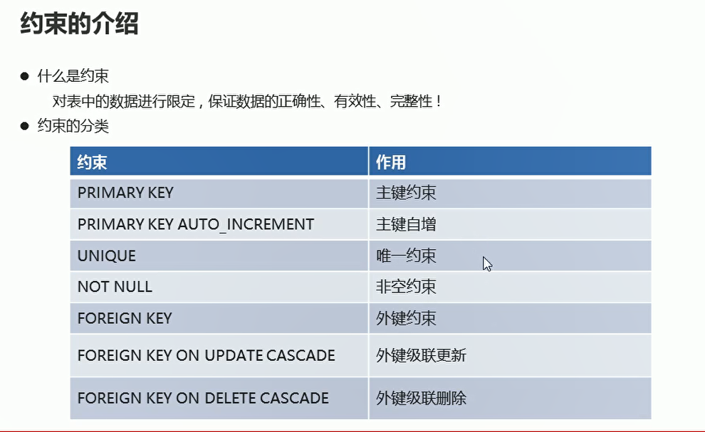
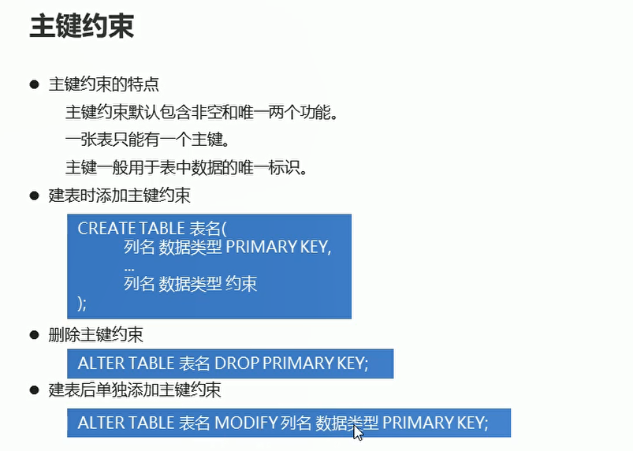
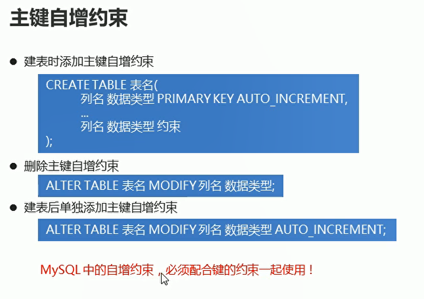
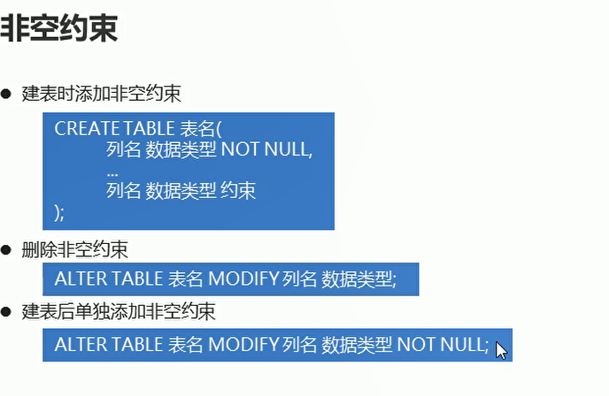
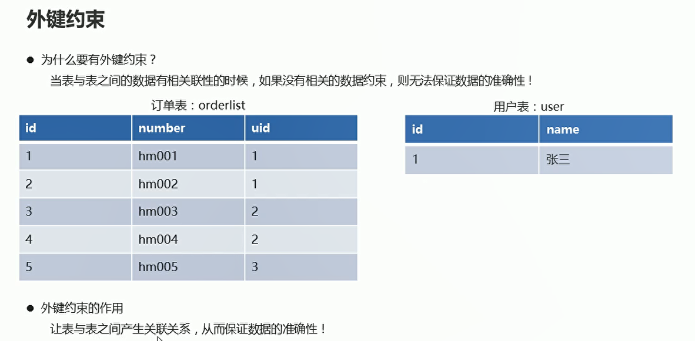
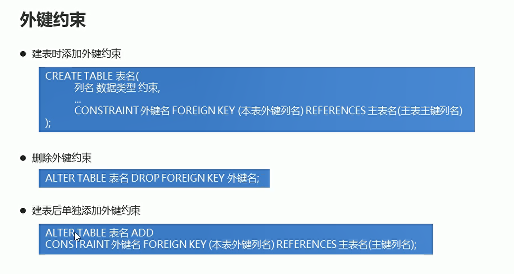
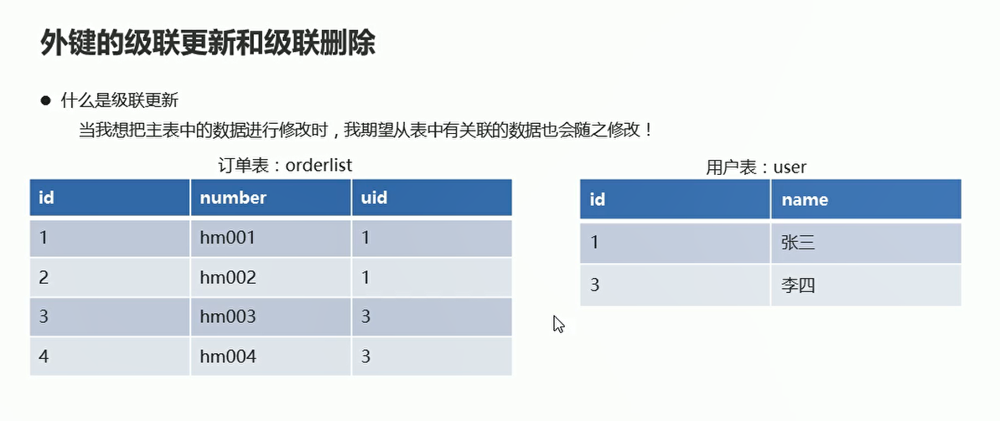
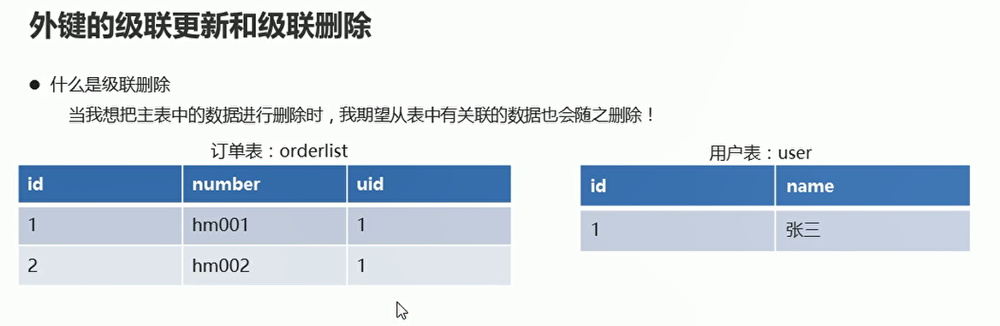
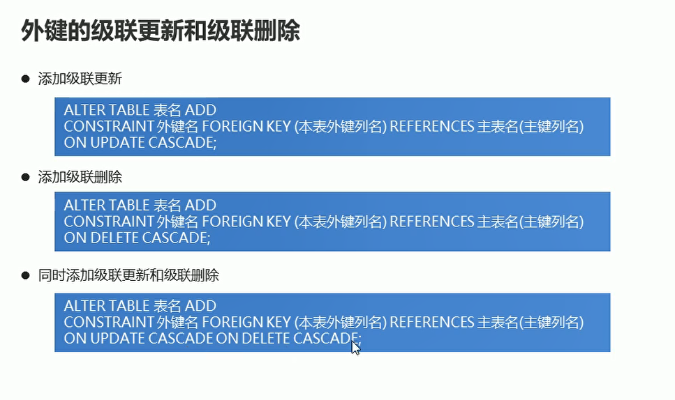

# 约束

## 约束的介绍

  

## 主键约束

  

```sql
USE dbs;

-- 创建学生表
CREATE TABLE student(
	id INT PRIMARY KEY,  -- 编号设置为主键
  NAME VARCHAR(30),
  age INT
);

-- 查询学生表的详细信息
DESC student;

-- 添加学生数据
INSERT INTO student VALUES(1,'xxx',21);
INSERT INTO student VALUES(2,'xxf',22);

-- 删除主键
ALTER TABLE student DROP PRIMARY KEY;

-- 单独添加主键约束
ALTER TABLE student MODIFY id INT PRIMARY KEY;
```

## 主键自增约束

  

```sql
-- 创建user用户表
 CREATE TABLE USER(
id INT PRIMARY KEY AUTO_INCREMENT, -- ID
     NAME VARCHAR(20) NOT NULL  -- 姓名
);
```

## 唯一约束

```sql
USE dbs;
-- 创建学生表 编号 姓名 年龄  编号设置为主键自增 年龄设置为唯一
CREATE TABLE st(
	id INT PRIMARY KEY AUTO_INCREMENT,
  NAME VARCHAR(30),
  age INT_UNIQUE
);

-- 查询学生表的详细信息
DESC st;

-- 添加数据
INSERT INTO st VALUES(1,'zhangsan',21);
INSERT INTO st VALUES(2,'lisi',22);

-- 删除唯一约束
ALTER TABLE st DROP INDEX age;

-- 单独添加唯一约束
ALTER TABLE student MODIFY age INT UNIQUE;

```

## 非空约束

  

```sql
USE dbs;

-- 创建学生表  非空约束 NAME
CREATE TABLE ss(
	id INT PRIMARY KEY AUTO_INCREMENT,
  NAME VARCHAR(30) NOT NULL,
  age INT UNIQUE
);

-- 查询学生表的详细信息
DESC ss;

-- 添加数据
INSERT INTO ss VALUES (1,'xx',21);

-- 删除非空约束
ALTER TABLE ss MODIFY NAME VARCHAR(30);

-- 建表之后单独添加非空约束
ALTER TABLE ss MODIFY NAME VARCHAR(30) NOT NULL;

```

## 外键约束

  

**让表和表之间产生关联关系，从而保证数据的准确性**

  

```sql
USE dbs;

-- 创建user用户表
 CREATE TABLE USER(
id INT PRIMARY KEY AUTO_INCREMENT, -- ID
     NAME VARCHAR(20) NOT NULL  -- 姓名
);

-- 添加用户数据
INSERT INTO USER VALUES (NULL,'张三'),(NULL,'李四');

-- 创建orderlist订单表
 CREATE TABLE orderlist(
	id INT PRIMARY KEY AUTO_INCREMENT,-- id
   number VARCHAR(20) NOT NULL, -- 订单编号
   uid INT, -- 外键列
  CONSTRAINT ou_fk1 FOREIGN KEY (uid) REFERENCES USER(id) -- 使用用户表的id作为外键
);
 
-- 删除外键约束
ALTER TABLE orderlist DROP FOREIGN KEY ou_fk1;

-- 添加外键约束
ALTER TABLE orderlist ADD CONSTRAINT ou_fk1 FOREIGN KEY (uid) REFERENCES USER(id);

```

## 外键的级联更新和级联删除

  

  

  

```sql

-- 添加外界约束 同时添加级联更新和级联删除
ALTER TABLE orderlist ADD CONSTRAINT ou_fk1 FOREIGN KEY(uid) REFERENCES USER(id) ON UPDATE CASCADE ON DELETE CASCADE;

-- 测试级联更新的效果  订单表的uid 自动进行修改
UPDATE USER SET id=3 WHERE id= 2;

-- 将id =3的用户进行删除  订单表中id=3的记录也被删除
DELETE FROM USER  WHERE id=3;
 

```


