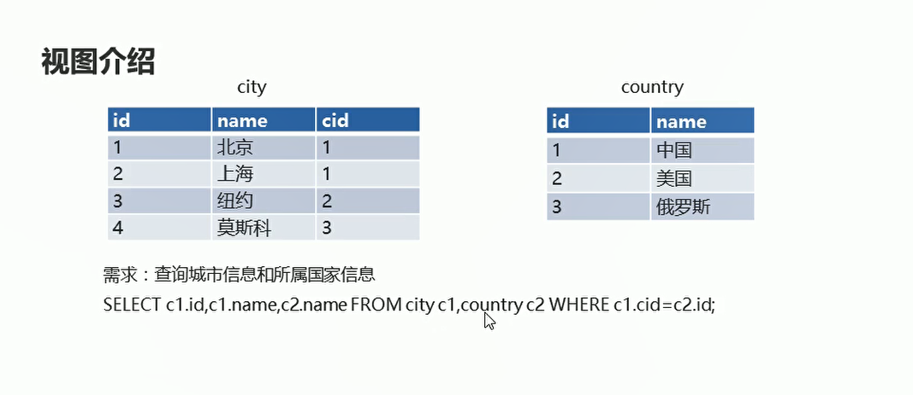
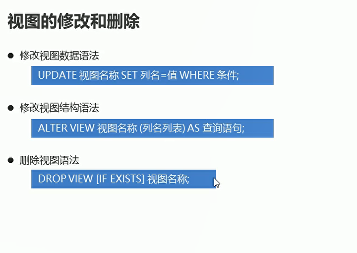

# 视图

## 概述

  


  

## 视图的创建和查询

  

```sql
-- 创建视图  保存城市和国家的信息
CREATE VIEW city_country(city_id,city_name,country_name) AS

SELECT  c1.id,c1.name,c2.name  FROM city c1,country c2  WHERE c1.cid = c2.id;
```
## 视图的修改和删除

  

**修改视图数据 原表数据也会被修改**

```sql
-- 修改视图数据  将北京修改为深圳
UPDATE city_country SET city_name = '深圳' WHERE city_name = '北京';

```

```sql

-- 删除视图
DROP VIEW IF EXISTS city_country;
```
