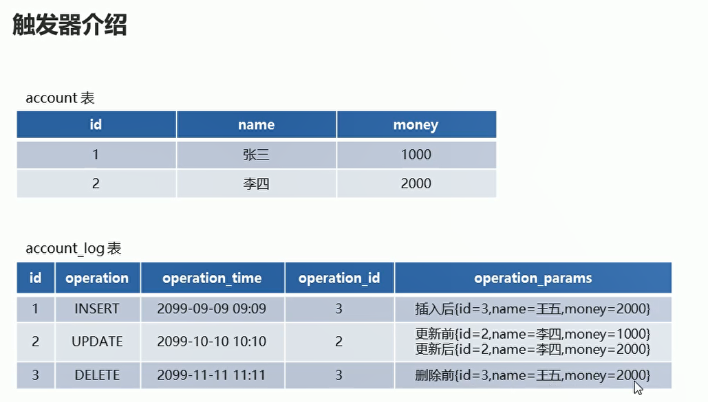
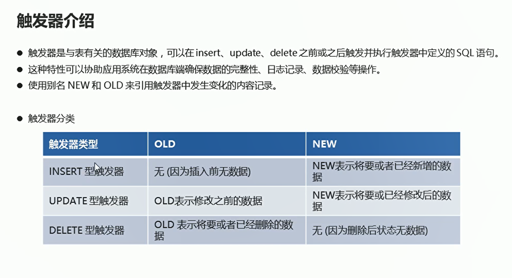
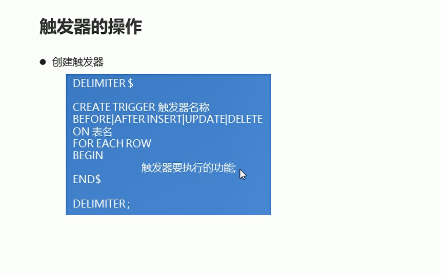
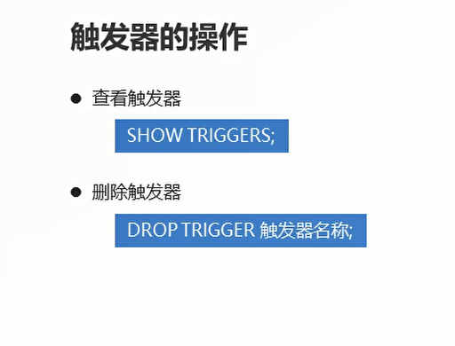

# 触发器

## 概述

  

  

## INSERT触发器

  

```sql
-- 创建INSERT触发器  用于对account表新增数据进行日志记录
DELIMITER $

CREATE TRIGGER account_insert
AFTER INSERT
ON account
FOR EACH ROW

BEGIN 

	INSERT INTO account_log VALUES (NULL,'INSERT',NOW(),new.id,CONCAT('插入后{id=',new.id,',name=',new.name,',money=',new.money,'}'));

END $
DELIMITER ;

```
## UPDATE触发器

```sql
DELIMITER $
CREATE TRIGGER account_update
AFTER UPDATE
ON account
FOR EACH ROW

BEGIN
	INSERT INTO account_log VALUES (NULL,'UPDATE',NOW(),new.id,CONCAT('更新后{id=',new.id,',name=',new.name,',money=',new.money,'}'));

END $
DELIMITER ;

```


## DELETE型触发器

```sql

DELIMITER $

CREATE TRIGGER account_delete
AFTER DELETE
ON account
FOR EACH ROW
BEGIN 

	INSERT INTO account_log VALUES (NULL,'DELETE',NOW(),old.id,CONCAT('删除之前的数据{id=',old.id,',name=',old.name,',money=',old.money,'}'));

END $
DELIMITER ;

```


## 查看和删除触发器

  

```sql
-- 查看触发器
SHOW TRIGGERs;


-- 删除触发器
DROP TRIGGER account_delete;

```

