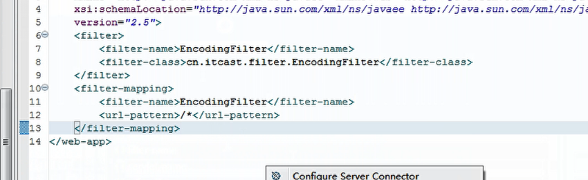

## 项目搭建整个过程

adminjsps：后台页面

jsps:前台页面

book:模块相关页面

cart:购物车模块相关页面 

order: 订单模块相关页面

user:主页相关页面

其他：主页相关页面

CSS：

book: 相关修饰
user: 用户页面修饰

bank_imp: 银行图片

book_imp:书本图片 

images: 按钮图片

menu: jsp 的小工具

项目的表结构介绍，运行：

六张表

订单分为两张表： 订单表，订单条目表

图书表：cid图书所属二级分类

购物车：bid uid 都是主码  bid图书编号  uid 用户id

order：total：总计费用，status：订单状态 address:收货地址  uid:谁下的单

orderitem: 订单条目：一个订单包含多个订单条目，oid:所属订单id

admin: 管理员表

# 导包：
web-inf 中的 lib文件夹下面：
数据库驱动程序，简化数据库操作  

beanutils dbutils 简化数据库操作

fileupdload: 添加图书上传图片

mysql-connector : mysql连接

 
# 配置文件的介绍

c3p0:  指定数据库 goods
 
 
  

管理员 密码
  

mysql 批处理 打卡
  

注册成功的邮件消息
  

命名包的规范
  
 

  

添加过滤器
  

# 项目前台的搭建

关于创建servelet,不是java class  需要继承一个BaseServlet，下面所有的勾选框都不要选，

前面的路径清掉。
  

finish.

登陆页面的实现：

  

  

更改三样东西：jsps user中的regist.js   js user中创建regist.js  

引入css
  

