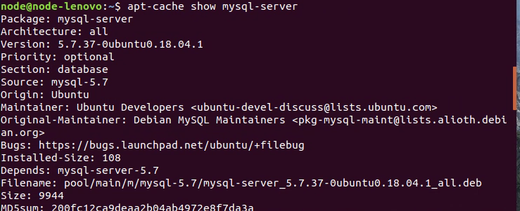
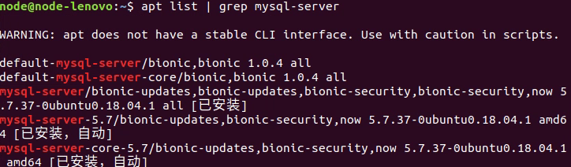
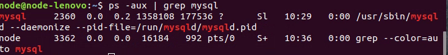
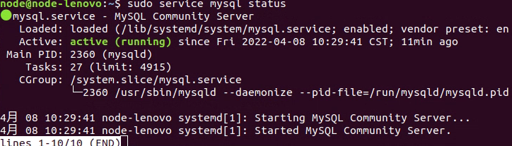

# Linux下安装MySQL数据库

## 一、MySql数据库安装

在ubuntu中打开终端，输入下面的命令：
```
sudo apt-get install mysql-server
```

说明：目前大家使用的ubuntu已经安装好MySQL服务端软件，不需要再次安装。

显示MySQL服务端安装包信息效果图：```apt-cache show mysql-server```

  


或者使用管道命令：```apt list | grep mysql-server ``` 抓取mysql-server

  

或者使用命令：```ps -aux | grep mysql ```

  

ps说明：
* ps 查看当前系统中的进程
* -a表示所有用户
* -u表示显示用户名
* -x表示显示所有的执行程序

**查看mysql的状态：sudo service mysql status**

  


**启动mysql: sudo service mysql start**

**关闭mysql:sudo service mysql stop**

**重启mysql:sudo service mysql restart**


## 二、MYSQL配置文件的介绍

配置文件路径：/etc/mysql/mysql.conf.d/mysqld.cnf

查看MySQL配置文件效果图：先使用命令：```cd /etc/mysql/mysqld.conf.d```

然后使用命令:vim mysqld.cnf  查看mysql配置文件

主要配置信息如下：

```
port表示端口号，默认就是3306

bind-address表示服务器绑定的ip,默认就是127.0.0.1

datadir表示数据库保存路径，默认就是 /var/lib/mysql

log_error表示错误日志，默认为/var/log/mysql/error.log

```

## 三、MYSQL数据库客户端软件安装

客户端是程序员或者dba使用的软件，通过socket方式与服务端程序通信。

**常用的MySQL数据库客户端软件有**：
* 图形化界面客户端Navicat
* 命令行客户端mysql

**图形化界面客户端Navicat的使用**：
* 可以到Navicat官网下载
* 将压缩文件拷贝到Ubuntu虚拟机中，放到桌面上，解压

**Navicat的使用说明：**

```
tar zxvf navicat112_mysql_cs_x64.tar.gz
./start_navicat
```

运行之后，点击两次取消。
  

  


试用过期解决办法：

当过期之后，删除用户主目录下的.navicat64目录，继续再使用14天。

```
cd ~
rm -r .navicat64
```

**命令行客户端mysql的安装**
输入：```sudo apt-get install mysql-client```

连接数据库:```mysql -uroot -p  输入密码 回车

* -u表示MySQL服务端的用户名
* -p:表示MySQL服务端的密码
* quit或者exit或者ctrl + d表示退出


## 四、解决navicat for linux中文乱码问题

参看这篇文章：```https://blog.csdn.net/yuxiao97/article/details/84886921```


