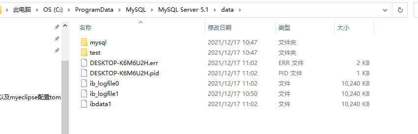
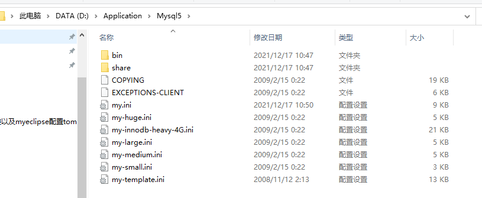
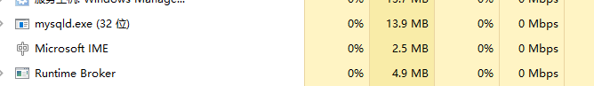
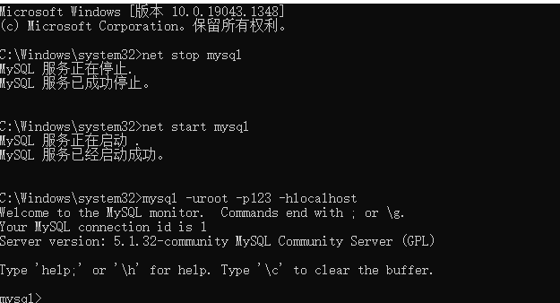
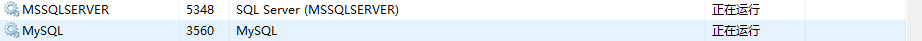

# Mysql的登录与退出

## Mysql的目录结构
MySql的数据存储目录为data,这个data目录通常是在```C:\ProgramData\MySQL\MySQL Server 5.1\data```。在data下的每一个目录都代表一个数据库

  

MySql的安装目录：
* bin目录中都是可执行的文件
* My.ini文件是MySql的配置文件

  

## 启动与关闭
1.启动和关闭mysql服务器
* 启动：net start mysql
* 关闭：net stop mysql

这里可能要以管理员身份启动，直接进入C盘下的windows目录，里面有个system32文件，进入选择cmd.exe,右键以管理员身份运行（可以直接固定到开始界面磁贴）

在启动mysql之后，打开windows任务管理器，会有一个mysqld.exe的进程运行，所以mysqld才是mysql服务器程序

  

2.客户端登陆退出mysql
在启动mysql服务器之后，我们需要使用管理员用户登录mysql服务器，然后来对服务器进行操作，登录mysql的客户端程序：mysql.exe

* 登录：mysql -u root -p 123 -h localhost
  * -u:后面的root是用户名，这里使用的是超级管理员room
  * -p:后面的123是密码，这是在安装mysql就已经确定的密码
  * -h: 后面给出的是localhost是服务器主机名，他是可以省略的，例如：mysql -u root -p 123;
* 退出：quit exit

在登录成功之后，打开windows任务管理器，会有一个mysql.exe的进程运行，所以mysql.exe是客户端程序

  

查看任务管理器
  
