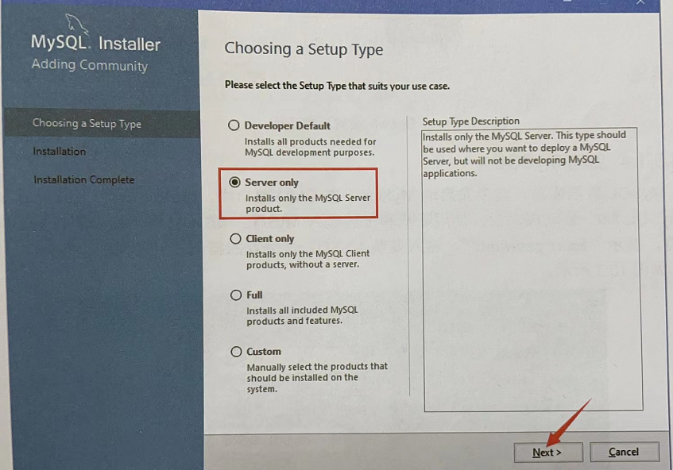
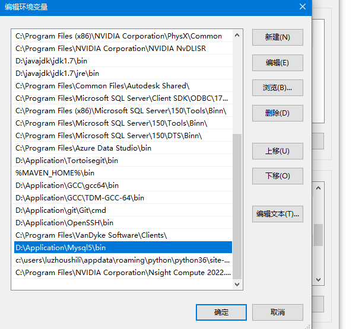
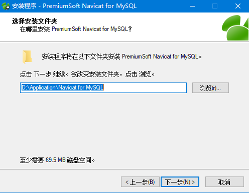
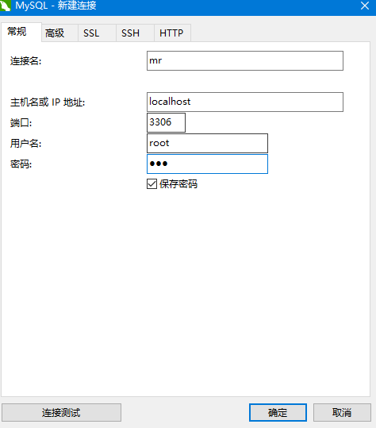
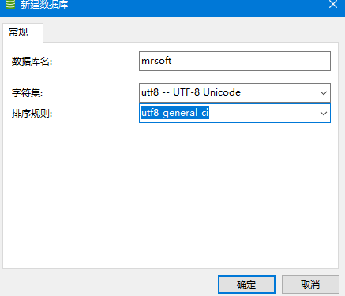
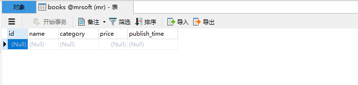

# python中的数据库操作
最近做毕设，需要添加个数据库，记录一下。

## 一、数据库编程接口
重点介绍数据库API接口中的连接对象和游标对象


### 1. 连接对象

数据库连接对象主要提供获取数据库游标对象和提交/回滚事务的方法，以及关闭数据库连接。

使用connect函数获取对象，该函数有多个参数：

* host 主机名
* database/db 数据库名称
* user 用户名
* password 用户密码
* charset 编码方式

使用PyMySQL模块连接MySQL数据库。

```python
conn = pymysql.connect(host='localhost',user='user',password='passwd',db='test',charset='utf-8')
```

**connect函数返回连接对象，该对象表示当前与数据库的会话。**

连接对象支持的方法如下：

* close()  关闭数据库连接
* commit()  提交事务
* rollback()  回滚事务
* cursor()  **获取游标对象，操作数据库，如执行DML操作、调用存储过程**

对于这里的commit方法，commit是用于提交事务，事务主要是处理数据量大、复杂度高的数据。如果操作的是一系列动作，比如张三给李四转账：那么张三的账户余额减少，李四的账户余额增加，那么使用事务可以维护数据库的完整性，**也就是保证两个操作要么全部执行，要么都不执行。**


对于游标对象，代表数据库中的游标，用于指示抓取数据操作的上下文，主要是提供执行SQL语句，调用存储过程，获取查询结果等方法。

使用连接对象的cursor方法可以获取游标对象，游标对象的属性如下：

* description属性：表示数据库列类型以及值得描述信息
* rowcount属性：返回结果得行数统计信息，如SELECT、UPDATE、CALLPROC

* callproc(procname[,parameters]) 调用存储过程，需要数据库支持
* close()  关闭当前游标
* execute(operation[,parameters]) 执行数据库操作，SQL语句或者数据库命令

  


## 二、使用内置的SQLite

&emsp;SQLite是一种嵌入式数据库，该数据库本身就是一个文件。SQLite将整个数据库（包括表、索引、数据本身）作为一个单独的可跨平台使用文件存储在主机中，由于SQLite本身是使用C语言开发的，而且体积小，经常被集成到各种应用程序中，Python中内置了SQLite,所以在python中使用SQLite数据库，不需要安装任何模块，直接使用。

### 1.创建数据库文件

  

创建SQLite数据库文件：

```python
import sqlite3

# 连接到SQLite数据库
# 数据库文件是mrsoft.db 如果文件不存在，会自动在当前目录中创建

conn = sqlite3.connect('mrsoft.db')

# 创建一个cursor
cursor = conn.cursor()

# 使用游标对象执行SQL语句，创建user表
cursor.execute('create table user (id int(10) primary key, name varchar(20))')

# 关闭游标
cursor.close()

# 关闭Connection
conn.close()
```

在上面的代码中，使用sqlite3.connect()方法连接SQLite数据库文件mrsoft.db，由于mrsoft.db文件并不存在，所以会在本实例python代码得同级目录下创建mrsoft.db文件，该文件包含了user表的相关信息。

但是如果你再次执行上面的代码，会提示错误信息，因为user表已经存在。


### 2.操作SQLite

向数据表中新增数据可以使用SQL中的insert语句。

语法如下：
```
**insert into 表名（字段名1，字段名2，字段名3） values(字段值1，字段值2，...字段值n)**
```

在上面创建得user表中，有两个字段，字段名分别为id,name。而字段值需要根据字段的类型来赋值。


那执行SQL语句：

```sql
cursor.execute('insert into user(id,name) values(1,"MRSOFT")')
cursor.execute('insert into user(id,name) values(2,"Andy")')
cursor.execute('insert into user(id,name) values(3,"SiRi")')
```

案例1：向数据库中插入三条记录

```python
import sqlite3

# 连接到SQLite数据库
# 数据库文件是mrsoft.db 如果文件不存在，会自动在当前目录中创建

conn = sqlite3.connect('mrsoft.db')

# 创建一个cursor
cursor = conn.cursor()

# 使用游标对象执行SQL语句，创建user表
# cursor.execute('create table user (id int(10) primary key, name varchar(20))')

# 执行插入语句  引号 外单内双
cursor.execute('insert into user(id,name) values(1,"MRSOFT")')
cursor.execute('insert into user(id,name) values(2,"Andy")')
cursor.execute('insert into user(id,name) values(3,"Siri")')

# 关闭游标
cursor.close()

# 提交事务  使用数据库连接对象进行提交事务
conn.commit()

# 关闭Connection
conn.close()

```


案例2：查看用户信息

查找数据表中的数据可以使用SQL中的select语句：

```
select 字段名1，字段名2，字段名3，  from 表名 where 查询条件
```

这个是查询符合条件的数据集，但是我们可能只需要某种数据，所以还需要具体的查询语句。

* fetchone():获取查询结果集中的下一条记录
* fetchmany(size):获取指定数量的记录
* fetchall():获取结构集所有记录

```python
import sqlite3
con = sqlite3.connect('mrsoft.db')  # 连接数据库

# 创建一个cursor  获取游标对象
cursor = con.cursor()

# 执行查询语句
cursor.execute('select * from user')

# 获取查询结果  获取的是第一条记录
# fetchone 返回的是一个元组
result1 = cursor.fetchone()
print(result1)

# 关闭游标
cursor.close()

# 关闭连接
con.close()

```

```python                   
import sqlite3
con = sqlite3.connect('mrsoft.db')  # 连接数据库

# 创建一个cursor  获取游标对象
cursor = con.cursor()

# 执行查询语句
cursor.execute('select * from user')

# 获取查询结果  获取的是第一条记录
# fetchone 返回的是一个元组
# result1 = cursor.fetchone()
# print(result1)

# 使用fetchmany查询多条数据
# 返回一个列表  列表中有两个元组
# result2 = cursor.fetchmany(2)
# print(result2)

result3 = cursor.fetchall()  # 获取所有的数据
print(result3)

# 关闭游标
cursor.close()

# 关闭连接
con.close()

```


```python
import sqlite3
con = sqlite3.connect('mrsoft.db')  # 连接数据库

# 创建一个cursor  获取游标对象
cursor = con.cursor()

# 执行查询语句  查询id > 1 所有元组
cursor.execute('select * from user where id > 1')

# 获取查询结果  获取的是第一条记录
# fetchone 返回的是一个元组
# result1 = cursor.fetchone()
# print(result1)

# 使用fetchmany查询多条数据
# 返回一个列表  列表中有两个元组
# result2 = cursor.fetchmany(2)
# print(result2)

result3 = cursor.fetchall()  # 获取所有的数据
print(result3)

# 关闭游标
cursor.close()

# 关闭连接
con.close()

```


案例3：修改用户数据信息

语法如下：

```sql
update 表名 set 字段名 = 字段值 where 查询条件
```

```python
import sqlite3

# 连接数据库
con = sqlite3.connect("mrsoft.db")

# 创建游标对象
cursor = con.cursor()

# 执行数据库更新操作
cursor.execute('update user set name = "xiaxuefei" where id = 1')

cursor.execute('select * from user')

result = cursor.fetchall()
print(result)

cursor.close()

con.commit()  # 提交事务

con.close()
```

案例4：删除用户信息

删除数据库表中的数据可以使用SQL中的delete语句，语法如下：

```
delete from 表名 where 查询条件
```

```python
import sqlite3

# 连接数据库
con = sqlite3.connect('mrsoft.db')

# 创建一个游标对象
cursor = con.cursor()

# 删除ID是1的用户
cursor.execute('delete from user where id = 1')

# 获取所有的用户信息
cursor.execute('select * from user')

# 记录查询结果
result = cursor.fetchall()
print(result)

# 关闭游标
cursor.close()

# 提交事务
con.commit()

# 关闭connection
con.close()
```


## 三、MySql数据库的使用

### 3.1 安装MySql

  

进入选择设置类型界面。五种类型：

* Developer Default: 安装MySql服务器以及开发MySql应用所需要的工具，工具包括开发和管理服务器的GUI平台，访问操作数据的EXCEL插件，与Visual Studio 集成开发的插件、通过NET/Java/C/C++/ODBC 等访问数据的连接器、官方示例教程、开发文档。
* Server only: 仅安装MySql服务器，适用于部署MySql服务器
* Client only: 仅安装客户端，适用于基于已经存在的mySql服务器进行MySql应用开发的情况
* Full：安装MySql所有的可用组件
* Custom:自定义所需要的组件


### 3.2 设置环境变量

安装完成之后，默认路径肯定是“C:\Program Files\MySQL Server 8.0\bin”。新建一个环境变量，写入路径。

  


### 3.3 启动MySql

  

使用以下两个命令：

```sql
net start mysql  # 启动mysql服务器

mysql -u root -p # 进入MySQL服务器，需要输入密码

```

注意输入以上两个命令，需要管理员权限。

### 3.4 使用navicat for mysql 管理软件

这里我安装破解版navicat for mysql.

可以自定义安装路径：
  

然后使用PatchNavicat.exe进行破解。可以正常使用

```
链接：https://pan.baidu.com/s/1SeCf0BCIO1LHB5-tjPD0OQ?pwd=8x2u 
提取码：8x2u 
--来自百度网盘超级会员V2的分享
```

  


然后新建连接：

  

输入连接名，主机名或者IP地址填写：localhost或者127.0.0.1,输入MYsql数据库的登陆密码，这里是root

下面使用Navicat创建一个Mrsoft的数据库，右键单击mr->选择新建数据库-> 输入数据库信息。

  


### 3.5 安装PyMysql模块
&emsp; 由于MySql服务器以独立的进程运行，并通过网络对外服务，所以需要支持Python的MySql驱动来连接到MySQl服务器，在python中支持MySql数据库的模块有很多，这里选择使用PyMySql。

安装命令如下：
```
pip install PyMySQL
```

### 3.6 连接数据库

```python
import pymysql

# 打开数据库连接 参数1：数据库域名或者IP；参数2：数据库账号；参数3：数据库密码  参数4：数据库名称
db = pymysql.connect(host="localhost",user="root",password="123",database="mrsoft")

# 创建一个游标对象
cursor = db.cursor()

# 执行SQL查询
cursor.execute("SELECT VERSION()")

# 使用fetchone() 获取单条数据
data = cursor.fetchone()
print("DataBase version : %s " % data)

# 关闭游标对象连接
cursor.close()

# 关闭数据库连接
db.close()
```
上面的代码只是用来查看数据库的版本。

运行结果如下：DataBase version : 5.1.32-community


## 四、创建数据表

下面通过execute()创建数据库表。

### 4.1 创建books 图书表

books表包含id(主键)、name(图书的名称)、category(图书分类)、price(图书价格)和publish_time(出版时间)共五个字段。

sql语句如下：

```sql
CREATE TABLE books(
    id int(8) NOT NULL AUTO_INCREMENT,
    name varchar(50) NOT NULL,
    category varchar(50) NOT NULL,
    price decimal(10,2) DEFAULT NULL,
    publish_time date DEFAULT NULL,
    PRIMARY KEY(id)
)ENGINE=MyISAM AUTO_INCREMENT=1 DEFAULT CHARSET=utf8

```

创建数据库表之前，先测试是否已经存在这个表：
```
drop table if exists books
```
表示如果mrsoft数据库已经存在表books,那么先删除books,然后在创建books数据表。具体代码如下：

```python
import pymysql
# 打开数据库
db = pymysql.connect(host='localhost',user='root',password='123',database='mrsoft')

# 使用cursor() 方法执行SQL，如果表存在则删除
cursor = db.cursor()

# 使用execute 执行SQL，如果表存在 就删除表
cursor.execute('DROP TABLE IF EXISTS books')

# 使用预处理语句创建表
sql = """
CREATE TABLE books(
    id int(8) NOT NULL AUTO_INCREMENT,
    name varchar(50) NOT NULL,
    category varchar(50) NOT NULL,
    price decimal(10,2) DEFAULT NULL,
    publish_time date DEFAULT NULL,
    PRIMARY KEY(id)
)ENGINE=MyISAM AUTO_INCREMENT=1 DEFAULT CHARSET=utf8
"""

# 执行SQL语句
cursor.execute(sql)
db.close()

```

  

### 4.2 操作MySql数据表

&emsp;MySQL数据表的操作主要是CRUD。

案例：批量添加图书数据：

插入数据，可以使用execute()添加一条记录，也可以使用executemany()方法批量添加多条记录，executemany()语法如下：

```sql
executemany(operation,seq_of_params)
```

operation:操作的SQL语句
seq_of_params:参数序列

使用executemany() 批量添加多条记录。

```python
import pymysql
# 打开数据库
db = pymysql.connect(host='localhost',user='root',password='123',database='mrsoft')

# 使用cursor() 方法执行SQL，如果表存在则删除
cursor = db.cursor()

data = [("零基础学习python",'python','1',"2018-09-10"),("零基础学习java",'java','11',"2018-09-11")]

try:
    # 执行sql语句 插入多条数据  第二个参数是 要插入的数据
    cursor.executemany("insert into books(name,category,price,publish_time) values(%s,%s,%s,%s)",data)

    # 提交事务
    db.commit()

except:
    # 发生错误时，回滚
    db.rollback()

db.close()

```

* connect()方法连接数据库，额外设置字符集charset=utf8，可以防止插入中文时出现乱码。
* 在使用Insert语句插入数据时，使用%s作为占位符，可以防止SQL注入。

  


