# Anaconda与JupyterNotebook的简介与使用

## 一、Anaconda的简介
* Anaconda支持Linux，Mac,Windows，包含了众多流行的科学计算、数据分析的Python包。

* Anaconda和Jupyter notebook已经成为数据分析的标准环境

* 我们使用Anconda发行版作为Python的使用环境。
  
* Anaconda指的是一个开源的Python发行版本，其中包含了conda、python等180多个科学包以及依赖项。
  
## 二、Anaconda的下载
* 官网下载
  https://www.anaconda.com/

* 清华大学镜像
  https://mirrors.tuna.tsinghua.edu.cn/anaconda/archive/

这里 我选择anaconda3-5.3.1-windows 64位版本
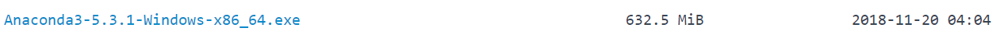  


## 三、Anaconda的安装

1. next
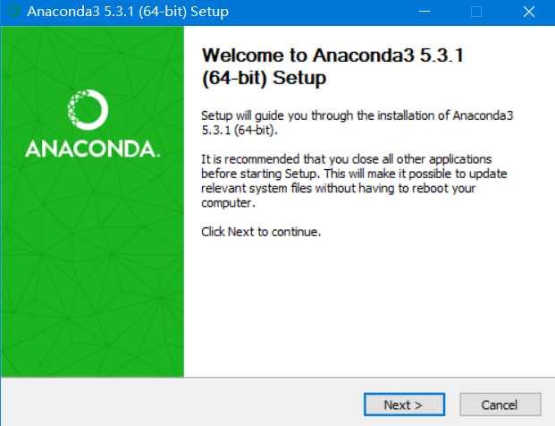  

2. Agree
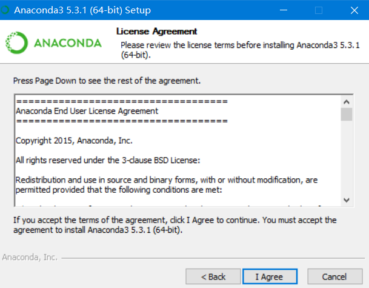  

3. next
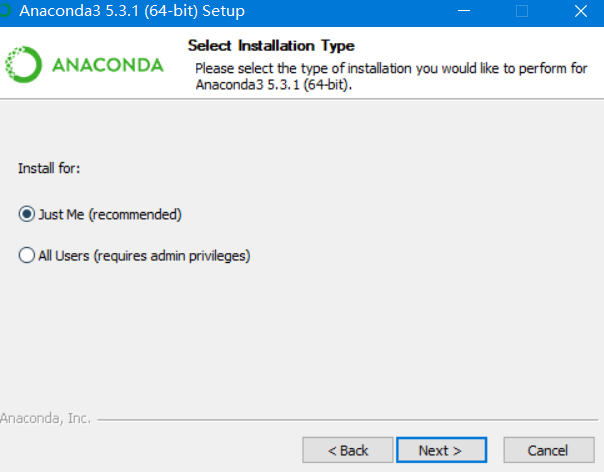  

4. 自定义安装路径
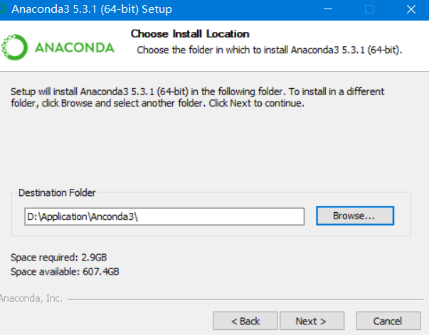  

5. 全部勾选 
这里有两个选项：第二个选项会让你将anconda中的python作为默认的python，如果你安装了pycharm，则pycharm会将anaconda中的python作为解释器。第一个选项，将anconda添加到系统环境，打开命令行，输入python，会显示anaconda的环境
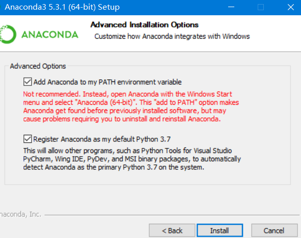  

6. 跳过
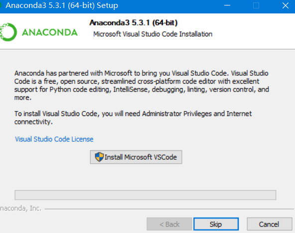  

## 四、关于conda
打开 Anaconda prompt 这是Anaconda自带的一个命令行，可以自动进入Anaconda虚拟环境

输入 conda list, 显示anaconda 所有的python 包
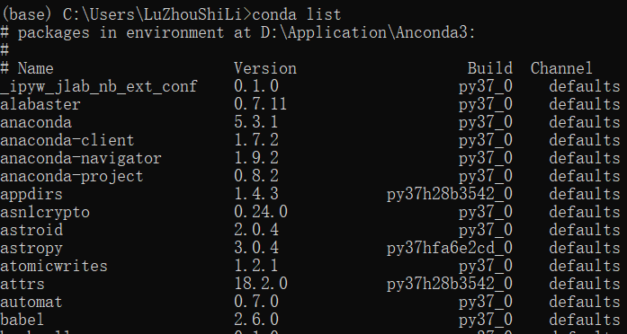  

关于conda:
conda 是一个包管理器

* which conda 或者conda -version命令检查是否安装正确
* conda list 查询
* conda install * 安装包
* conda update * 升级包
* conda remove * 卸载包

比如 ```conda install tensorflow-gpu==2.0.0```

由于conda下载的包默认是从国外的源进行下载的，为了下载更快捷，下面进行更改conda的下载源：执行以下命令

```
conda config --add channels https://mirrors.tuna.tsinghua.edu.cn/anaconda/pkgs/free/

conda config --add channels http://mirrors.tuna.tsinghua.edu.cn/anaconda/pkgs/main/

conda config --set show_channel_urls yes
```


这里配置的时候 我遇到了问题：
```
Warning: 'https://mirrors.tuna.tsinghua.edu.cn/anaconda/pkgs/free/' already解决
```

解决办法：

找到C盘下的用户目录，找到.condarc文件，记事本打开
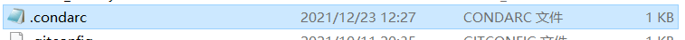  

之后将default前面的内容全部删除，重新执行上述命令即可。


如果你不希望有这么多的包，可以下载miniconda

https://conda.io/miniconda.html

安装miniconda,然后conda 安装你所需要的包

$conda install numpy


如果你不喜欢使用anaconda:
可以直接使用pip安装，使用豆瓣源进行安装：

```
pip install numpy pandas matplotlib sklearn -i http://pypi.doubanio.com/simple
```
-i 选项表示使用的镜像源 这里安装了numpy matplotlib sklearn 三个安装包

继续安装Jupyter notebook

pip install notebook


## 五、关于创建虚拟环境
新建一个python虚拟环境：

```
创建环境：conda create -n myenv python=3.6

进入环境：source activate myenv

离开环境: source deactivate

列出环境：conda env list

删除环境：conda env remove -n env_name
```

## 六、Jupyter Notebook

### 1. 概述
Jupyter Notebook (此前被称为 IPython notebook) 是一个基于网页的交互式笔记本，支持运行多种编程语言

Jupyter Notebook 的本质是一个Web应用程序，便于创建和共享文学化程序文档，支持实时代码，数学方程，可视化和markdown。用途包括数据清理和转换，数值分析，统计建模，机器学习等等。

## 2. 使用
在anaconda prompt 中输入jupyter notebook 此时浏览器会自动打开jupyter notebook

可以看到这里的Files文件 这个文件显示的是anaconda prompt中进入的文件夹
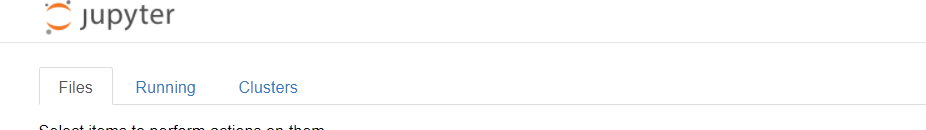  

如何创建一个新的notebook 文件：

点击new -> python3：
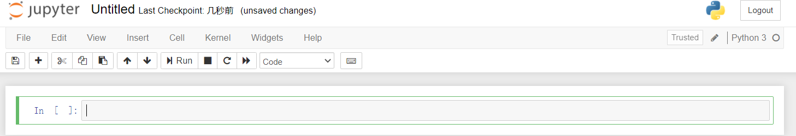  

这个标题是可以进行修改的，比如起名：test1
回到主页面，可以看到创建的文件
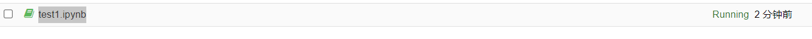  


在空行输入代码，点击run运行（快捷键：shfit + enter）
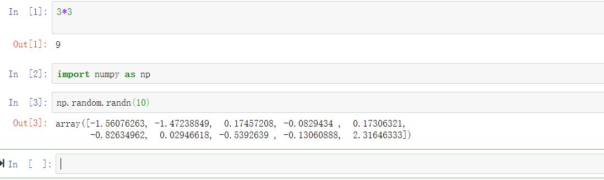  

工具栏介绍：
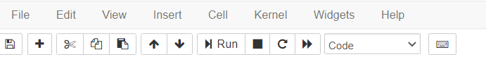  

* 第一个是保存按钮
* 第二个是添加行
* 第三个是剪切
* 第四个是复制
* 第五个是粘贴
* 第六、七个是上下移动行
* 第八个是运行
* 第九个是中断
* 第十个是重启
* 第十一个是重启所有代码

关于code选项框：

如果选上code,表示编辑的是代码，如果选markdown表示编辑Markdown文件，如果选上RAW NBConvert 表示不执行 只起到显示文本的作用
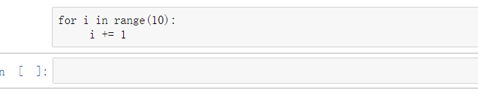  

选择heading 可以编辑标题
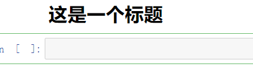  


同样地，notebook支持TAB键自动补全功能

支持魔术命令
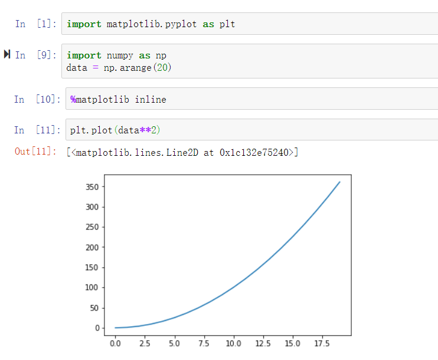  
