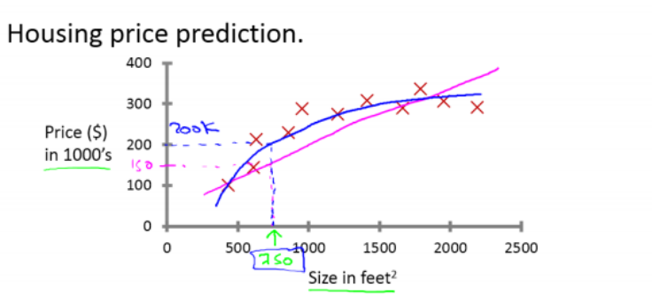

# 吴恩达机器学习入门笔记

## 一、机器学习的定义

* Arthur Samuel:在进行特定编程的情况下，给与计算机学习能力的领域。
* Tom Mitchell: 一个程序被认为能从经验E中学习，解决任务T，达到性能度量值P，当且仅当，有了经验E之后，经过P评判，程序在处理T时的性能有所提升。

## 二、监督学习
案例一：一个学生收集了一些房价的数据，现在将这些数据画出来看看是个什么样子：横轴表示房子的面积，单位是平方英尺，纵轴表示房价，单位是千美元。那么基于这组数据，假如你有一个朋友，他有一套750平方英尺的房子，现在他希望将房子卖掉，那么房子的售价标定为多少合适？

  

如果用一条直线进行拟合的话，可以推测出房子卖掉150000$,这个不是唯一的算法，如果用一条二次曲线去拟合效果会更好，房子可以买到200000$,这两个方案显然后者更兼合理。

**可以看出监督学习指的是我们给学习算法一个数据集**，这个数据集由“正确答案”组成。在房价的例子中，我们给了一系列房子的数据，我们给定数据集中每一个样本的正确价格，即他们实际的售价，然后运用学习算法，算出更多的正确答案，**比如，你朋友那个新房子的价格**，这个其实也是回归问题（我们尝试推测出一个连续值的结果，也就是房子的价格）

**所以回归的意思就是，推测出一系列连续值属性**

案例二：如果你想通过查看病例来推测乳腺癌良性与否，假如有人检测出乳腺癌肿瘤，恶性肿瘤有害且十分危险，良性肿瘤就没有那么大的危害，所以人们就会很在意这个问题。

  

在这个数据集中，横坐标表示肿瘤的大小，纵坐标0表示良性 1表示恶性，这里有五个良性五个恶行样本，如果有个朋友查出乳腺肿瘤，机器学习的问题在于能否估算出肿瘤是恶性的还是良性的概率，**这个是分类问题**。

**分类指的是我们尝试推测出离散的输出值：0或1**，事实上，分类问题中输出往往不止两个值。

在其他的机器学习问题中，往往不止一个特征。现在我们不止知道肿瘤的尺寸，还知道患者对应的年龄，（机器学习问题中，通常有更多的特征）
  

可以看到，每一个样本对应两个特征：年龄和尺寸，同时，良性肿瘤和恶性肿瘤被很好的区分开，机器学习很好的做到了分类问题。

如果你的算法想运用无限个特征，这就得用到支持向量机，能让计算机处理无限个特征。

总结：监督学习就是给学习算法一个数据集，每一个数据都有相应的“正确答案”，之后再根据这些样本数据做预测。回归问题就是预测出的结果是一个连续的输出值，分类问题就是输出一组离散的结果
