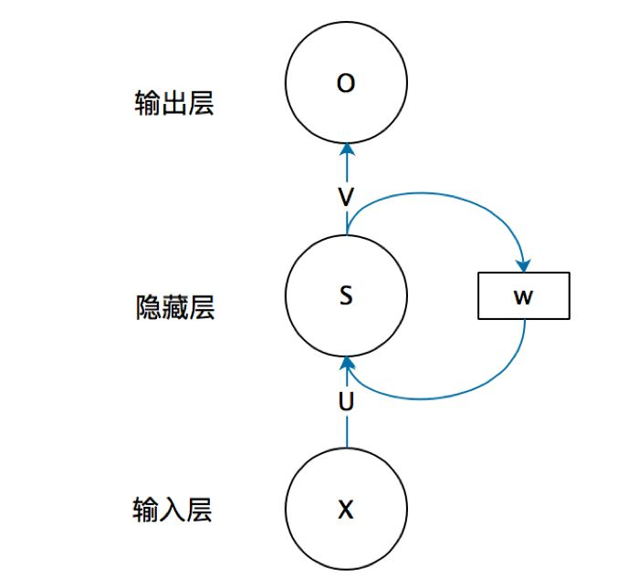
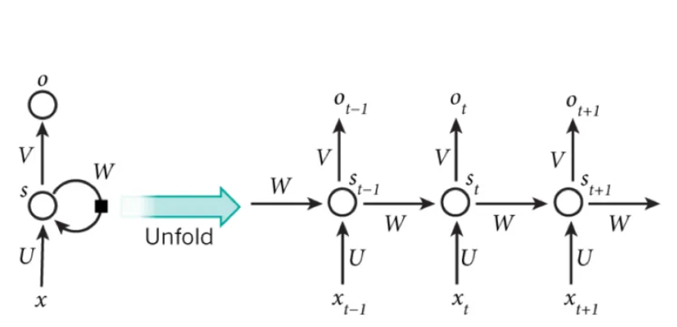
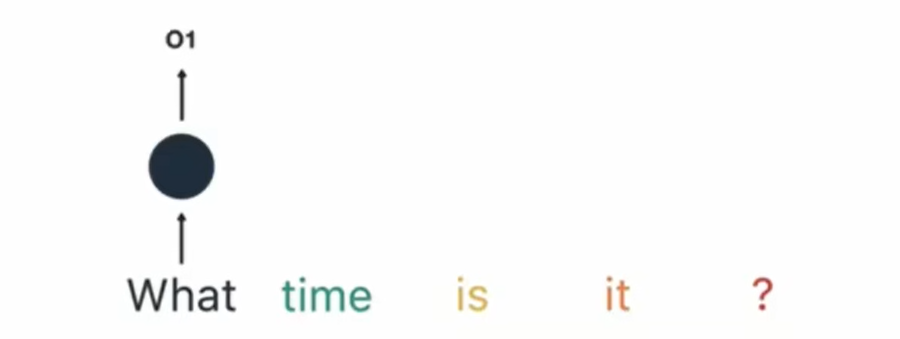
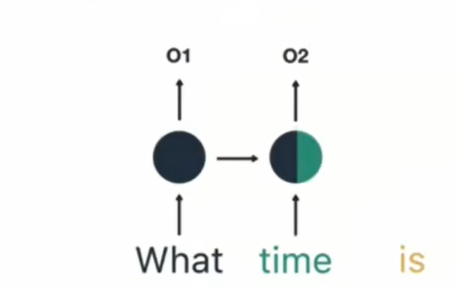
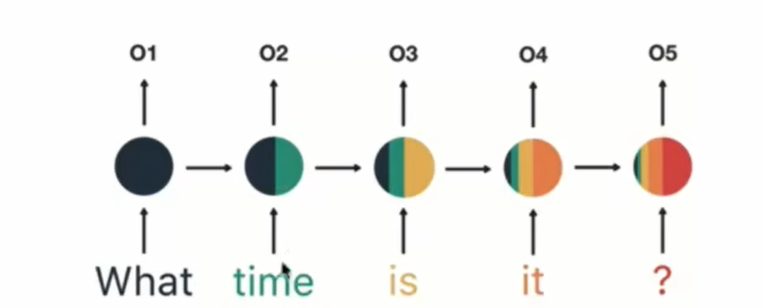
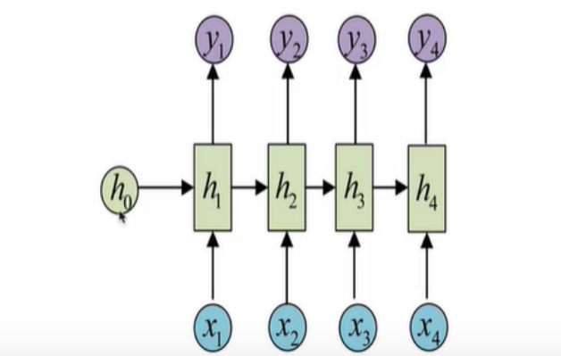
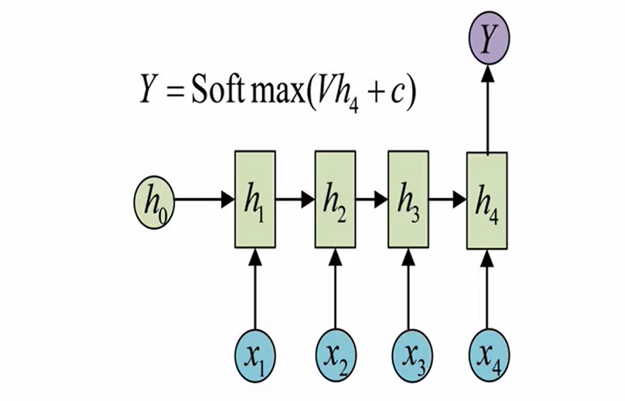
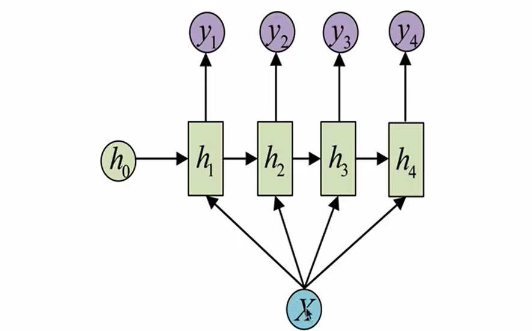
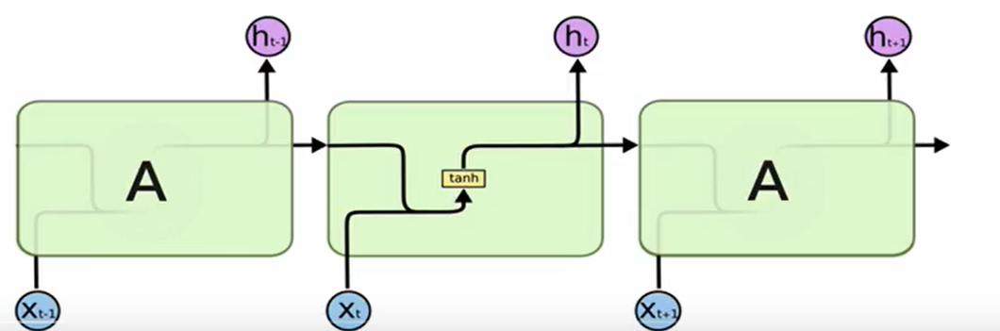
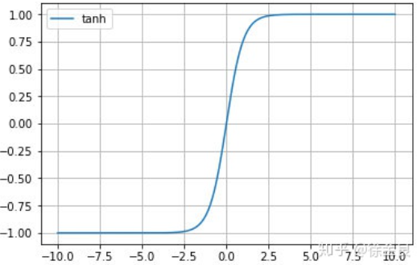

# RNN模型学习笔记


## 一、RNN模型的概述

&emsp;RNN(Recurrent Netural Network)，中文称之为循环神经网络，他一般以序列数据作为输入，通过网络内部的结构设计有效捕捉序列之间的关系特征，一般也是以序列形式进行输出

  

传统的神经网络只能单独的处理一个个的输入，前一个输入和后一个输入时完全没有关系的，但是有些任务需要能够更好的处理序列的信息，也就是序列数据前后之间是有关联的。


比如：当我们在理解一句话的时候，不能单独的理解这句话中的每一个词，需要处理这些词连接起来的整句话。具体表现形式为网络会对前面的信息进行记忆并应用于当前输出的计算中，**即隐藏层之间的节点不再无连接而是有连接的，并且隐藏层的输入不仅包括输入层的输出还包括上一时刻隐藏层的输出。**

  

RNN的循环机制使模型隐藏层上一时间步产生的结果，能够作为当下时间步输入的一部分（当下时间步的输入除了正常的输入之外还包括上一步的隐藏层输出）对当下时间步的输出产生影响

RNN模型的作用：
* 因为RNN结构能够很好使用序列之间的关系，因此针对自然界具有连续性的输入序列，比如人类语言，语音等进行很好的处理

比如：用户输入：what time is it? 

* 首先需要对它进行基本的分词，RNN使按照顺序工作的，每次只接受一个单词进行处理

* 第二步：将单词what输送给RNN 它将产生一个输出output1

  


* 第三步：继续将单词time输送给RNN,此时的RNN不仅仅使用time来产生Output2，还会使用来自上一层隐藏层的输出output1作为输入信息

  

* 第四步：重复这样的步骤，直到处理完所有的单词

  

* 第五步：将最终隐藏层的输出output5进行处理来解析用户意图


## 二、RNN模型的分类

&emsp;这里我们将从两个角度对RNN模型进行分类，第一个角度是输入和输出的结构，第二个角度是RNN的内部构造

* 按照输入和输出的结构进行分类
  * N vs N-RNN
  * N vs 1 - RNN
  * 1 vs N-RNN
  * N vs M -RNN

* 按照RNN的内部构造进行分类
  * 传统RNN
  * LSTM
  * Bi-LSTM
  * GRU
  * Bi-GRU


* N vs N-RNN:
  * 他是RNN最基础的结构形式，最大的特点就是输入和输出序列是等长的，由于这个限制的存在，使其使用范围比较小

  


* N vs 1-RNN:
  * 处理的问题是一个序列，而要求输出是一个单独的值而不是序列，我们只要在最后一个隐藏层输出h上进行线性变化就可以，有时候还需要对输出进行sigmoid或者softmax处理，这种结构常应用于文本分类问题
  


* 1 vs N-RNN:
  * 如果输入不是序列而输出是序列，输入作用与每一次的输出之上，这种结构常用于图片生成文字任务

  


* N vs M-RNN:
  * 这是一种不限输入输出长度的RNN结构，它由编码器和解码器两部分组成，两者的内部结构都是某类RNN,它也被成为seq2seq架构，输入数据首先通过编码器，最终输入一个隐含变量c，之后最常用的做法就是使用这个隐含变量c作用在解码器进行解码的每一步上，以保证信息被有效利用

## 三、传统RNN模型的学习

### 3.1 传统RNN内部结构图：
  

内部结构分析：

* 对于中间的隐藏层，它的输入有两个部分，分别是h(t - 1)以及x(t)，代表上一时间步的隐藏层输出以及此时间步的输入，他们进入RNN进入RNN结构体之后会进行拼接，形成新的张量[x(t),h(t - 1)]，之后这个新的张量将通过一个全连接层（线性层），该层输出使用tanh作为激活函数，最终得到该时间步的输出h(t)，它将作为下一个时间步的输入和x(t + 1)一起进入结构体

  

激活函数tanh的作用：
* 用于帮助调节流经网络的值，tanh函数将值压缩在-1和1之间

  

### 3.2 在pytorch中使用RNN

* pytorch中传统RNN工具的使用
  * 位置：在torch.nn工具包中，通过torch.nn.RNN可以调用

* nn.RNN类初始化主要参数解释：
  * input_size:输入张量x中特征维度的大小
  * Hidden_size:隐藏层张量h中，特征维度的大小
  * num_layers:隐藏层的数量
  * nonlinearity:激活函数的选择，默认是tanh

* nn.RNN类实例化对象主要参数解释：
  * input:输入张量x
  * h0:初始化的隐藏层张量h

```py
import torch
import torch.nn as nn

## 输入层神经元数量 隐藏层神经元数量  隐藏层个数
rnn = nn.RNN(5,6,1)  ## 实例化RNN模型

## 第一个参数：sequence_length(输入序列的长度)
## 第二个参数：batch_size(批次的样本数)
## 第三个参数：input_size(输入张量x的维度)
input = torch.randn(1,3,5)  ## 生成标准正态分布数据

## 第一个参数：num_layers * num_directions(层数* 网络方向数)
## 第二个参数：batch_size(批次的样本数)
## 第三个参数：hidden_szie(隐藏层的维度)
h0 = torch.randn(1,3,6)
output,hn = rnn(input,h0)

print(output)
print(output.shape)
print(hn)
print(hn.shape)


```

```py

tensor([[[ 0.2364,  0.2111,  0.7135,  0.1670,  0.2313, -0.2744],
         [ 0.4567, -0.8079,  0.1117,  0.0210,  0.7217,  0.6725],
         [ 0.2621,  0.2160,  0.9258,  0.8018,  0.5957,  0.5398]]],
       grad_fn=<StackBackward0>)
torch.Size([1, 3, 6])
tensor([[[ 0.2364,  0.2111,  0.7135,  0.1670,  0.2313, -0.2744],
         [ 0.4567, -0.8079,  0.1117,  0.0210,  0.7217,  0.6725],
         [ 0.2621,  0.2160,  0.9258,  0.8018,  0.5957,  0.5398]]],
       grad_fn=<StackBackward0>)
torch.Size([1, 3, 6])

Process finished with exit code 0

```

传统RNN的优势：由于内部结构简单，对计算资源要求低，相比RNN变体：LSTM 和GRU模型，参数总量少了很多，在短序列任务上性能和效果都表现优异

传统RNN的缺点：传统RNN在解决长序列之间的关联时，在进行反向传播的时候，过长的序列导致梯度的计算异常，发生梯度消失或者爆炸

  

sigmoid的函数值值域是固定的，在[0,0.25]之间，权重w一般都小于1,那么通过这样的公式连乘之后，最后的梯度就会变得非常小，这种现象称之为梯度消失，如果w大于1，连乘积、就可能造成梯度过大，称作梯度爆炸

* 梯度消失或者爆炸的危害：
  * 如果在训练过程中发生了梯度消失，那么权重参数就没有办法更新，最终导致训练失败，梯度爆炸所带来的梯度过大，大幅度更新网络参数，在极端情况下，结果会溢出

  


