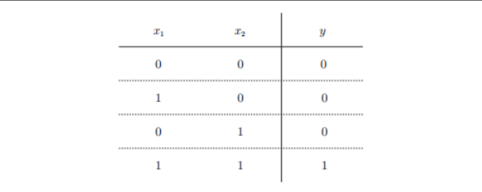
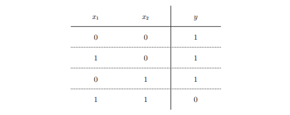
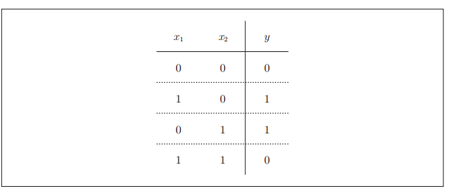
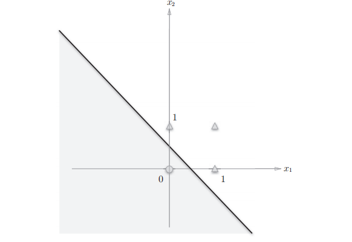
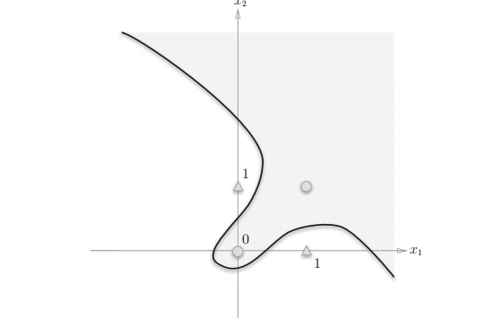
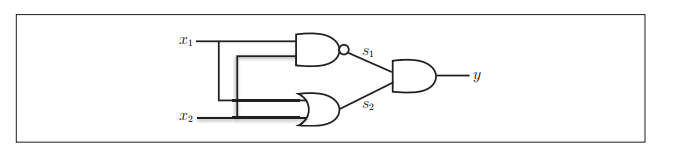
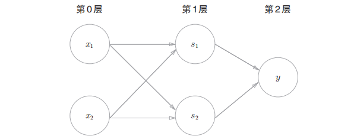

# 感知机的实现

## 一、感知机概述

&emsp;感知机接受多个输入信号，输出一个信号。感知机的信号只有0和1两种取值，0表示不传递信号，1表示传递信号

  

&emsp;上图是一个接受两个输入信号的感知机的例子，x1和x2表示输入信号，w1和w2表示权重，图中的圆圈代表神经元或者节点。输入信号被送往神经元时候，会被分别乘以固定的权重（w1x1、w2x2），神经元会计算传送过来的信号的总和，只有当这个总和超过某个界限的时候，才会输出1，这也称之为神经元被激活，这里将界限值称之为阈值。

  

**感知机的多个输入信号都有各自固定的权重，这些权重发挥着控制各个信号的重要性的作用，也就是说，权重越大，对应权重的信号的重要性也就越高。**

## 二、简单逻辑电路

### 2.1 与门

  


如何实现这个真值表，使用感知机：

我们可以看到，真值表中给出了输入信号x1,x2和输出信号y1,那么要我们决定的就是权重参数x1,x2和阈值,比如(0.5,0.5,0.7)就是一组很符合的数据。

### 2.2 与非门和或门

&emsp;与非门就是在与门的基础上取非

  

要表示上面这个与非门，参数取值(-0.5,-0.5,-0.7)

**我们可以看到与门、与非门都感知机构造都是一样的，实际上三个门电路只有参数的值不一样（权重和阈值），也就是说，相同构造的感知机，只需要通过适当地调整参数的值，就可以成为不同的逻辑门**


## 三、感知机的实现

### 3.1 与门的简单实现

```python
def AND(x1,x2):
    w1,w2,theta = 0.5,0.5,0.7
    tmp = w1 * x1 + w2 * x2

    if tmp <= theta:
        return 0

    else:
        return 1


print(AND(1,1))
```

### 3.2 导入权重和偏置

**我们尝试将theta更换成-b,**

  

b称之为偏置,w1,w2称之为权重，感知机会计算输入信号和权重的乘积，然后加上偏置，如果这个值大于0则输出1，否则输出0

```cpp
import numpy as np
x = np.array([0,1])
w = np.array([0.5,0.5])
b = -0.7
## w * x 乘积是一个矩阵 sum 进行求和
print(np.sum(w * x) + b)  ## 矩阵相乘 加上偏置矩阵
```

### 3.3 使用权重和偏置实现与门

```python
def AND(x1,x2):
    x = np.array([x1,x2])
    w = np.array([0.5,0.5])
    b = -0.7

    # 计算临时变量
    tmp = np.sum(w * x) + b
    if tmp <= 0:
        return 0

    else:
        return 1
```

具体的来说，w1和w2是控制输入信号的重要性的参数，而偏置是调正神经元被激活的容易程度的参数。

实现与非门：

```python
def NAND(x1,x2):
    x = np.array([x1,x2])
    w = np.array([-0.5,-0.5]) # 权重和偏置与and不一样

    b = 0.7

    tmp = np.sum(w * x) + b
    if tmp <= 0:
        return 0

    else:
        return 1

        
```

实现或门
```python
def OR(x1,x2):
    x = np.array([x1,x2])  ## array中传入的是列表
    w = np.array([0.5,0.5])
    b = -0.2
    tmp = np.sum(w * x) + b

    if tmp <= 0:
        return 0

    else:
        return 1
```


## 四、感知机的局限性

### 4.1 异或门

  

&emsp;我们首先将或门的动作形象化，权重参数是(-0.5,1.0,1.0)
  

上面式子表示的感知机生成一条直线-0.5 + x1 + x2 =0分割两个空间，神经元没有被激活的空间输出0，被激活的空间输出1

  


该条直线很好的将（0，0）(0,1)（1，0）（1，1）四个点分开

但是对于异或门：(0,0)和（1，1）输出1，(0,1)和(1,0)输出0，看看下面这张图

  

不存在一条直线将四个点分割。


### 4.2 线性和非线性

**感知机的局限性在于它只能表示由一条直线分割的空间**，

异或门只能用非线性表示

  

## 五、多层感知机

  

异或门可以由与门，或门，与非门来实现

```python
def XOR(x1,x2):
    s1 = NAND(x1,x2)
    s2 = OR(x1,x2)
    y = AND(s1,s2)
    return y

```

与门和或门都是单层感知机，异或门是多层感知机

  

输入是第0层，输出是第2层

* 第0层的两个神经元接受输入信号，并将信号发送到第一层的神经元中
* 第一层的神经元将信号发送到第二层神经元，第二层的神经元输出y

在异或门的感知机中，工人之间不断进行零件的传送，通过这种多层结构，感知机得以实现异或门，单层感知机无法表示的东西，通过叠加层数就可以解决。

**感知机通过叠加层能够进行非线性的表示**


