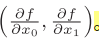

# 神经网络参数的学习

## 一、训练数据和测试数据

&emsp;数据一般分为训练数据和测试数据，首先，使用训练数据进行学习，寻找最优的参数，然后使用测试数据评价训练得到的模型的实际能力，将数据分为训练数据和测试数据的原因：正确评价模型的泛化能力

&emsp;泛化能力指的是处理未被观察过的数据的能力，获得泛化能力是机器学习的最终目标。

&emsp;过拟合：仅仅使用一个数据集去学习和评价参数，是无法正确评价的。这样会导致可以顺利的处理某一数据集，但是没有办法处理其他数据集，这种状态称之为过拟合

## 二、损失函数

&emsp;损失函数是表示神经网络性能的恶劣程度的指标，即当前的神经网络对训练数据在多大程度上不拟合，在多大程度上不一致，以“性能的恶劣程度“为指标可能会使人感到不自然，但是如果给损失函数乘上一负数，就可以理解为多大程度上不坏，也就是性能有多好。

### 2.1 均方误差

  

yk表示神经网络的输出，tk表示监督数据，k表示数据的维数

在手写数字识别的例子中，yk,tk,由下面十个元素构成的数据

  

&emsp;数组元素的索引从第一个开始一次对应数字0,1,2...这里的yk对应的是softmax函数的输出，由于sofmax的输出其实是概率，标签tk采用的是独热编码

**均方误差会计算神经网络的输出和正确解监督数据的各个元素之差的平方，然后再求和**

```py
def mean_squared_error(y,t):
    return 0.5 * np.sum((y - t) ** 2)
t = [0,0,1,0,0,0,0,0,0,0]
y = [0.1,0.05,0.6,0.0,0.05,0.1,0.0,0.1,0.0,0.0]
mean_squared_error(np.array(y),np.array(t))
y = [0.1,0.05,0.1,0.0,0.05,0.1,0.0,0.6,0.0,0.0]
mean_squared_error(np.array(y),np.array(t))
```

可以看到第一个例子的损失函数的值更小，和监督数据之间的误差比较小，也就是说，均方误差显示第一个例子的输出结果和监督数据更加吻合

### 2.2 交叉熵损失

&emsp;交叉熵误差也被经常用作损失函数，

  

log表示以e为底数的自然对数(log).yk是神经网络的输出，tk是正确解标签，并且tk采用one-hot编码，上面的式子实际上只计算对应正确解标签的输出的自然对数，比如假设正确解标签的索引是2，与之对应的神经网络的输出是0.6，交叉熵误差是-log0.6 = 0.51;如果2对应的输出是0.1，那么交叉熵误差就是-log0.1 = 2.30，**交叉熵误差的值是由正确解标签所对应的输出结果决定的。**

如果正确解标签对应的输出越小，那么交叉熵误差就越大，说明预测的越不准确

```py
def cross_entroy_error(y,t):
    delta = 1e-7
    return -np.sum(t * np.log(y + delta))

```

**函数内部在计算Np.log时，加上了一个微小值delta,这是因为np.log(0),np.log(0)会变为负无穷大，这样一来就会导致后续计算没办法进行，作为保护性对策**

**这里只计算一个样本数据**
```py
from torch import det

def cross_entroy_error(y,t):
    delta = 1e-7
    return -np.sum(t * np.log(y + delta))


t = [0,0,1,0,0,0,0,0,0,0]
y = [0.1,0.05,0.6,0.0,0.05,0.1,0.0,0.1,0.0,0.0]

cross_entroy_error(np.array(y),np.array(t))

y = [0.1,0.05,0.1,0.0,0.05,0.1,0.0,0.6,0.0,0.0]
cross_entroy_error(np.array(y),np.array(t))
```

### 2.3 mini-batch学习

&emsp;机器学习就是针对训练数据计算损失函数的值，找出使该值尽可能小的参数，计算损失函数必须将所有的训练数据作为对象，也就是说如果训练数据有100个，我们就要把这100个损失函数的总和作为学习的指标

  

这里，假设数据有N个，tnk表示第N个数据的第k个元素的值，（ynk表示的是神经网络的输出，tnk是监督数据），上面的式子只是把求单个数据的损失函数扩大到N份数据，最后还需要除以N来进行正则化，通过除以N，可以获得和训练数据的数量无关的统一指标


**神经网络的学习也是从训练数据中选出一批数据，然后针对每一个Mini-batch进行学习**

首先测试一下数据的形状
```py
import sys,os
sys.path.append(os.pardir)
import numpy as np
from dataset.mnist import load_mnist

(x_train,t_train),(x_test,t_test) = load_mnist(normalize=True,flatten=True,one_hot_label=True)

print(x_train.shape)
print(t_train.shape)


```

加载上面的MNIST数据之后，训练数据有60000个，输入数据是784维的图像数据，监督数据是1 x 10的数据

**我们使用Numpy中的np.random.choice() 随机选择若干数据**

```py
from msilib import type_binary
import sys,os
sys.path.append(os.pardir)
import numpy as np
from dataset.mnist import load_mnist

(x_train,t_train),(x_test,t_test) = load_mnist(normalize=True,flatten=True,one_hot_label=True)

print(x_train.shape)
print(t_train.shape)


train_size = x_train.shape[0]  ## 打印第一个维度大小
print(train_size)
print(x_train.shape[1])  ## 打印第二个维度大小


batch_size  = 10
## 使用np.random.choice() 可以从指定的数字中随机选取想要的数字 选10个
batch_mask = np.random.choice(train_size,batch_size)

print(batch_mask)
## 然后利用随机选取的数字下标 选择训练数据和标签
x_batch = x_train[batch_mask]
t_batch = t_train[batch_mask]

print(x_batch)
print(t_batch)

```

* 使用np.random.choice() 可以从指定的数字中随机选取想要的数字
* 然后利用随机选取的数字下标 选择训练数据和标签


### 2.4 mimi-batch版交叉熵误差的实现

**这里我们实现一个可以同时处理单个数据和批量数据**
```py
def cross_entroy_error(y,t):
    if y.ndim == 1:
        t = t.reshape(1,t.size)
        y = y.reshape(1,y.size)

    batch_size = y.shape[0]  ## 计算第一维度

    return -np.sum(t * np.log(y + 1e-7)) / batch_size

```

这里，y是神经网络的输出，t是监督数据，y的维度是1的时候，也就是求单个数据的交叉熵误差，需要改变数据的形状，并且，当输入为mini-batch时，要用Batch的个数进行正规化，计算单个数据的平均交叉熵误差。

此外，当监督数据是标签形式（非one-hot表示，而是像2 6 7 这样的标签的时候），交叉熵误差可以通过如下代码进行实现：


```py
def cross_entropy_error(y,t):

    if y.ndim == 1:
        t = t.reshape(1,t.size)
        y = y.reshape(1,y.size)

    batch_size = y.shape[0] ## 批量大小就是样本数量 预测值的第一维度

    return -np.sum(np.log(y[np.arrange(batch_size),t] + 1e-7)) / batch_size
```


这里np.arange(batch_size)会生成一个从0到batch_size - 1的数组，t中标签是以[2,7,0,9,4]的形式进行存储的，所以y[np.arange(batch_size),t]能抽出各个数据的正确解标签对应的神经网络的输出（这个例子中y[np.arange(batch_size),t]会生成Numpy数组[y[0.2],y[1,7],y[2,0],y[3,9],y[4,4]]）


### 2.5 设置损失函数的理由

&emsp;在神经网络的学习中，寻找最优参数（权重和偏置）的时候，要寻找使损失函数的值尽可能小的参数，为了找到使损失函数的值尽可能小的地方，需要计算参数的导数（确切的说是梯度），然后以这个倒数为指引，逐步更新参数的值


如果导数的值为负，通过使该权重参数向正方向改变，可以减小损失函数的值，反过来，如果导数的值为正，则通过使该权重参数向负方向改变，可以减小损失函数的值，不过，当导数的值为0时，无论权重参数向那个方向变化，损失函数的值都不会发生改变，此时该权重参数的值更新会停在此处

**在神经网络的学习中，不能将识别精度作为指标，如果以识别精度作为指标，则参数的导数在绝大多数地方都会变为0**

识别精度对微小的参数变化基本上没什么反应，即便有反应，它的值也是不连续、突然的变化。

  

## 三、梯度下降法

### 3.1 数值微分

利用微小差分的过程求导数称之为数值微分

```py
def numerical_diff(f,x):
    h = 1e-4

    return (f(x + h) - f(x - h)) / (2 * h)

```
### 3.2 数值微分的例子

  

```py
## 采用中心微分的思想
def numerical_diff(f,x):
    h = 1e-4

    return (f(x + h) - f(x - h)) / (2 * h)

def function_1(x):
    return 0.01 * x**2 + 0.1 * x

import numpy as np
import matplotlib.pylab as plt

x = np.arange(0.0,20.0,0.1) ## 以0.1为单位从0~20的数组
y = function_1(x)

plt.xlabel("x")
plt.ylabel("y")
plt.plot(x,y)
plt.show()

numerical_diff(function_1,5)
```

  

0.1999999999990898


### 3.3 梯度

&emsp;全部变量的偏导数汇总而成的向量称之为梯度

  

```py

def numerical_gradient(f,x):
    h = 1e-4

    ## 创建梯度数组
    grad = np.zeros_like(x) ## 生成和x形状相同的数组

    ## for循环遍历每一个x  然后求解偏导数
    for idx in range(x.size):
        tmp_val = x[idx]
        
        # f(x + h)的计算
        x[idx] = tmp_val + h
        fxh1 = f(x)


        # f(x - h)的计算
        x[idx] = tmp_val - h
        fxh2 = f(x)


        grad[idx] = (fxh1 - fxh2) / (2*h)

        x[idx] = tmp_val ## 还原值

    return grad

def function_2(x):

    return x[0]**2 + x[1]**2
import numpy as np
numerical_gradient(function_2,np.array([3.0,4.0]))

```

**梯度会指向各点处的函数值降低的方向，也是各点处的函数值减小最多的方向**

### 3.4 梯度下降法

&emsp;梯度表示的是各点处的函数值减小最多的方向，因此，无法保证梯度所指的方向就是函数的最小值或者真正应该前进的方向。实际上，在复杂的函数中，梯度指示的方向基本上都不是函数值最小处

&emsp;虽然梯度的方向不一定指向最小值，但是沿着他的方向能够最大程度减小函数的值，因此，在寻找函数的最小值的位置任务中，要以梯度的信息为线索，决定前进的方向

&emsp;在梯度法中，函数的取值从当前位置沿着梯度的方向前进一段距离，然后在新的地方重新求梯度，在沿着新梯度的方向前进，如此反复，不断沿着梯度的方向前进，像这样，通过不断地沿着梯度方向前进，逐渐减小函数值的过程就是梯度法。

  

学习率需要实现确定为某一个值，比如0.01或者0.001，这个值过大或者过小，都无法到达一个好的位置


```py
from matplotlib.pyplot import step


def gradient_descent(f,init_x,lr = 0.01,step_num = 100):
    x = init_x
    for i in range(step_num):
        grad = numerical_gradient(f,x) ## 每到一个函数位置 就计算下梯度 
        ## 找到函数下降最多的方向 然后更新函数值

        ## 更新x
        x -= lr * grad

    return x


```

&emsp;参数f是要进行最优化的函数，init_x是初始值，lr的学习率learning_rate ，step_num 是梯度法的重复次数，numerical_gradient(f,x)会求解函数的梯度，用该梯度乘以学习率得到的值进行更新操作，由step_num指定重复额次数

```py

init_x = np.array([-3.0,4.0])

gradient_descent(function_2,init_x = init_x,lr = 0.1,step_num=100)


```

对于学习率，学习率过大的话，会发散成一个很大的值，反过来学习率很小的话，基本上就不怎么更新结束。**相对于神经网络的权重参数是通过训练数据和学习算法自动获得的，学习率这样的超参数则是人工设定的**


### 3.5 神经网络的梯度

&emsp;神经网络的梯度指的是损失函数关于权重参数的梯度，

  

```py
import sys,os
sys.path.append(os.pardir)
import numpy as np

class simpleNet:
    def __init__(self):
        self.W = np.random.randn(2,3)  ## 使用高斯分布进行初始化

    ## 计算预测值
    def predict(self,x):
        return np.dot(x,self.W)

    def loss(self,x,t):
        z = self.predict(x)
        y = softmax(z)
        loss = cross_entropy_error(y,t)  ## 计算交叉熵损失
        return loss

net  = simpleNet()
print(net.W) ## 权重参数

x = np.array([0.6,0.9])
p = net.predict(x)
print(p)


```

计算损失函数：
```py
t = np.array([0,0,1]) ## 正确解标签
net.loss(x,t)

```

求解梯度：

```py
def f(W):
    return net.loss(x,t)

dW = numerical_gradient(f,net.W)
print(dW)

```

### 3.6 学习算法的实现

&emsp;求出神经网络的梯度之后，接下来只需要根据梯度法，更新权重参数即可

**神经网络的学习步骤如下：**

* 步骤一：
  从训练数据中随机选出一部分数据，这部分数据称之为mini-batch.我们的目标就是减小mini-batch的损失函数的值

* 步骤二：（计算梯度）
  为了减小mini-batch的损失函数的值，需要求出各个权重参数的梯度，梯度表示损失函数的值减小最多的方向

* 步骤三：（梯度表示损失函数的值减小最多的方向）将权重参数沿着梯度方向进行微小更新

* 步骤四：重复步骤一，步骤二，步骤三


&emsp;神经网络的学习按照上面四个步骤进行，这个方法通过梯度下降法更新参数，不过这里使用的数据是随机选择的mini batch数据，所以又称为随机梯度下降法（SGD），随机梯度下降法顾名思义：指的是对随机选择的数据进行的梯度下降法。深度学习的很多框架中，随机梯度下降法一般由一个名为SGD的函数来实现

下面，实现手写数字识别的神经网络，这里以两层神经网络为对象，使用MNIST数据集进行学习


#### 3.6.1 两层神经网络的类

这里，我们实现一个TwoLayerNet类：

```py
import sys,os
sys.path.append(os.pardir)
from common.functions import * 
from common.gradient import numerical_gradient

def numerical_gradient(f,x):
    h = 1e-4
    grad = np.zeros_like(x) ## 生成和x形状相同的数组

    ## for循环遍历每一个x 然后求解偏导数
    ## 针对每一个自变量都求解偏导数  然后组合成梯度
    for idx in range(x.size):
        tmp_val =x[idx]  ## 先保存 在恢复

        x[idx] = tmp_val + h
        fxh1 = f(x)


        x[idx] = tmp_val - h
        fxh2 = f(x)

        grad[idx] = (fxh1 - fxh2) / (2 * h)

        x[idx] = tmp_val


    return grad


class TwoLayerNet:

    def __init__(self,input_size,hidden_size,output_size,weight_init_std = 0.01):
        ## 初始化权重

        self.params = {}

        ## 使用高斯分布 生成第一层权重矩阵
        ## 隐藏层神经元 hidden_size
        self.params['W1'] = weight_init_std * np.random.randn(input_size,hidden_size)
        self.params['b1'] = np.zeros(hidden_size) ## 生成第一层的偏置矩阵

        ## 输出层神经元   output_size
        self.params['W2'] = weight_init_std * np.random.randn(hidden_size,output_size)
        self.params['b1'] = np.zeros(output_size)

    ## 生成预测值
    def predict(self,x):
        W1,W2 = self.params['W1'],self.params['W2']
        b1,b2 = self.params['b1'],self.params['b2']

        ## 计算隐藏层的输出
        a1 = np.dot(x,W1) + b1
        ## 隐藏层的激活函数
        z1 = sigmoid(a1)
        a2 = np.dot(z1,W2) + b2
        y = softmax(a2) ## 输出层的激活函数  输出概率值
        return y

    ## x: 输入数据  t:监督数据
    def loss(self,x,t):

        ## 计算预测值 然后和标签一起计算交叉熵损失
        y = self.predict(x)
        return cross_entropy_error(y,t)

    ## 计算精度
    def accuracy(self,x,t):
        ## 计算预测值
        y = self.predict(x)

        ## 取出第二维度：每一行最大值的索引
        y = np.argmax(y,axis = 1)
        t = p.argmax(t,axis = 1)

        accuracy = np.sum(y == t) / float(y.shape[0])

        return accuracy

    ## 输入数据   监督数据
    ## 计算梯度
    def numericalgradient1(self,x,t):

        loss_W = lambda W:self.loss(x,t)  ## 损失函数

        grads = {}  ## 保存每一层参数的梯度
        grads['W1'] = numerical_gradient(loss_W,self.params['W1'])
        grads['W2'] = numerical_gradient(loss_W,self.params['W2'])
        grads['b1'] = numerical_gradient(loss_W,self.params['b1'])
        grads['b2'] = numerical_gradient(loss_W,self.params['b2'])

        return grads
```


  

  

TwoLayerNet类中有params和grads两个字典变量，params变量中保存权重参数，比如params['W1']保存第一层的权重参数：

```py
net = TwoLayerNet(input_size= 784,hidden_size= 100,output_size= 10)

print(net.params['W1'].shape)
print(net.params['b1'].shape)
print(net.params['W2'].shape)
print(net.params['b2'].shape)

```

与params变量对应，grads变量中保存了各个参数的梯度，使用numerical_gradient()方法计算梯度之后，梯度的信息将保存在grads变量中

```py
x = np.random.rand(10,784)  ## 输入数据
t = np.random.rand(10,10)  ## 随机生成标签

grads = net.numericalgradient(x,t)  ## 计算一次梯度

print(grads['W1'].shape)
print(grads['W2'].shape) 

```


&emsp;对于初始化方法__init__(self,input_size,hidden_size,output_size)方法，它是类的初始化方法，（它是类的初始化方法，就是生成TowLayerNet实例时被调用的方法），从第一个参数开始，一次表示输入层的神经元数、隐藏层的神经元数、输出层的神经元数，对于手写数字识别案例，输入图像大小是784，输出类别是10，所以指定参数input_size = 784,output_size = 10,将隐藏层的个数hidden_size设置合适的值

权重使用符合高斯分布的随机数进行初始化，偏置使用0进行初始化。

loss(self,x,t)是计算损失函数值的方法。这个方法会基于predict()的结果和正确解标签，计算交叉熵误差


剩下的numerical_gradient(self,x,t)方法会计算各个参数的梯度。

#### 3.6.2 minibatch的实现

```py
import numpy as np
import sys,os
sys.path.append(os.pardir)
from dataset.mnist import load_mnist
from two_layer_net import TwoLayerNet

(x_train,t_train),(x_test,t_test) = load_mnist(normalize=True,one_hot_label=True)

train_loss_list = []


## 超参数

iters_num = 10000  ## 梯度下降迭代次数
train_size = x_train.shape[0]  ## 计算训练数据样本个数
batch_size = 100## 批处理大小
learning_rate = 0.1  ## 学习率

network = TwoLayerNet(input_size=784,hidden_size=50,output_size=10)

for i in range(iters_num):
    ## 获取mini_batch
    batch_mask = np.random.choice(train_size,batch_size)

    ## 批量获取数据
    x_batch = x_train[batch_mask]
    t_batch = t_train[batch_mask]

    ## 计算梯度
    grad = network.numerical_gradient(x_batch,t_batch)

    ## 更新参数
    for key in ('W1','b1','W2','b2'):
        network.params[key] -= learning_rate * grad[key]

    # 记录学习过程
    loss = network.loss(x_batch,t_batch)
    train_loss_list.append(loss)


```

mini-batch的大小是100，需要每次从60000个训练数据中随机选择100个数据,然后对包含100笔数据的Mini-batch求梯度，使用随机梯度下降SGD更新参数，更新10000次，没更新一次，都对训练数据计算损失函数的值，并将该值添加到数组中

  

可以看到损失函数的值正在不断地减小，表示神经网络的权重参数正在逐渐拟合数据，神经网络正在逐渐向最优参数靠近

#### 3.6.3 基于测试数据的评价

&emsp;神经网络的学习中，必须确认是否能够正确识别训练数据以外的其他数据，即确认是否会发生过拟合，为了使神经网络掌握泛化能力，就需要使用不包含在训练数据中的数据


```py
import numpy as np
import sys,os
sys.path.append(os.pardir)
from dataset.mnist import load_mnist
from two_layer_net import TwoLayerNet

(x_train,t_train),(x_test,t_test) = load_mnist(normalize=True,one_hot_label=True)

train_loss_list = []

train_acc_list = []
test_acc_list = []


## 超参数

iters_num = 10  ## 梯度下降迭代次数
train_size = x_train.shape[0]  ## 计算训练数据样本个数
batch_size = 100## 批处理大小
learning_rate = 0.1  ## 学习率

# 平均每一个epoch的重复次数
iter_per_epoch = max(train_size / batch_size,1)

network = TwoLayerNet(input_size=784,hidden_size=50,output_size=10)

for i in range(iters_num):
    ## 获取mini_batch
    batch_mask = np.random.choice(train_size,batch_size)

    ## 批量获取数据
    x_batch = x_train[batch_mask]
    t_batch = t_train[batch_mask]

    ## 计算梯度
    grad = network.numerical_gradient(x_batch,t_batch)

    ## 更新参数
    for key in ('W1','b1','W2','b2'):
        network.params[key] -= learning_rate * grad[key]

    # 记录学习过程
    loss = network.loss(x_batch,t_batch)
    train_loss_list.append(loss)

    ## 计算每一个epoch的识别精度  100次
    if i % iter_per_epoch == 0:
        train_acc = network.accuracy(x_train,t_train)
        test_acc = network.accuracy(x_test,t_test)

        train_acc_list.append(train_acc)
        test_acc_list.append(test_acc)

        print("train acc, test acc |" + str(train_acc) + "," + str(test_acc))
```

&emsp;empoch是一个单位，一个epoch表示学习中所有训练数据均被使用过一次的更新次数，比如对于10000笔训练数据，用大小100笔数据的mini-batch进行学习时，重复随机梯度下降法100次，所有的训练数据就被使用过一次，100就是一个epoch


