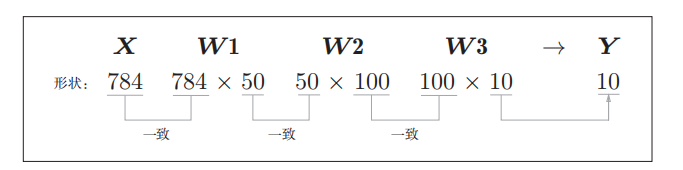

# 神经网络学习笔记

## 一、概述

&emsp;虽然多重感知机可以实现复杂的函数，但是他的权重和偏置都是人工确定的，而神经网络的出现就是为了解决这个问题，神经网络就是可以自动地从数据中学习到合适的权重参数

## 二、神经网络的例子
  


我们把最左边的一列称之为输入层，最右边的一列称之为输出层，中间的一列称之为中间层，中间层有时候称之为隐藏层，从输入层到输出层一次称之为第0层，第1层，第2层

  

  

我们对比一下感知机，b作为偏置的参数，用于控制神经元被激活的容易程度，w1和w2表示每一个信号的权重和参数，用于控制每一个信号的重要性。

这里我们可以将b也作为权重，输入信号是1，这个感知机将x1,x2,1三个输入信号作为神经元的输入，将其和各自的权重相乘之后，传送至下一个神经元，在下一个神经元中，计算这些加权信号的总和。如果这个总和超过0，输入1，否则输出0。这里为了将激活操作和求和操作区分开，引入一个新的函数：

  

  

输入信号的总和被函数hx进行转换，转换之后的数值就是输出y

## 三、激活函数

上面的函数h(x)就是激活函数，**激活函数的作用在于决定如何来激活输入信号的总和**

上面的式子表示的激活函数以阈值为界，一旦输入超过阈值，就切换输出，这样的函数称之为阶跃函数，感知机使用的就是阶跃函数，神经网络使用的函数不是阶跃函数。

### 3.1 sigmoid函数

&emsp;神经网络中使用的一个函数就是sigmoid函数

  

**神经网络中用sigmoid函数作为激活函数，进行信号的转换，转换之后的信号被传送给下一个神经元。**

感知机和神经网络主要的区别就是激活函数

### 3.2 阶跃函数的实现

```python

def step_function(x):
    y = x > 0
    return y.astype(np.int)  ## 将布尔类型的数组转换成int类型

```

这里，set_function(np.array([1.0,2.0]))

该函数需要传入一个np数组，因为神经元有多个输入信号。对numpy数组先进行不等号运算，数组的每一个元素都会进行不等号运算，生成一个布尔类型的数组，大于0的元素都被转换为TRUE,小于或者等于0的元素都转换为False，生成的数组y是一个布尔类型的数组，最后通过astype函数转换数据类型，传入的参数是np.int

### 3.3 阶跃函数的图形

```py
import numpy as np
import matplotlib.pylab as plt

def step_function(x):
    y = x > 0

    return y.astype(np.int)

x = np.arange(-5.0,5.0,0.1)  ## 生成指定范围的数据
y = step_function(x)

plt.plot(x,y)
plt.ylim(-0.1,1.1) ## 指定y轴的范围
plt.show()
```

  


### 3.4 sigmoid函数的实现

  

```py

def sigmoid(x):
    return 1 / (1 + np.exp(-x))

x = np.array([-1.0,1.0,2.0])
sigmoid(x)
```

针对多个输入信号，我们需要在sigmoid函数中传入一个np数组，我们可以看到，传入的x是一个向量，但是函数里面的1都是标量，标量如何与向量进行计算，**之所以，sigmoid函数的实现能支持numpy数组，秘密在于numpy数组的广播功能，根据numpy的广播功能，如果在标量和Numpy数组之间进行计算，则标量会和NUmpy数组的各个元素进行运算，np.exp(-x)会生成numpy数组，所以1 / 1 + np.exp(-x)的运算将会在numpy数组的各个元素之间进行**

```py
def sigmoid(x):
    return 1 / (1 + np.exp(-x))

x = np.arange(-5.0,5.0,0.1)
y = sigmoid(x)

plt.plot(x,y)
plt.ylim(-0.1,1.1)
plt.show()

```

  


### 3.5 sigmoid函数和阶跃函数的比较

* sigmoid函数是一条平滑的曲线，输出随着输入发生连续性的变化
* 阶跃函数只能返回0或者1，sigmoid函数可以返回小数，也就是说感知机神经元之间流动的是01信号，神经网络中流动的是连续的实数值信号
* 阶跃函数和sigmoid函数的共同点：不管输入信号多小或者多大，输出信号都在0和1之间

### 3.6 ReLU函数

&emsp;函数在输入大于0时，直接输出该值，在输入小于等于0时，输出0，

  

```py
def relu(x):
    return np.maximum(0,x)
```


## 四、多维数组的运算

### 4.1 多维数组的概述

```py
import numpy as np

A = np.array([1,2,3,4])

print(np.ndim(A))
A.shape

```

数组的维数通过np.ndim()函数来获得，数组的形状通过shape函数来获得，矩阵的点乘通过dot函数

```py
A = np.array([[1,2],[3,4]])
B = np.array([[5,6],[7,8]])

print(np.dot(A,B))

```

## 五、神经网络的设计

### 5.1 神经网络的内积

  

实现神经网络的时候，要注意X,W,Y的形状，尤其是注意XW的形状

```py
X = np.array([1,2])
X.shape

W = np.array([[1,2,3],[2,4,6]])

W.shape

Y = np.dot(X,W)
print(Y)

```

### 5.2 三层神经网络的实现

  

该神经网络：输入层两个神经元，隐藏层（第一层）：三个神经元，隐藏层（第二层）：两个神经元，输出层：两个神经元

#### 5.2.1 符号确认


  

上图显示了从输入层神经元x2到后一层神经元a1的权重w12,右上角的(1)表示权重和神经元的层号（即第一层的权重，第一层的神经元），权重右下角有两个数字，他们是后一层神经元和前一层神经元的索引号，比如w12表示前一层的第二个神经元x2到后一层的第一个神经元a1的权重。

#### 5.2.2 各层神经元之间的实现

  


从输入层到第一层的实现：偏置也作为输入信号


  


  


下面实现输入层到隐藏层第一层：

```py
X = np.array([1.0,0.5])
W1 = np.array([[0.1,0.3,0.5],[0.2,0.4,0.6]])
B1 = np.array([0.1,0.2,0.3])

A1 = np.dot(X,W1) + B1
print(A1) # 1 x 3 矩阵

# 激活
Z1 = sigmoid(A1)
print(Z1)

```

下面实现第一层到第二层的信号传递：

```py
W2 = np.array([[0.1,0.4],[0.2,0.5],[0.3,0.6]])
B2 = np.array([0.1,0.2])

A2 = np.dot(Z1,W2) + B2
print(A2)

Z2 = sigmoid(A2)
```

实现第二层到输出层的信号传递：

```py
def identity_function(x):
 
    return x

W3 = np.array([[0.1,0.3],[0.2,0.4]])
B3 = np.array([0.1,0.2])

A3 = np.dot(Z2,W3) + B3
Y = identity_function(A3)
print(Y)

```

#### 5.2.3 代码实现小节

```cpp
## 初始化参数和偏置
def init_network():
    network = {}
    network['w1'] = np.array([[0.1,0.3,0.5],[0.2,0.4,0.6]])
    network['b1'] = np.array([0.1,0.2,0.3])
    network['w2'] = np.array([[0.1,0.4],[0.2,0.5],[0.3,0.6]])
    network['b2'] = np.array([0.1,0.2])
    network['w3'] = np.array([[0.1,0.3],[0.2,0.4]])
    network['b3'] = np.array([0.1,0.2])
    return network

def forward(network,x):
    W1,W2,W3 = network['w1'],network['w2'],network['w3']
    b1,b2,b3 = network['b1'],network['b2'],network['b3']
    a1 = np.dot(x,W1) + b1
    z1 = sigmoid(a1)
    a2 = np.dot(z1,W2) + b2
    z2 = sigmoid(a2)
    a3 = np.dot(z2,W3) + b3
    z3 = identity_function(a3)
    return z3

network = init_network()
x = np.array([1.0,0.5])
y = forward(network,x)
print(y)
```

&emsp;这里定义了init_network()和forward()函数，init_network()函数会进行权重和偏置的初始化，并将它们保存在字典变量Network中，这个字典变量Network中保存了每一层所需要的参数（权重和偏置）,forward()函数中则封装了将输入信号转换为输出信号的处理过程。

&emsp;这里的forward函数，他表示的是从输入到输出方向传递处理，后面在进行神经网络的训练时，我们将介绍后向(backward,从输出到输入方向)的处理

## 六、输出层的设计

### 6.1 softmax函数

回归问题使用恒等函数，分类问题使用softmax函数

softmax函数实现：
```py
def softmax(a):
    c = np.max(a)
    exp_a = np.exp(a - c)  ## 溢出对策
    sum_exp_a = np.sum(exp_a)
    y = exp_a / sum_exp_a


    return y

```
```py

a = np.array([0.3,2.9,4.0])
y = softmax(a)

print(y)
```

softmax函数的特征：

* softmax函数的输出总是0.0到1.0之间的实数，并且softmax函数的输出值总和是1
* 输出总和是1
* 即便使用了softmax函数，各个元素之间的大小关系也不会改变，因为指数函数也是单调递增的
* 神经网络只把输出值最大的神经元所对应的泪飙作为识别结果，即便是用softmax函数，输出值最大的神经元的位置也不会改变

### 6.2 输出层的神经元数量

&emsp;输出层神经元数量需要根据解决的问题来决定，对于分类问题，输出层的神经元数量一般设定为类别的数量


## 七、手写数字识别

### 7.1 MNIST数据集

&emsp;这里使用的数据集是MNIST手写数字图像集，MNIST数据集是由0-9数字图像构成的，训练图像六万张，测试图像一万张，每一张图像都是28x28x1（灰度）,各个像素值取值在0~255之间。每一张图像对应相应的数字标签

打印训练数据和标签  测试数据和标签的形状

```py
import sys,os
sys.path.append(os.pardir)  ## 为了导入父目录种的文件进行的设定
import numpy as np
import os
from PIL import Image
from dataset.mnist import load_mnist

## 导入训练数据
(x_train,t_train),(x_test,t_test) = load_mnist(flatten=True,normalize=False)

## 输出数据的形状
print(x_train.shape)
print(t_train.shape)
print(x_test.shape)
print(t_test.shape)
```
```
(60000, 784)
(60000,)
(10000, 784)
(10000,)

```

**训练数据是60000张照片，每一张照片都是一个一维数组**

load_mnist函数以（训练图像，训练标签）、（测试图像，测试标签）的形式返回读入的MNIST数据。

load_mnist(normalize = True,flatten = True,one_hot_label = False) 设置三个参数：第一个参数将输入图像正规化0~1,第二个参数：展开图像形成一个一维数组，那么输入图像会保存成一个784个元素的一维数组，第三个参数设置是否将标签保存为one-hot表示（正确标签为1，其余都是0）


**加载第一张图像**
```py
import sys,os
sys.path.append(os.pardir)  ## 为了导入父目录种的文件进行的设定
import numpy as np
import os
from PIL import Image
from dataset.mnist import load_mnist

## 导入训练数据
(x_train,t_train),(x_test,t_test) = load_mnist(flatten=True,normalize=False)

## 输出数据的形状
print(x_train.shape)
print(t_train.shape)
print(x_test.shape)
print(t_test.shape)

def img_show(img):
    ## 将Numpy数组的图像数据转换为PIL用的数据对象
    pil_img = Image.fromarray(np.uint8(img))
    pil_img.show()

## 取出训练数据第一张图像
img = x_train[0]
label = t_train[0]
print(label)

img = img.reshape(28,28) ## 回复图像尺寸
img_show(img)

```

&emsp;需要注意的是，我们读取的图象是一个一维数组，所以显示图像的时候，需要将他恢复成原来的28x28尺寸图像，另外还需要将保存为Numpy数组的图像数据转换为PIL用的数据对象。

### 7.2 神经网络的推理处理

&emsp;神经网络的输入层有784个神经元，输出层10个神经元，输入层的神经元个数784来源于图像大小（28x28）,输入层10来源于图像分类个数，另外神经网络有2个隐藏层，第一个隐藏层50个神经元，第二个隐藏层100个神经元

```py
from copyreg import pickle
import sys,os
import pickle
from sklearn.metrics import accuracy_score

from torch import softmax
sys.path.append(os.pardir)  ## 为了导入父目录种的文件进行的设定
import numpy as np
import os
from PIL import Image
from dataset.mnist import load_mnist

## 导入训练数据
(x_train,t_train),(x_test,t_test) = load_mnist(flatten=True,normalize=False)

## 输出数据的形状
print(x_train.shape)
print(t_train.shape)
print(x_test.shape)
print(t_test.shape)

def sigmoid(x):
    return 1 / (1 + np.exp(-x))

def img_show(img):
    ## 将Numpy数组的图像数据转换为PIL用的数据对象
    pil_img = Image.fromarray(np.uint8(img))
    pil_img.show()

## 取出训练数据第一张图像
img = x_train[0]
label = t_train[0]
print(label)

# img = img.reshape(28,28) ## 回复图像尺寸
# img_show(img)


def get_data():
    (x_train,t_train),(x_test,t_test) = load_mnist(normalize=True,flatten=True,one_hot_label=False)

    return x_test,t_test


## 读取学习到的权重参数
def init_network():
    with open("sample_weight.pkl","rb") as f:
        network = pickle.load(f)
    return network


def softmax(a):
    c = np.max(a)
    exp_a = np.exp(a - c)  ## 溢出对策
    sum_exp_a = np.sum(exp_a)
    y = exp_a / sum_exp_a


    return y
def predict(network,x):
    W1,W2,W3 = network['W1'],network['W2'],network['W3']
    b1,b2,b3 = network['b1'],network['b2'],network['b3']

    a1 = np.dot(x,W1)  + b1
    z1 = sigmoid(a1)
    a2 = np.dot(z1,W2) + b2
    z2 = sigmoid(a2)
    a3 = np.dot(z2,W3) + b3
    y = softmax(a3)

    return y

x,t = get_data() ## 加载
network = init_network()  ## 加载参数

## 计算正确分类个数
accuracy_cnt = 0
for i in range(len(x)):
    y = predict(network,x[i])
    p = np.argmax(y) ## 获取改了最高的元素的索引

    if p == t[i]:
        accuracy_cnt += 1

print("Accuracy:" + str(float(accuracy_cnt) / len(x)))

```
上述代码：首先获得MNIST数据集，生成网络，然后使用for语句逐个取出保存在x中的图像数据，使用predict()函数进行分类，predict()函数以NuMPY数组的形式输出各个标签对应的概率，然后使用np.argmax(x)函数取出数组中的最大值的索引，np.argmax(x)将获取被赋给参数x的数组中的最大值元素的索引，最后，比较神经网络所预测的答案和正确的解标签，将回答正确的概率作为识别精度

### 7.3 批处理

  

&emsp;输入一个由784个元素（原本是一个28x28的二维数组）构成的一维数组后，输出一个有10个元素的一维数组

考虑打包输入多张图像的情况：

  

输入数据的形状是100x 784，输出数据的形状为100 x 10 

```cpp
x,t = get_data()
network = init_network()

batch_size = 100 ## 批数量
accuracy_count = 0

## 指定步长
for i in range(0,len(x),batch_size):
    x_batch = x[i:i + batch_size]
    y_batch = predict(network,x_batch)
    p = np.argmax(y_batch,axis = 1)  ## 指定第二维度
    accuracy_count += np.sum(p == t[i:i + batch_size])


print("Accuracy:" + str(float(accuracy_cnt) / len(x))) 

```

这里通过argmax()获取值最大的元素的索引，这里给定的参数axis = 1，指定第一维方向，最后使用比较运算符生成布尔数组，计算True个数

总结：批处理一次性计算大型数组要比分开逐步计算
各个小型数组速度更快
