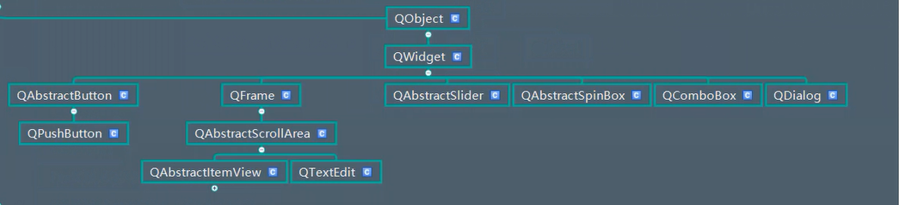
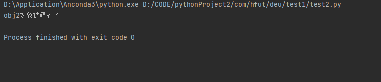

# PyQt5内存管理机制

## QObject继承树
  

* 所有的对象都是直接或者间接的继承自QObject
* QObject在一个对象树中组织他们自己
  * 当创建一个QObject时，如果使用了其他对象作为其父对象
  * 那么，他就会被添加到父对象的Children（）列表中
* 当父对象被销毁时，这个QObject也会被销毁

```python
from PyQt5.Qt import  *

class Window(QWidget):
    def __init__(self):
        super().__init__() # 初始化父类
        self.setWindowTitle("QObject的学习笔记")
        self.resize(500,500)
        self.setup_ui()

    def setup_ui(self):
        # 启动测试函数
        self.QObject5()


    def QObject1(self):
        # 取出所有的父类进行打印  继承object
        mros = QObject.mro()

        for mro in mros:
            print(mro)

    def  QObject2(self):
        obj = QObject()
        obj.setObjectName("notice")
        print(obj.objectName())

        obj.setProperty("notice_level","error")
        obj.setProperty("notice_level1","warning")

        # 根据属性名称 获取属性值
        print(obj.property("notice_level"))

        # 获取该对象的所有属性名称
        print(obj.dynamicPropertyNames())

    def QObject3(self):

        # 将qss文件中的内容进行读取
        with open("QObject1.qss","r") as f:
            qApp.setStyleSheet(f.read())


        # 标签控件放在窗口中
        label = QLabel(self)
        label.setObjectName("notice")
        label.setProperty("notice_level","normal")
        label.setText("社会我顺哥")

        label2 = QLabel(self)
        label2.move(100,100)
        label2.setObjectName("notice")
        label2.setProperty("notice_level","warning")
        label2.setText("人狠话不多")

        # 设置样式
        # label.setStyleSheet("font-size:25px; color:red")

    def QObject4(self):

        # 将obj2设置成obj1的父对象
        obj1 = QObject()
        obj2 = QObject()
        # 设置ID
        obj2.setObjectName("notice")
        obj3 = QObject()
        obj4 = QObject()
        obj5 = QObject()
        obj0 = QObject()

        obj1.setParent(obj0)
        obj2.setParent(obj0)
        obj3.setParent(obj1)
        obj4.setParent(obj2)
        obj5.setParent(obj5)
        # label = QLabel()
        # label.setParent(obj0)

        # 内存地址相同 说明obj2是obj1的父对象
        print("obj0",obj0)
        print("obj1",obj1)
        print("obj2",obj2)
        print("obj3",obj3)
        print("obj4",obj4)
        print("obj5",obj5)

        print(obj1.parent())
        print(obj2.parent())
        print(obj3.parent())
        print(obj4.parent())
        print(obj5.parent())


        # 获取obj0的所有子对象 只包括直接子对象 不包括间接子对象
        print(obj0.children())

        # obj0有两个子对象 但是这里只打印一个子对象,并且是第一个子对象
        print(obj0.findChild(QObject))

        # 这里添加了筛选参数2 ID  打印第二个子对象
        print(obj0.findChild(QObject,"notice"))

        # 控件的父对象必须是一个控件 这样才可以将一个控件添加到另外一个控件中
        # print(obj0.findChild(QLabel))

    def QObject5(self):
        obj1 = QObject()

        # 直接将obj1设置成成员
        self.obj1 = obj1

        obj2 = QObject()

        obj2.setParent(obj1)

        # 监听obj2对象被释放
        obj2.destroyed.connect(lambda :print("obj2对象被释放了"))

        del self.obj1


if __name__ == '__main__':
     import sys
     app = QApplication(sys.argv)

     window = Window()
     window.show()

     sys.exit(app.exec_())
```

效果图：

  


## QWidget

* 扩展了父子关系
* 当一个控件设置了父控件
  * 会包含在父控件内部
  * 受父控件区域裁剪
  * 父控件被删除时，子控件会自动删除
* 场景案例
  * 一个对话框上面有很多操作按钮，按钮和对话框本身是父子控件关系
  * 我们操作的时候，是操作的对话框控件本身，而不是其内部的子控件（按钮）
  * 当对话框被删除时，内部的子控件也会被自动的删除


